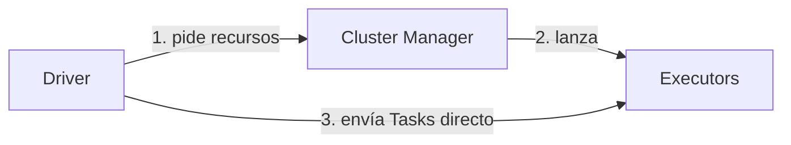

# Cheatsheet — Sección 1: Arquitectura Topológica y Computacional del Clúster

## 1. Los tres roles del modelo Master-Worker

| Rol | Qué es | Cuántos por app |
|---|---|---|
| **Driver** | Cerebro: planifica, arma el DAG, parte en Stages/Tasks | 1 |
| **Cluster Manager** | Negocia recursos físicos (CPU/memoria) | 1 por clúster (compartido) |
| **Executors** | JVMs que ejecutan Tasks en paralelo | N (configurable) |

- El Driver negocia recursos **una vez** con el Cluster Manager; toda la ejecución de Tareas es **Driver ↔ Executor directo**, sin pasar por el Cluster Manager.



---

## 2. Driver Program

- Ejecuta tu `main()` / script. **Nunca** procesa datos directamente — solo orquesta.
- `.collect()` trae datos a la memoria del Driver → riesgo de `OutOfMemoryError`.
- **DAGScheduler**: construye el DAG y corta en **Stages** en cada shuffle.
- **TaskScheduler**: convierte cada Stage en **Tasks** (una por partición), respeta localidad de datos.

| Deploy mode | Dónde vive el Driver | Uso |
|---|---|---|
| `client` | Fuera del clúster (tu terminal) | Desarrollo, notebooks |
| `cluster` | Dentro del clúster | Producción |

```bash
spark-submit --deploy-mode cluster --master yarn app.py
```

---

## 3. Unificación del punto de entrada

| Antes (1.x) | Ahora (2.0+) |
|---|---|
| `SparkContext` | `spark.sparkContext` |
| `SQLContext` | `spark.read`, `spark.sql`, `spark.createDataFrame` |
| `HiveContext` | `.enableHiveSupport()` |
| `StreamingContext` (DStreams) | Structured Streaming: `spark.readStream`/`writeStream` |

```python
spark = SparkSession.builder.appName("x").enableHiveSupport().getOrCreate()
```

- `getOrCreate()` = patrón Singleton: reutiliza la sesión activa del proceso.
- `newSession()` crea una sesión "hija" con catálogo/config aislados, **sin** nuevo `SparkContext` (solo 1 por JVM).

---

## 4. Cluster Manager: los 4 sabores

| Tipo | Uso típico | Notas |
|---|---|---|
| **Standalone** | Dev/testing | Gestor propio de Spark, simple |
| **YARN** | Enterprise on-prem (Hadoop) | ResourceManager + NodeManager + ApplicationMaster |
| **Kubernetes** | Cloud-native | Driver/Executors como pods |
| **Mesos** | Legacy | En desuso, reemplazado por K8s |

```bash
spark-submit --master yarn ...
spark-submit --master k8s://https://api-server:443 ...
spark-submit --master spark://master:7077 ...
```

---

## 5. Executors

- Proceso JVM **exclusivo por aplicación**, vive toda la duración de la app.
- **Cores/slots** = hilos paralelos → 1 Task por core a la vez.
- Memoria dividida en: **Storage** (caché), **Execution** (shuffles/joins/sorts), **User Memory**, **Reserved** (~300MB).

```python
.config("spark.executor.instances", "8")
.config("spark.executor.cores", "4")     # 8x4 = 32 slots paralelos
.config("spark.executor.memory", "8g")
```

**Paralelismo máximo = instances × cores**

---

## 6. Jerarquía: Application → Job → Stage → Task

| Nivel | Disparado por | Se divide por |
|---|---|---|
| Application | `spark-submit` / `SparkSession` | — |
| **Job** | Cada **Action** (`.collect()`, `.count()`, `.write()`, `.show()`) | DAGScheduler, en shuffles |
| **Stage** | Frontera de **Wide Transformation** (shuffle) | Una por "lado" del shuffle |
| **Task** | Una por **partición** | Número de particiones |

- Las transformaciones son **lazy**: no generan Job. Solo las Actions lo hacen.
- Sin `.cache()`, cada Action **recalcula todo el linaje** → Job nuevo, recómputo completo.
- Un nodo `Exchange` en el plan físico (`.explain()`) = shuffle = frontera de Stage.

```python
df.filter(...)              # Stage 0 (narrow, se fusiona)
  .groupBy(...)              # <- frontera: inicia Stage 1
  .sum(...)
```

**Regla de tuning**: particiones ≈ 2-4× el total de cores disponibles.

---

## 7. Particionamiento físico

| Capa | Bloques (almacenamiento) | Particiones (memoria) |
|---|---|---|
| Vive en | Disco persistente (HDFS/S3/GCS) | RAM del Executor, efímera |
| Tamaño | Fijo (HDFS: 128MB típico) | Variable, config Spark |
| HDFS | Bloques reales | 1 partición ≈ 1 bloque |
| Cloud (S3/GCS) | Objeto plano, sin bloques reales | Simulado vía `maxPartitionBytes` |

```python
spark.conf.get("spark.sql.files.maxPartitionBytes")  # 128MB por defecto
```

particiones ≈ tamaño_total_datos / `maxPartitionBytes`

| Operación | Uso | Shuffle |
|---|---|---|
| `repartition(n)` | Aumentar particiones / balancear skew | Sí (completo) |
| `coalesce(n)` | Reducir particiones | No (barato) |
| `partitionBy(col)` en **write** | Organiza carpetas Hive-style en disco (`col=valor/`) | — (habilita partition pruning) |

```python
df.repartition(200)              # shuffle completo
df.coalesce(4)                   # fusión barata, solo reduce
df.write.partitionBy("pais").parquet(...)  # subdirectorios pais=PE/, pais=CO/...
```

**Localidad de datos** (mejor a peor): `PROCESS_LOCAL` → `NODE_LOCAL` → `RACK_LOCAL` → `ANY`. Pierde relevancia en cloud storage (cómputo desacoplado del almacenamiento).

---

## 8. Diagnóstico rápido (Spark UI)

| Puerto/Pestaña | Qué confirmar |
|---|---|
| `:4040` → Jobs | Cuántos Jobs, cuántas Stages por Job |
| `:4040` → Stages | Tasks totales, tiempo de shuffle, skew (una Task mucho más lenta) |
| `:4040` → Executors | Número de executors, cores, memoria — debe calzar con tu config |
| `:4040` → SQL | Plan físico, nodos `Exchange` = fronteras de Stage |
| `:8080` (Standalone) | Workers `ALIVE`, apps `RUNNING`/`FINISHED`, sección "Drivers" (solo en cluster mode) |

---

## 9. Errores/síntomas más comunes

| Síntoma | Causa | Acción |
|---|---|---|
| `Driver OOM` tras `.collect()` | Traer demasiados datos al Driver | Usar `.take()`, `.write()`, o agregaciones antes |
| App atascada en `ACCEPTED` (YARN) | Cluster sin recursos libres | Revisar cola/recursos disponibles |
| Muchas Stages de más | Wide Transformations innecesarias/repetidas | Revisar `.explain()`, simplificar |
| Una Task tarda 10x más | *Data skew* | `repartition()`, salting, o AQE |
| Mismo cómputo repetido entre Jobs | Falta `.cache()`/`.persist()` | Cachear DataFrame reutilizado |
| Miles de archivos pequeños | Small files problem | Compactar origen, subir `openCostInBytes` |
| App muere al cerrar terminal | `--deploy-mode client` | Usar `cluster` para producción |
