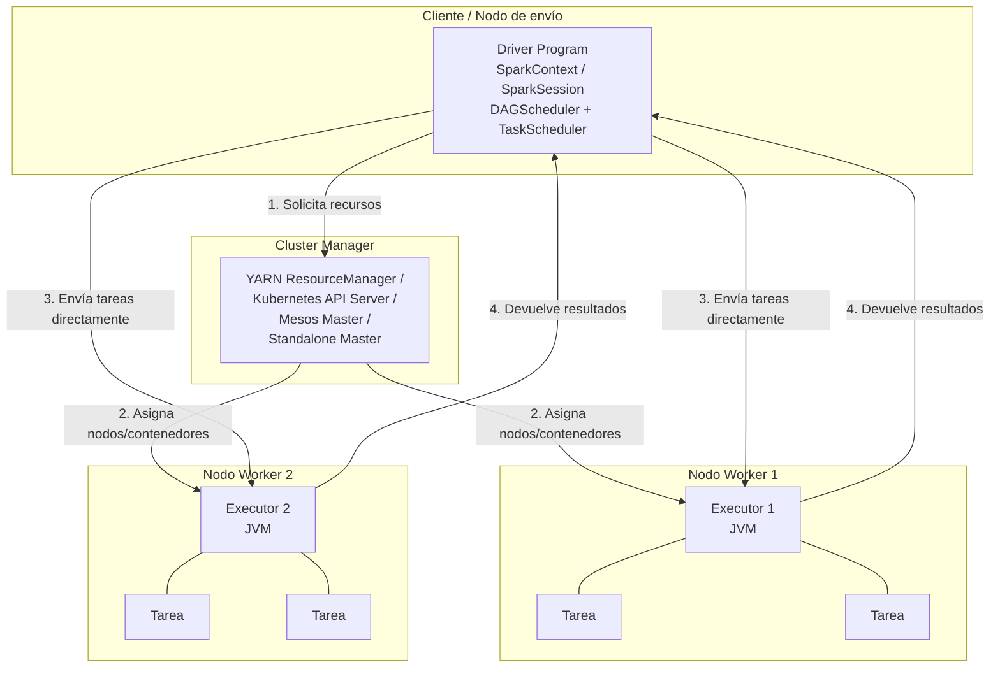
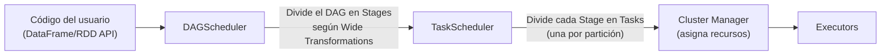
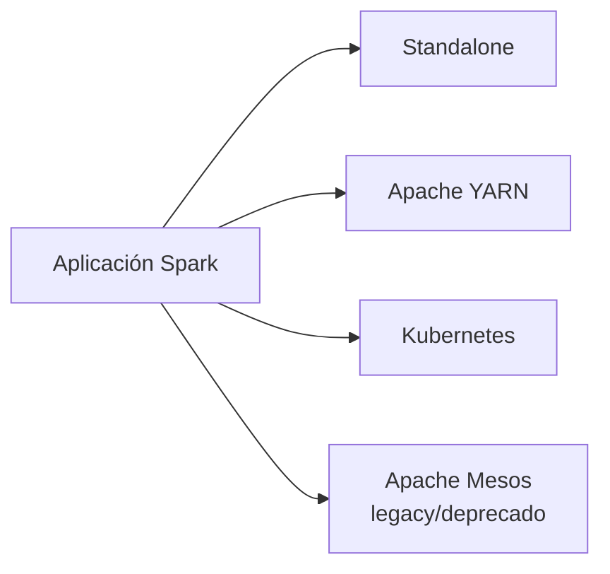
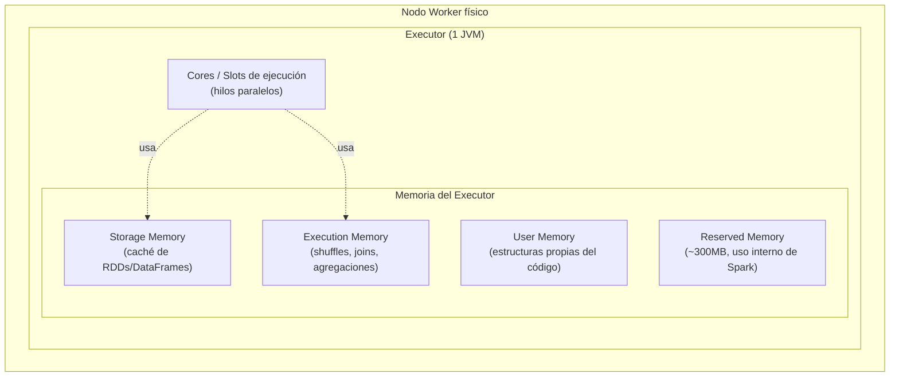
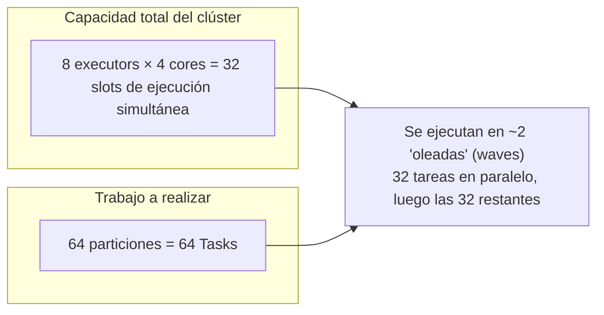
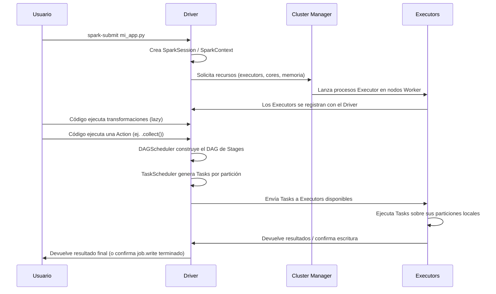

# Arquitectura Topológica y Computacional del Clúster: Modelo Master-Worker de Spark

## Índice

1. [Visión general del modelo](#1-visión-general-del-modelo)
2. [El Driver Program](#2-el-driver-program)
3. [El Cluster Manager](#3-el-cluster-manager)
4. [Los Executors](#4-los-executors)
5. [Ciclo de vida completo: de `spark-submit` a la ejecución](#5-ciclo-de-vida-completo-de-spark-submit-a-la-ejecución)
6. [Ejemplo práctico end-to-end](#6-ejemplo-práctico-end-to-end)
7. [Errores comunes y cómo depurarlos](#7-errores-comunes-y-cómo-depurarlos)
8. [Resumen mental (cheatsheet)](#8-resumen-mental-cheatsheet)

---

## 1. Visión general del modelo

Apache Spark implementa una arquitectura **Master-Worker distribuida**. Esto significa que hay un proceso que **coordina y planifica** (el "master" lógico de la aplicación, que es el Driver) y un conjunto de procesos que **ejecutan trabajo real** (los Workers, materializados como Executors).

Es fundamental entender desde el inicio que en Spark existen **tres roles distintos** que a veces se confunden:

| Rol | Qué es | Dónde vive | Cuántos hay |
|---|---|---|---|
| **Driver Program** | El cerebro de tu aplicación Spark | Una JVM, en el cliente o en el clúster | Exactamente 1 por aplicación |
| **Cluster Manager** | El "casero" que asigna recursos físicos | Servicio externo (YARN RM, K8s API Server, etc.) | 1 por clúster (compartido entre apps) |
| **Executors** | Los obreros que ejecutan tareas | JVMs en nodos Worker | N por aplicación (configurable) |



**Punto clave que mucha gente pasa por alto:** una vez que el Cluster Manager ha asignado los recursos, **el Driver se comunica directamente con los Executors**. El Cluster Manager no está en el camino crítico de la ejecución de tareas; solo negocia recursos al principio (y en escalado dinámico).

---

## 2. El Driver Program

### 2.1 ¿Qué es realmente el Driver?

El Driver es el **proceso JVM que ejecuta el método `main()`** de tu aplicación (o el proceso que interpreta tu script PySpark/línea de comandos `spark-shell`). Es responsable de:

1. Mantener información sobre la aplicación Spark (metadatos, configuración).
2. Responder al programa del usuario o a la entrada (shell interactivo, notebook, script).
3. Analizar, distribuir y programar el trabajo entre los Executors.
4. Coordinar con el Cluster Manager para obtener recursos físicos.

El Driver **nunca ejecuta transformaciones sobre los datos**; solo orquesta. Si tú llamas a `.collect()`, el Driver recibe los datos resultantes en su propia memoria (¡de ahí el clásico `OutOfMemoryError` del Driver cuando alguien hace `collect()` sobre un dataset gigante!).

### 2.2 SparkContext y SparkSession

Antes de Spark 2.0 existían múltiples puntos de entrada:

- `SparkContext` → funcionalidad RDD "core".
- `SQLContext` → funcionalidad SQL/DataFrame.
- `HiveContext` → integración con Hive.
- `StreamingContext` → streaming.

Desde Spark 2.0, **`SparkSession` unifica todos estos puntos de entrada** en un solo objeto. Internamente, `SparkSession` sigue creando y envolviendo un `SparkContext`.

```python
from pyspark.sql import SparkSession

# Punto de entrada único desde Spark 2.0+
spark = (
    SparkSession.builder
    .appName("MiAplicacionDeAnalisis")
    .master("local[4]")          # o "yarn", "k8s://...", "spark://master:7077"
    .config("spark.executor.memory", "4g")
    .config("spark.executor.cores", "2")
    .getOrCreate()
)

# El SparkContext "clásico" sigue accesible bajo el capó
sc = spark.sparkContext
print(sc.applicationId)   # ej: application_1699999999_0001
print(sc.uiWebUrl)        # URL del Spark UI para monitorear la app
```

> **`getOrCreate()`** es importante: si ya existe una `SparkSession` activa en el proceso (por ejemplo, en un notebook), la reutiliza en lugar de crear una nueva. Esto evita tener múltiples Drivers "fantasma" compitiendo por recursos dentro del mismo proceso.

### 2.3 El DAGScheduler

El Driver contiene dos "cerebros" internos que trabajan en cascada:



1. **DAGScheduler**: toma el plan lógico/físico de tu aplicación y lo traduce en un **Grafo Acíclico Dirigido (DAG)** de *Stages*. Cada vez que encuentra una **Wide Transformation** (que requiere shuffle), corta el grafo y crea una nueva Stage. Es responsable de la tolerancia a fallos a nivel de Stage (reintentar Stages completas si fallan).

2. **TaskScheduler**: toma cada Stage generada por el DAGScheduler y la traduce en un conjunto de **Tasks** (una tarea por partición de datos). Luego envía esas tareas a los Executors disponibles, respetando la localidad de datos (*data locality*) cuando es posible — es decir, intenta enviar la tarea al Executor que ya tiene esos datos en memoria/disco local para minimizar transferencia por red.

```python
# Este único comando dispara todo el ciclo: análisis -> DAG -> stages -> tasks
resultado = (
    spark.read.parquet("s3://bucket/ventas/")
    .filter("pais = 'PE'")
    .groupBy("categoria")          # <-- Wide Transformation: aquí se corta una nueva Stage
    .sum("monto")
)
resultado.show()   # <-- Action: dispara la materialización real
```

Puedes **ver el DAG generado** en el Spark UI (`http://<driver-host>:4040`), pestaña "Jobs" → "DAG Visualization".

### 2.4 ¿Dónde vive el Driver? (Deploy Modes)

Esto es clave y suele salir en entrevistas técnicas:

| Modo | Dónde corre el Driver | Uso típico |
|---|---|---|
| **Client mode** | En la máquina desde donde lanzas `spark-submit` (fuera del clúster) | Desarrollo interactivo, notebooks, debugging |
| **Cluster mode** | Dentro del propio clúster, en un nodo Worker/contenedor | Producción, jobs batch de larga duración |

```bash
# Client mode: el driver corre en tu terminal/edge node
spark-submit --deploy-mode client --master yarn mi_app.py

# Cluster mode: YARN elige un nodo del clúster para correr el driver
spark-submit --deploy-mode cluster --master yarn mi_app.py
```

**¿Por qué importa?** En *client mode*, si cierras tu terminal o se cae tu conexión, la aplicación muere (el Driver depende de tu proceso local). En *cluster mode*, la aplicación sobrevive independientemente de tu máquina local — ideal para jobs programados (cron, Airflow, etc.).

---

## 3. El Cluster Manager

El Cluster Manager es un **servicio externo e independiente de Spark** cuya única responsabilidad es la **negociación de recursos físicos** (CPU, memoria) entre múltiples aplicaciones que compiten por el mismo clúster.

> Analogía: si el Driver es el "jefe de obra" que decide qué construir y cómo dividir el trabajo, el Cluster Manager es el "dueño del edificio" que decide cuántos obreros (Executors) puede tener cada jefe de obra según el espacio disponible.

### 3.1 Los cuatro sabores de Cluster Manager



#### a) Standalone

El propio Spark trae su gestor de clúster incorporado. Simple, sin dependencias externas, pero con menos funcionalidades multi-tenant.

```bash
# Iniciar el master
$SPARK_HOME/sbin/start-master.sh

# Iniciar un worker apuntando al master
$SPARK_HOME/sbin/start-worker.sh spark://master-host:7077

spark-submit --master spark://master-host:7077 mi_app.py
```

#### b) YARN (Yet Another Resource Negotiator)

El gestor de recursos del ecosistema Hadoop. Es el más usado en entornos empresariales on-premise (Cloudera, EMR en algunos casos).

- **ResourceManager**: el maestro global que decide qué aplicación recibe qué contenedores.
- **NodeManager**: agente en cada nodo worker que efectivamente lanza los contenedores.
- **ApplicationMaster**: en el caso de Spark, el propio Driver actúa (o es envuelto por) un ApplicationMaster cuando se corre en `cluster mode`.

```bash
spark-submit \
  --master yarn \
  --deploy-mode cluster \
  --num-executors 10 \
  --executor-memory 8g \
  --executor-cores 4 \
  mi_app.py
```

#### c) Kubernetes (K8s)

Cada Driver y cada Executor se ejecutan como **pods** de Kubernetes. Es el modelo dominante en arquitecturas cloud-native modernas.

```bash
spark-submit \
  --master k8s://https://<api-server>:443 \
  --deploy-mode cluster \
  --conf spark.kubernetes.container.image=mi-imagen-spark:3.5 \
  --conf spark.executor.instances=6 \
  --conf spark.kubernetes.namespace=data-eng \
  local:///opt/spark/apps/mi_app.py
```

Ventaja clave: aislamiento total por contenedor, autoescalado nativo, e integración con el resto del ecosistema cloud (Helm, operadores como el *Spark Operator*).

#### d) Mesos

Gestor de propósito general anterior a Kubernetes. Hoy prácticamente **deprecado en favor de Kubernetes**; se menciona por completitud histórica pero rara vez se usa en proyectos nuevos.

### 3.2 Comparativa rápida

| Característica | Standalone | YARN | Kubernetes | Mesos |
|---|---|---|---|---|
| Complejidad de setup | Baja | Media-Alta | Media | Alta |
| Multi-tenancy (compartir con otros frameworks) | No | Sí (Hadoop ecosystem) | Sí (cualquier workload en contenedores) | Sí |
| Popularidad actual | Baja (dev/testing) | Alta (legacy enterprise) | Muy alta (cloud-native) | En declive |
| Aislamiento de recursos | Proceso | Contenedor YARN | Contenedor (pod) | Contenedor |

---

## 4. Los Executors

### 4.1 ¿Qué es un Executor?

Un Executor es un **proceso JVM de larga duración** que se lanza en un nodo Worker **para una aplicación Spark específica**, y que vive durante toda la duración de esa aplicación (salvo fallos o *dynamic allocation*). Sus responsabilidades:

1. **Ejecutar las tareas** que le envía el Driver.
2. **Almacenar datos en caché** cuando el usuario llama a `.cache()` o `.persist()`.
3. **Reportar el estado** de las tareas (éxito, fallo, métricas) de vuelta al Driver.

> **Importante**: los Executors son *exclusivos por aplicación*. Dos aplicaciones Spark distintas nunca comparten el mismo proceso Executor, aunque sí pueden compartir el mismo nodo físico.

### 4.2 Anatomía interna de un Executor



- **Cores (slots)**: cada `executor-core` es esencialmente un **hilo (thread)** dentro de la JVM del Executor capaz de ejecutar **una Task a la vez**. Si configuras `--executor-cores 4`, ese Executor puede correr hasta 4 tareas **en paralelo simultáneamente**.

- **Memoria del Executor** se divide (desde Spark 1.6+, con el *Unified Memory Manager*) en:
  - **Storage Memory**: para cachear particiones de datos (`.cache()`, `.persist()`).
  - **Execution Memory**: para operaciones que requieren memoria temporal intensiva (shuffles, sorts, hash joins, agregaciones).
  - Estas dos zonas comparten un pool unificado y pueden "prestarse" espacio dinámicamente entre sí (de ahí "Unified Memory Manager").
  - **User Memory**: para tus propias estructuras de datos en el código Python/Scala (fuera del control de Spark).
  - **Reserved Memory**: una porción fija reservada para el propio funcionamiento interno de Spark.

```python
spark = (
    SparkSession.builder
    .config("spark.executor.instances", "8")   # 8 executors
    .config("spark.executor.cores", "4")        # 4 cores (slots) por executor -> 32 tareas paralelas en total
    .config("spark.executor.memory", "8g")      # memoria heap por executor
    .config("spark.memory.fraction", "0.6")     # % de (memoria - reserved) para Storage+Execution
    .config("spark.memory.storageFraction", "0.5")  # % de esa fracción garantizado para Storage
    .getOrCreate()
)
```

### 4.3 Mapeo de tareas a cores: ejemplo numérico

Supongamos:

- 8 Executors
- 4 cores por Executor
- Un DataFrame particionado en 64 particiones (por ejemplo, tras un `.repartition(64)`)



Esto explica una intuición práctica muy usada para *tunear* Spark: **el número de particiones idealmente debería ser un múltiplo del número total de cores disponibles** (aquí, 32), para que ninguna oleada de ejecución deje cores ociosos esperando a que termine una tarea rezagada.

### 4.4 Executors vs. Cluster Manager: quién los lanza

Es el **Cluster Manager** quien físicamente lanza el proceso Executor (como contenedor YARN, pod de K8s, o proceso Standalone), siguiendo instrucciones del Driver sobre cuántos recursos necesita. Pero una vez lanzado, **el Executor se registra directamente con el Driver** y toda la comunicación de tareas ocurre Driver ↔ Executor, sin pasar por el Cluster Manager.

---

## 5. Ciclo de vida completo: de `spark-submit` a la ejecución



---

## 6. Ejemplo práctico end-to-end

```python
from pyspark.sql import SparkSession

# 1. Se crea el Driver (esta línea inicia el proceso Driver y
#    dispara la negociación con el Cluster Manager)
spark = (
    SparkSession.builder
    .appName("DemoMasterWorker")
    .master("yarn")
    .config("spark.submit.deployMode", "cluster")
    .config("spark.executor.instances", "4")
    .config("spark.executor.cores", "3")
    .config("spark.executor.memory", "6g")
    .getOrCreate()
)

sc = spark.sparkContext
print(f"App ID: {sc.applicationId}")
print(f"Executors solicitados: 4, cores totales: {4*3}")

# 2. Transformaciones (LAZY: solo construyen el plan, no ejecutan nada aún)
ventas = spark.read.parquet("s3://data-lake/ventas/2026/")
ventas_pe = ventas.filter(ventas.pais == "PE")            # Narrow -> misma Stage
agregado = ventas_pe.groupBy("categoria").sum("monto")    # Wide -> nueva Stage (shuffle)

# 3. Action: AQUÍ es cuando el Driver realmente:
#    - construye el DAG final,
#    - lo parte en Stages (DAGScheduler),
#    - genera Tasks (TaskScheduler),
#    - las envía a los Executors ya registrados.
agregado.write.mode("overwrite").parquet("s3://data-lake/resultados/agregado_categoria/")

print("Job finalizado. Revisa el Spark UI para ver el DAG y las 2 stages generadas.")
```

**Qué observarás en el Spark UI (`:4040` o el UI history server en cluster mode):**

- **Pestaña "Executors"**: verás exactamente 4 executors activos, cada uno con 3 cores y ~6GB de memoria — confirmando que el Cluster Manager cumplió lo solicitado por el Driver.
- **Pestaña "Jobs" → "DAG Visualization"**: verás **2 Stages** (una antes del `groupBy`, otra después), separadas por la frontera de shuffle.
- **Pestaña "SQL"**: si usas DataFrames, verás el plan físico completo generado por Catalyst.

---

## 7. Errores comunes y cómo depurarlos

| Síntoma | Causa típica relacionada al modelo Master-Worker |
|---|---|
| `Driver OutOfMemoryError` tras un `.collect()` | Estás trayendo demasiados datos al Driver, que **no** está diseñado para almacenar datasets completos |
| La app se queda en estado `ACCEPTED` para siempre en YARN | El Cluster Manager no tiene recursos libres (cola llena) para satisfacer la solicitud de Executors del Driver |
| Executors mueren y se relanzan constantemente | Configuración de memoria por Executor demasiado baja frente al volumen real de datos por partición |
| Un solo Executor tarda mucho más que los demás ("straggler") | *Data skew*: una partición mucho más grande que las demás, mal distribuida entre los Executors |
| App muere al cerrar la terminal del usuario | Estás en `--deploy-mode client`; usa `cluster` para jobs de producción |

---

## 8. Resumen mental (cheatsheet)

- **Driver = cerebro** → planifica, arma el DAG, parte en Stages y Tasks. Vive en 1 sola JVM.
- **Cluster Manager = casero de recursos** → asigna CPU/memoria físicos, pero no participa en la ejecución de tareas una vez asignados.
- **Executors = obreros** → JVMs que ejecutan Tasks en paralelo (1 Task por core/slot disponible), y pueden cachear datos en su memoria local.
- La comunicación de tareas es **siempre Driver ↔ Executor directamente**, nunca a través del Cluster Manager.
- `client mode` → Driver fuera del clúster (bueno para desarrollo). `cluster mode` → Driver dentro del clúster (bueno para producción).
- `SparkSession` (desde 2.0) unifica `SparkContext` + `SQLContext` + `HiveContext` como único punto de entrada.
