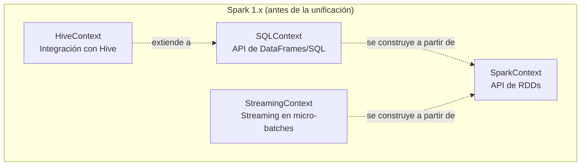
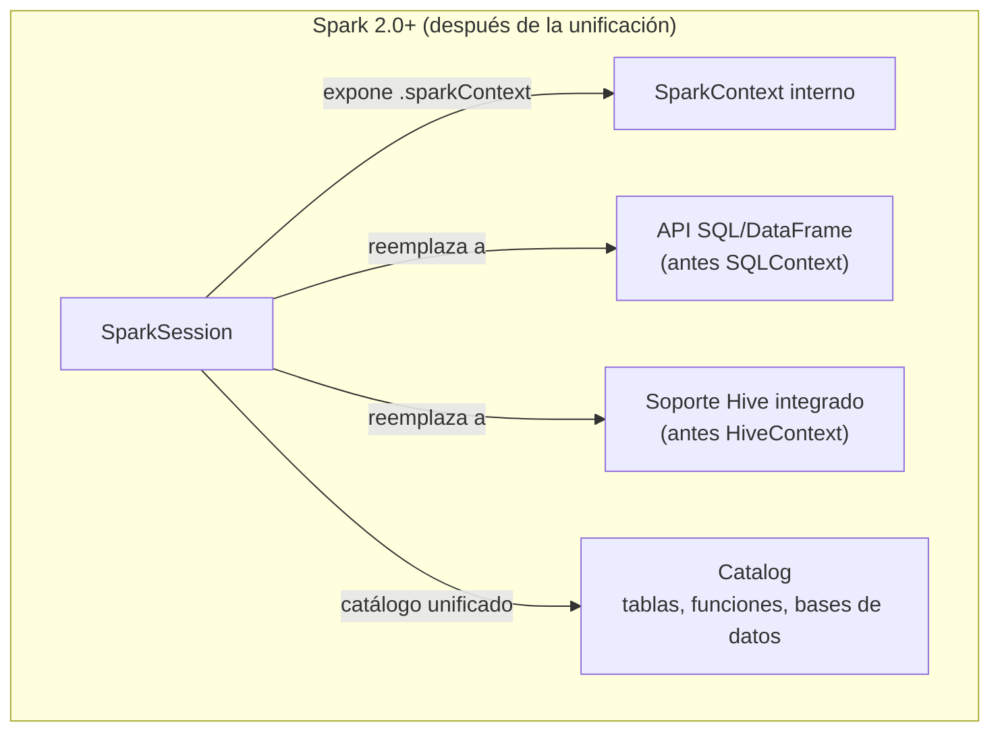
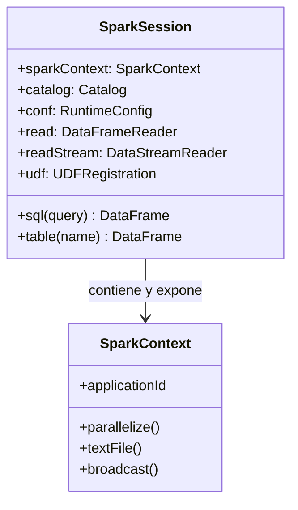

# La Unificación del Punto de Entrada: De `SparkContext` + `SQLContext` a `SparkSession`

## Índice

1. [El problema histórico: múltiples contextos](#1-el-problema-histórico-múltiples-contextos)
2. [Anatomía de la era pre-2.0](#2-anatomía-de-la-era-pre-20)
3. [La llegada de `SparkSession`](#3-la-llegada-de-sparksession)
4. [Qué envuelve realmente `SparkSession` por dentro](#4-qué-envuelve-realmente-sparksession-por-dentro)
5. [`getOrCreate()`: el patrón Singleton de Spark](#5-getorcreate-el-patrón-singleton-de-spark)
6. [Configuración: antes y después](#6-configuración-antes-y-después)
7. [Múltiples `SparkSession` en la misma aplicación](#7-múltiples-sparksession-en-la-misma-aplicación)
8. [Tabla comparativa de equivalencias](#8-tabla-comparativa-de-equivalencias)
9. [Ejemplo end-to-end migrando código legacy](#9-ejemplo-end-to-end-migrando-código-legacy)
10. [Errores comunes](#10-errores-comunes)
11. [Resumen mental (cheatsheet)](#11-resumen-mental-cheatsheet)

---

## 1. El problema histórico: múltiples contextos

Antes de Spark 2.0 (lanzado en 2016), cada "subsistema" de Spark tenía **su propio punto de entrada independiente**. Si tu aplicación necesitaba usar RDDs, SQL, Hive y Streaming a la vez, tenías que instanciar y gestionar **cuatro objetos distintos**, cada uno con su propio ciclo de vida y su propia configuración.



Este diseño generaba fricción real en el día a día:

- Había que decidir **de antemano** qué combinación de contextos instanciar según lo que ibas a usar.
- `HiveContext` requería configuración adicional (`hive-site.xml`) y era fácil confundir cuándo usar `SQLContext` vs `HiveContext`.
- Cada contexto tenía su propio conjunto de métodos de configuración (`setConf`, parámetros del constructor, etc.), duplicando lógica.
- El código de una aplicación mezclaba referencias a `sc`, `sqlContext`, `hiveContext`... generando *boilerplate* y confusión sobre cuál usar en cada línea.

---

## 2. Anatomía de la era pre-2.0

### 2.1 `SparkContext`: el núcleo original

`SparkContext` fue el **primer y único** punto de entrada en las primeras versiones de Spark. Representa la conexión de tu aplicación con el clúster y es el objeto que expone la API de **RDDs**.

```scala
// Scala — Spark 1.x
import org.apache.spark.{SparkConf, SparkContext}

val conf = new SparkConf()
  .setAppName("MiApp")
  .setMaster("local[4]")

val sc = new SparkContext(conf)

val rdd = sc.textFile("hdfs://datos/log.txt")
val conteo = rdd.flatMap(_.split(" ")).map((_, 1)).reduceByKey(_ + _)
conteo.collect().foreach(println)

sc.stop()
```

### 2.2 `SQLContext`: habilitando DataFrames y SQL

Para usar la API estructurada (DataFrames, consultas SQL sobre datos), había que envolver el `SparkContext` existente dentro de un `SQLContext` adicional.

```scala
// Scala — Spark 1.x
import org.apache.spark.sql.SQLContext

val sqlContext = new SQLContext(sc)   // depende de un SparkContext ya creado

val df = sqlContext.read.json("personas.json")
df.createOrReplaceTempView("personas")
sqlContext.sql("SELECT nombre FROM personas WHERE edad > 18").show()
```

### 2.3 `HiveContext`: para integración con Hive Metastore

Si necesitabas leer tablas de Hive, ventanas analíticas avanzadas o UDFs de Hive, `SQLContext` no bastaba: había que dar un paso más y usar `HiveContext`, una **subclase** de `SQLContext` con capacidades extendidas.

```scala
// Scala — Spark 1.x
import org.apache.spark.sql.hive.HiveContext

val hiveContext = new HiveContext(sc)
hiveContext.sql("SELECT * FROM ventas_historicas").show()
```

### 2.4 `StreamingContext`: para procesamiento en micro-batches

```scala
// Scala — Spark 1.x
import org.apache.spark.streaming.{StreamingContext, Seconds}

val ssc = new StreamingContext(sc, Seconds(5))
val stream = ssc.socketTextStream("localhost", 9999)
stream.flatMap(_.split(" ")).countByValue().print()

ssc.start()
ssc.awaitTermination()
```

**El problema queda claro**: un pipeline realista que combinara SQL + Hive + Streaming necesitaba **arrastrar y sincronizar cuatro objetos** (`sc`, `sqlContext`, `hiveContext`, `ssc`), todos apuntando en el fondo al mismo `SparkContext` subyacente.

---

## 3. La llegada de `SparkSession`

Con **Spark 2.0** (2016), la comunidad introdujo `SparkSession` como **punto de entrada único y unificado**. La filosofía de diseño fue simple: *"un solo objeto para gobernarlos a todos"*.



```python
from pyspark.sql import SparkSession

# Un único objeto reemplaza a SparkContext + SQLContext + HiveContext
spark = (
    SparkSession.builder
    .appName("MiAppUnificada")
    .master("local[4]")
    .enableHiveSupport()          # activa capacidades tipo HiveContext si es necesario
    .getOrCreate()
)

# Todo pasa ahora por 'spark':
df = spark.read.json("personas.json")               # antes: sqlContext.read
df.createOrReplaceTempView("personas")
spark.sql("SELECT nombre FROM personas WHERE edad > 18").show()  # antes: sqlContext.sql / hiveContext.sql

rdd = spark.sparkContext.textFile("hdfs://datos/log.txt")        # antes: sc.textFile
```

> Nota: `StreamingContext` (Spark Streaming "clásico", basado en DStreams) **no** fue absorbido del todo por `SparkSession`, porque ese modelo de streaming fue reemplazado por **Structured Streaming**, que sí vive completamente dentro de `SparkSession` (`spark.readStream`, `spark.writeStream`).

```python
# Structured Streaming: ya no necesitas un StreamingContext separado
streaming_df = spark.readStream.format("socket").option("host", "localhost").option("port", 9999).load()
```

---

## 4. Qué envuelve realmente `SparkSession` por dentro

Es importante entender que `SparkSession` **no reemplaza mecánicamente** al `SparkContext`; lo **envuelve y expone selectivamente**. Internamente sigue habiendo un único `SparkContext` real por aplicación (recordemos: solo puede haber uno activo por JVM).

```python
spark = SparkSession.builder.appName("Demo").getOrCreate()

# SparkSession expone el SparkContext subyacente cuando lo necesitas:
sc = spark.sparkContext
print(type(sc))          # <class 'pyspark.context.SparkContext'>
print(sc.applicationId)  # el ID de aplicación sigue viviendo en el SparkContext

# El catálogo unificado (antes disperso entre contextos):
spark.catalog.listDatabases()
spark.catalog.listTables()
```

Diagrama de composición interna:



---

## 5. `getOrCreate()`: el patrón Singleton de Spark

Como solo puede existir **un `SparkContext` activo por JVM**, `SparkSession.builder.getOrCreate()` implementa un patrón *Singleton*:

- Si **ya existe** una `SparkSession` activa en el proceso → la **reutiliza** (y aplica cualquier configuración adicional que sea compatible).
- Si **no existe ninguna** → crea una nueva desde cero, incluyendo su `SparkContext` interno.

```python
# Notebook / REPL: primera celda
spark = SparkSession.builder.appName("Analisis").config("spark.sql.shuffle.partitions", 50).getOrCreate()

# Notebook / REPL: celda posterior (más adelante, quizás en otra función)
spark2 = SparkSession.builder.getOrCreate()

print(spark is spark2)  # True -> es la MISMA sesión, no una nueva
```

**Por qué esto importa en la práctica**: en notebooks (Databricks, Jupyter con `findspark`) es muy común que múltiples celdas o funciones llamen a `getOrCreate()` de forma independiente. Gracias a este patrón, **no se crean sesiones duplicadas** que compitieran por los mismos recursos del clúster.

---

## 6. Configuración: antes y después

| Necesitas... | Spark 1.x (múltiples contextos) | Spark 2.0+ (unificado) |
|---|---|---|
| Crear el punto de entrada | `new SparkContext(conf)` | `SparkSession.builder.getOrCreate()` |
| Leer un RDD desde texto | `sc.textFile(path)` | `spark.sparkContext.textFile(path)` |
| Leer un DataFrame JSON | `sqlContext.read.json(path)` | `spark.read.json(path)` |
| Ejecutar SQL | `sqlContext.sql(query)` | `spark.sql(query)` |
| Acceder a tablas Hive | `new HiveContext(sc)` + `.sql(...)` | `spark.builder.enableHiveSupport()` + `spark.sql(...)` |
| Configurar parámetros | `conf.set("k", "v")` antes de crear el contexto | `spark.conf.set("k", "v")` incluso **después** de crear la sesión (para configs modificables en runtime) |
| Registrar una UDF | `sqlContext.udf.register(...)` | `spark.udf.register(...)` |
| Crear un DataFrame desde una lista | `sqlContext.createDataFrame(...)` | `spark.createDataFrame(...)` |

Ejemplo de configuración dinámica en runtime, algo que no era tan directo antes:

```python
spark.conf.set("spark.sql.shuffle.partitions", 200)   # cambia el número de particiones de shuffle al vuelo
print(spark.conf.get("spark.sql.shuffle.partitions")) # '200'
```

---

## 7. Múltiples `SparkSession` en la misma aplicación

Aunque solo hay **un** `SparkContext` por JVM, `SparkSession` sí permite crear **sesiones "hijas"** con `newSession()`, útiles cuando necesitas aislar configuración o el catálogo temporal de tablas entre distintas partes de tu código, sin pagar el costo de levantar un nuevo `SparkContext`.

```python
spark_base = SparkSession.builder.appName("Base").getOrCreate()

spark_aislada = spark_base.newSession()

spark_aislada.conf.set("spark.sql.shuffle.partitions", 10)  # no afecta a spark_base
spark_aislada.sql("CREATE OR REPLACE TEMP VIEW temp_local AS SELECT 1 AS x")

# 'temp_local' NO es visible desde spark_base, porque las vistas temporales
# están ligadas a la sesión, no al SparkContext compartido
try:
    spark_base.sql("SELECT * FROM temp_local").show()
except Exception as e:
    print("Error esperado:", e)
```

Esto es exactamente análogo a cómo, en 1.x, distintos `SQLContext` podían coexistir compartiendo el mismo `SparkContext` pero con catálogos de tablas temporales independientes — `SparkSession.newSession()` preserva esa flexibilidad sin devolver la complejidad de gestionar objetos separados por tipo.

---

## 8. Tabla comparativa de equivalencias

| Objeto legacy | Rol que cumplía | Absorbido por `SparkSession` como... |
|---|---|---|
| `SparkContext` | Conexión al clúster, API de RDDs | `spark.sparkContext` (sigue existiendo, accesible bajo demanda) |
| `SQLContext` | API DataFrame/SQL | Métodos directos de `spark` (`spark.read`, `spark.sql`, `spark.createDataFrame`) |
| `HiveContext` | Soporte Hive extendido | `SparkSession.builder.enableHiveSupport()` |
| `StreamingContext` (DStreams) | Streaming en micro-batches (API legacy) | Reemplazado conceptualmente por Structured Streaming (`spark.readStream` / `spark.writeStream`) |

---

## 9. Ejemplo end-to-end migrando código legacy

**Código Spark 1.x (legacy, NO recomendado hoy):**

```scala
val conf = new SparkConf().setAppName("Legacy").setMaster("local[*]")
val sc = new SparkContext(conf)
val sqlContext = new SQLContext(sc)
val hiveContext = new HiveContext(sc)

val ventasRdd = sc.textFile("ventas.csv")
val ventasDf = sqlContext.read.option("header", "true").csv("ventas.csv")
ventasDf.createOrReplaceTempView("ventas")

val resumen = hiveContext.sql("""
  SELECT categoria, SUM(monto) AS total
  FROM ventas
  GROUP BY categoria
""")
resumen.show()

sc.stop()
```

**Código equivalente en Spark 2.0+ (unificado, recomendado):**

```python
from pyspark.sql import SparkSession

spark = (
    SparkSession.builder
    .appName("Moderno")
    .master("local[*]")
    .enableHiveSupport()
    .getOrCreate()
)

# Ya no necesitas sc, sqlContext ni hiveContext por separado:
ventas_rdd = spark.sparkContext.textFile("ventas.csv")           # si aún necesitas RDDs
ventas_df = spark.read.option("header", "true").csv("ventas.csv")
ventas_df.createOrReplaceTempView("ventas")

resumen = spark.sql("""
    SELECT categoria, SUM(monto) AS total
    FROM ventas
    GROUP BY categoria
""")
resumen.show()

spark.stop()
```

**Diferencias clave a resaltar:**
- 3 objetos (`sc`, `sqlContext`, `hiveContext`) → **1 objeto** (`spark`).
- `enableHiveSupport()` reemplaza directamente a la instanciación de `HiveContext`.
- El acceso a RDDs sigue disponible, simplemente un nivel más adentro (`spark.sparkContext`), sin perder funcionalidad.

---

## 10. Errores comunes

| Error / síntoma | Causa | Solución |
|---|---|---|
| `AttributeError: 'SparkSession' object has no attribute 'textFile'` | Se intenta llamar un método de `SparkContext` directamente sobre `spark` | Usar `spark.sparkContext.textFile(...)` |
| `Cannot enable Hive support because Hive classes are not found` | Se llamó a `.enableHiveSupport()` sin tener las dependencias de Hive en el classpath | Añadir los jars de Hive o quitar `enableHiveSupport()` si no se necesita |
| Configuraciones que "no se aplican" en notebooks | Se llama `getOrCreate()` de nuevo esperando una sesión nueva, pero reutiliza la existente (algunas configs solo se fijan en la creación inicial) | Detener la sesión (`spark.stop()`) antes de reconfigurar parámetros que requieren un nuevo `SparkContext` |
| Vistas temporales "desaparecen" entre partes del código | Se usó `newSession()` sin saber que aísla el catálogo temporal | Usar la misma sesión (`spark`, no `spark.newSession()`) si necesitas compartir vistas temporales |

---

## 11. Resumen mental (cheatsheet)

- **Antes de Spark 2.0**: 4 puntos de entrada distintos (`SparkContext`, `SQLContext`, `HiveContext`, `StreamingContext`), cada uno con su propio ciclo de vida.
- **Desde Spark 2.0**: `SparkSession` es el **único punto de entrada recomendado**, y envuelve/expone al `SparkContext` interno cuando se necesita la API de RDDs.
- `enableHiveSupport()` es el reemplazo directo de instanciar un `HiveContext`.
- `getOrCreate()` implementa un patrón Singleton: reutiliza la sesión activa en el proceso en lugar de crear una nueva cada vez.
- `newSession()` permite aislar configuración y catálogo temporal **sin** crear un nuevo `SparkContext`.
- Solo puede existir **un `SparkContext` activo por JVM**, sin importar cuántas `SparkSession` "hijas" se generen.
