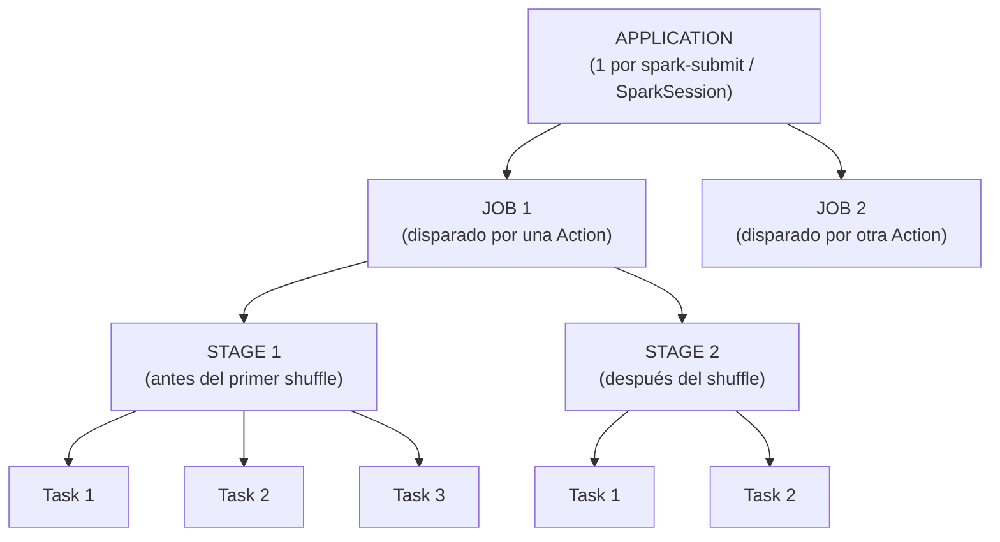
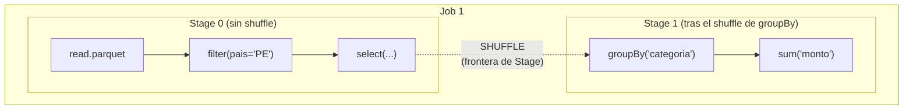
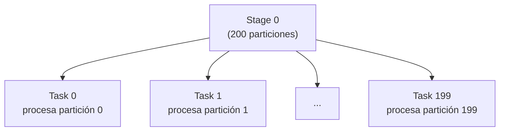
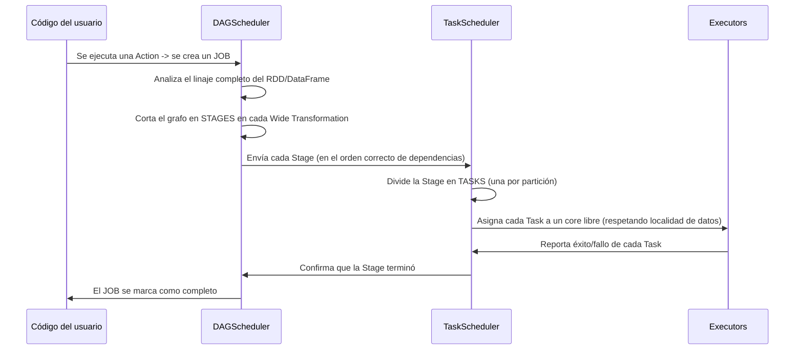
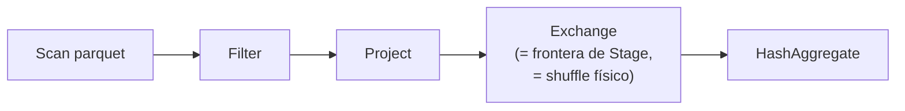

# Anatomía de una Aplicación Spark: Jobs, Stages y Tasks

## Índice

1. [La jerarquía completa](#1-la-jerarquía-completa)
2. [Aplicación (Application)](#2-aplicación-application)
3. [Job](#3-job)
4. [Stage](#4-stage)
5. [Task](#5-task)
6. [De código a Tasks: el recorrido completo paso a paso](#6-de-código-a-tasks-el-recorrido-completo-paso-a-paso)
7. [Ejemplo práctico con múltiples Jobs y Stages](#7-ejemplo-práctico-con-múltiples-jobs-y-stages)
8. [Leyendo el Spark UI para confirmar la teoría](#8-leyendo-el-spark-ui-para-confirmar-la-teoría)
9. [Paralelismo: cuántas Tasks corren a la vez](#9-paralelismo-cuántas-tasks-corren-a-la-vez)
10. [Errores comunes y cómo interpretarlos](#10-errores-comunes-y-cómo-interpretarlos)
11. [Resumen mental (cheatsheet)](#11-resumen-mental-cheatsheet)

---

## 1. La jerarquía completa

Toda aplicación Spark se descompone en una **jerarquía anidada de cuatro niveles**. Entender esta jerarquía es la base para leer el Spark UI, optimizar rendimiento y depurar fallos.



| Nivel | Disparado por | Unidad de... | Se divide por... |
|---|---|---|---|
| **Application** | `spark-submit` / creación de `SparkSession` | Todo el programa | — |
| **Job** | Cada **Action** (`.collect()`, `.count()`, `.write()`, `.show()`...) | Un cómputo completo necesario para resolver la Action | El DAGScheduler, al encontrar shuffles |
| **Stage** | Fronteras de **Wide Transformation** (shuffle) | Un conjunto de tareas que se pueden ejecutar sin comunicación entre particiones | Una Stage por cada "lado" del shuffle |
| **Task** | Una por **partición de datos** dentro de una Stage | La unidad mínima de trabajo real, ejecutada en un core de un Executor | El número de particiones del RDD/DataFrame |

---

## 2. Aplicación (Application)

Una **Application** es el programa Spark completo, desde que se crea la `SparkSession`/`SparkContext` hasta que se detiene (`spark.stop()`) o el proceso termina. Tiene un **`applicationId`** único asignado por el Cluster Manager.

```python
spark = SparkSession.builder.appName("PipelineDeVentas").getOrCreate()
print(spark.sparkContext.applicationId)
# ej: application_1699999999_0001  (formato típico de YARN)
```

Una misma Application puede contener **muchos Jobs** a lo largo de su ejecución — cada `.show()`, `.collect()` o `.write()` que llames genera un Job nuevo dentro de la misma Application.

---

## 3. Job

Un **Job** es el conjunto de cómputo necesario para satisfacer **una única Action**. Recordemos: Spark es de evaluación perezosa (*lazy*), así que **ninguna transformación por sí sola crea un Job** — solo las Actions lo disparan.

```python
df = spark.read.parquet("ventas.parquet")     # no crea Job (es solo metadata + lectura de esquema)
filtrado = df.filter(df.pais == "PE")         # no crea Job (transformación, lazy)
agregado = filtrado.groupBy("categoria").sum("monto")  # no crea Job (transformación, lazy)

agregado.show()        # <-- JOB 1: dispara todo el cómputo hasta aquí
agregado.count()        # <-- JOB 2: dispara el cómputo OTRA VEZ desde cero (a menos que haya cache)
agregado.write.parquet("salida/")  # <-- JOB 3: nuevamente, todo el cómputo se re-ejecuta
```

> **Lección de rendimiento clave**: si llamas a múltiples Actions sobre el mismo DataFrame sin cachearlo (`.cache()` / `.persist()`), Spark **recalculará todo el linaje desde el origen cada vez**, generando un Job independiente y repitiendo el trabajo. Esto es una de las razones más comunes de mal rendimiento en pipelines mal escritos.

```python
agregado.cache()          # ahora el resultado se materializa en memoria tras el primer Job
agregado.show()            # JOB 1: calcula y cachea
agregado.count()           # JOB 2: reutiliza el caché, mucho más rápido
```

Puedes ver el listado de Jobs de una Application en el Spark UI, pestaña **"Jobs"**, cada uno con su `Job Id`, la Action que lo originó, y su duración.

---

## 4. Stage

Un **Job se subdivide en Stages**. Una Stage es un conjunto de Tasks que pueden ejecutarse **sin necesidad de mover datos entre particiones** (sin shuffle) — es decir, todas las transformaciones dentro de una Stage son **Narrow Transformations** encadenadas.

Cada vez que el DAGScheduler encuentra una **Wide Transformation** (que exige reorganizar datos entre particiones — `groupBy`, `join`, `distinct`, `repartition`, `orderBy`...), **corta el grafo** y crea una **frontera de Stage**: la Stage actual debe terminar y escribir sus resultados (shuffle files) antes de que pueda comenzar la siguiente.



```python
resultado = (
    spark.read.parquet("ventas.parquet")   # Stage 0
    .filter("pais = 'PE'")                  # Stage 0 (narrow, se fusiona)
    .select("categoria", "monto")           # Stage 0 (narrow, se fusiona)
    .groupBy("categoria")                   # <-- FRONTERA: inicia Stage 1
    .sum("monto")
)
resultado.show()  # Job con 2 Stages
```

### 4.1 ¿Por qué importan las fronteras de Stage?

- Las Stages se ejecutan **en orden** (una Stage que depende de un shuffle no puede empezar hasta que la anterior termine de escribir sus archivos de shuffle a disco).
- Dentro de una misma Stage, en cambio, **todas las Tasks pueden correr en paralelo** de inmediato, sin esperarse entre sí.
- El **shuffle es costoso**: implica escritura a disco local, transferencia por red entre Executors, y lectura posterior. Minimizar el número de fronteras de Stage (es decir, minimizar Wide Transformations innecesarias) es una de las principales palancas de optimización en Spark.

### 4.2 Tipos de Stage

| Tipo | Descripción |
|---|---|
| **ShuffleMapStage** | Stage intermedia cuyo output es un conjunto de archivos de shuffle que alimentarán a la siguiente Stage |
| **ResultStage** | La Stage final de un Job, cuyo output va directamente al resultado de la Action (ej. escribir a disco, devolver al Driver) |

---

## 5. Task

Una **Task es la unidad de ejecución más pequeña** en Spark. **Cada Stage se divide en tantas Tasks como particiones tenga el RDD/DataFrame** sobre el que opera esa Stage. Cada Task ejecuta exactamente la misma secuencia de transformaciones, pero sobre **una partición de datos distinta**.

```python
df = spark.read.parquet("ventas.parquet")
print(df.rdd.getNumPartitions())   # ej: 200 -> esta Stage tendrá 200 Tasks
```



Cada Task se envía a **un core (slot) libre** de algún Executor. Si tienes 32 cores disponibles en el clúster y 200 Tasks, las Tasks se ejecutarán en **oleadas** (~7 oleadas de 32, la última incompleta con 8).

### 5.1 Qué contiene una Task

Una Task no solo lleva "el código a ejecutar" — lleva consigo:

- El **código serializado** de la función a aplicar (closure).
- Referencias a la partición de datos que debe procesar.
- Información de **localidad de datos** (para que el TaskScheduler intente asignarla a un Executor que ya tenga esos datos cerca, minimizando movimiento por red).

### 5.2 Reintentos de Tasks

Si una Task falla (por ejemplo, por un error transitorio de red o un nodo caído), Spark la **reintenta automáticamente** (por defecto, hasta 4 veces vía `spark.task.maxFailures`) en otro Executor, gracias a que el **linaje (lineage)** permite reconstruir esa partición desde el origen sin afectar al resto del Job.

---

## 6. De código a Tasks: el recorrido completo paso a paso



---

## 7. Ejemplo práctico con múltiples Jobs y Stages

```python
from pyspark.sql import SparkSession

spark = SparkSession.builder.appName("AnatomiaDemo").master("local[4]").getOrCreate()

ventas = spark.read.parquet("ventas.parquet")          # 100 particiones de origen

# --- Transformaciones narrow (se quedan en la misma Stage) ---
filtrado = ventas.filter(ventas.monto > 0).select("cliente_id", "categoria", "monto")

# --- Wide Transformation #1: nueva Stage ---
por_categoria = filtrado.groupBy("categoria").sum("monto")

# --- JOB 1 ---
por_categoria.show()
# Anatomía esperada:
#   Job 0
#     Stage 0: read + filter + select        (Tasks = 100, una por partición de origen)
#     Stage 1: groupBy + sum (post-shuffle)   (Tasks = 200, spark.sql.shuffle.partitions por defecto)

# --- Wide Transformation #2 sobre un DataFrame DISTINTO: otro Job ---
por_cliente = filtrado.groupBy("cliente_id").sum("monto")

# --- JOB 2 ---
por_cliente.write.mode("overwrite").parquet("salida_por_cliente/")
# Anatomía esperada:
#   Job 1
#     Stage 2: read + filter + select (SE REPITE, porque 'filtrado' no está cacheado)
#     Stage 3: groupBy(cliente_id) + sum (post-shuffle)
```

**Nota de optimización dentro del propio ejemplo**: como `filtrado` se reutiliza para dos agregaciones distintas sin cachear, Spark **recalcula el filtro y la lectura del parquet dos veces** (una vez por cada Job). Si agregáramos `filtrado.cache()` justo después de crearlo, el segundo Job reutilizaría los datos ya filtrados en memoria, ahorrándose la Stage 2 completa.

---

## 8. Leyendo el Spark UI para confirmar la teoría

En `http://<driver>:4040`:

- **Pestaña "Jobs"**: lista todos los Jobs de la Application, con su ID, la Action que los originó, duración, y el número de Stages que contiene cada uno.
- **Pestaña "Stages"**: al entrar a un Job, ves sus Stages en orden, cada una con:
  - Número de Tasks totales.
  - Tasks completadas/fallidas/en progreso.
  - Tiempo de shuffle read/write (si aplica).
  - Métricas de *skew* (si alguna Task tardó mucho más que las demás).
- **Pestaña "SQL / DataFrame"**: si usaste la API de DataFrames, verás el plan físico con las mismas fronteras de Stage marcadas visualmente como `Exchange` (el operador físico que representa un shuffle).



> **Tip práctico**: cada vez que veas un nodo `Exchange` en el plan físico (pestaña SQL del UI), ahí es exactamente donde termina una Stage y comienza la siguiente.

---

## 9. Paralelismo: cuántas Tasks corren a la vez

El número de Tasks **que corren simultáneamente** está limitado por el número total de cores disponibles en el clúster (suma de `executor.cores` de todos los Executors activos), **no** por el número total de Tasks de la Stage.

```python
# Configuración del clúster:
#   spark.executor.instances = 5
#   spark.executor.cores = 4
#   => 20 slots de ejecución paralela en total

df = spark.read.parquet("datos_grandes.parquet")
print(df.rdd.getNumPartitions())  # ej: 400 particiones

resultado = df.groupBy("region").count()
resultado.collect()
# Con 400 Tasks y solo 20 slots disponibles, Spark ejecuta en ~20 oleadas de 20 Tasks cada una
```

Esto conecta directamente con la configuración clave `spark.sql.shuffle.partitions` (200 por defecto), que determina cuántas Tasks (particiones) tendrá **cualquier Stage generada tras un shuffle** — un valor mal ajustado (demasiado alto para pocos datos, o demasiado bajo para muchos) es una causa común de ineficiencia.

```python
spark.conf.set("spark.sql.shuffle.partitions", 50)  # ajustar según volumen real de datos y cores disponibles
```

---

## 10. Errores comunes y cómo interpretarlos

| Observación en el Spark UI | Qué significa | Acción sugerida |
|---|---|---|
| Un Job tiene muchísimas más Stages de las esperadas | Hay Wide Transformations innecesarias o repetidas en el código (ej. varios `groupBy`/`join` que podrían combinarse) | Revisar el plan lógico (`.explain()`) y simplificar transformaciones |
| Una Task específica dentro de una Stage tarda 10x más que las demás | *Data skew*: esa partición tiene muchísimos más datos que las otras | Repartición explícita, "salting" de claves, o dejar que AQE optimice el skew join |
| El mismo cómputo se repite en Jobs distintos | Falta de `.cache()`/`.persist()` sobre un DataFrame reutilizado | Cachear el DataFrame intermedio si se usa en múltiples Actions |
| Stage con muy pocas Tasks pero datos enormes | Particionamiento insuficiente (pocas particiones muy grandes) | Aumentar `spark.sql.shuffle.partitions` o hacer `.repartition()` |
| Stage con miles de Tasks diminutas | Sobre-particionamiento (overhead de scheduling supera el beneficio del paralelismo) | Usar `.coalesce()` para reducir particiones sin shuffle completo |

---

## 11. Resumen mental (cheatsheet)

- **Application** → todo el programa. **Job** → una Action. **Stage** → un tramo sin shuffle. **Task** → una partición.
- Las **transformaciones son lazy**: no generan Jobs por sí solas, solo construyen el plan.
- Cada **Action genera un Job nuevo**, y si el DataFrame no está cacheado, **recalcula todo el linaje desde el origen**.
- Una **Wide Transformation** (shuffle) siempre crea una **nueva frontera de Stage**.
- El número de **Tasks de una Stage = número de particiones** del RDD/DataFrame en ese punto.
- El paralelismo real está limitado por el **número total de cores** del clúster, sin importar cuántas Tasks totales existan.
- En el plan físico (SQL tab), un nodo **`Exchange`** = shuffle = frontera de Stage.
