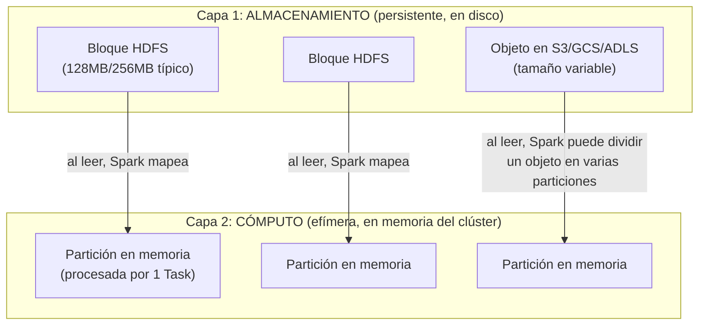
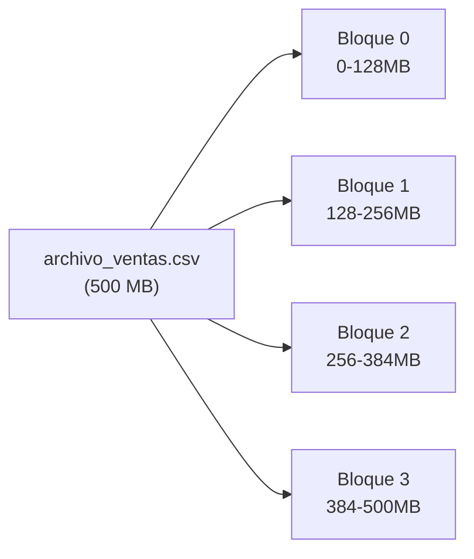
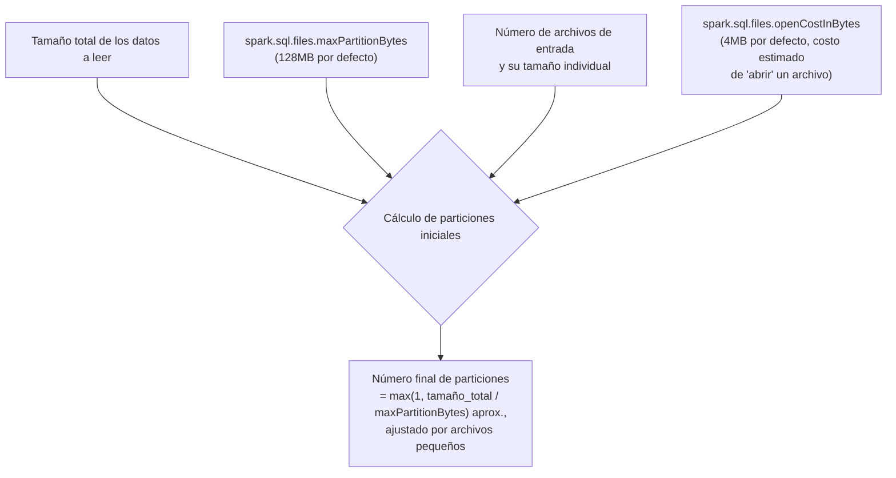
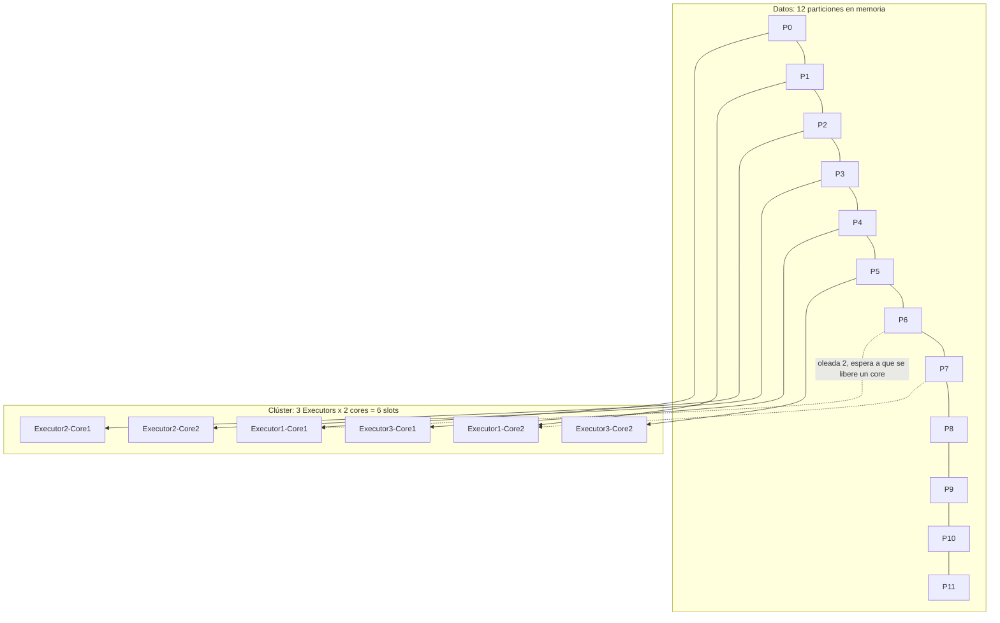
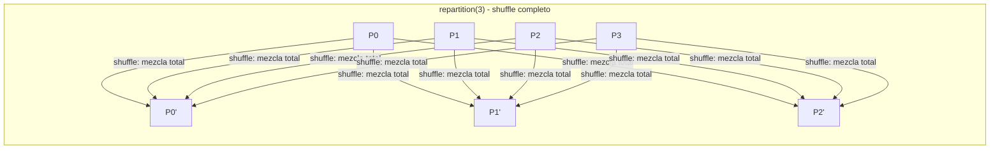
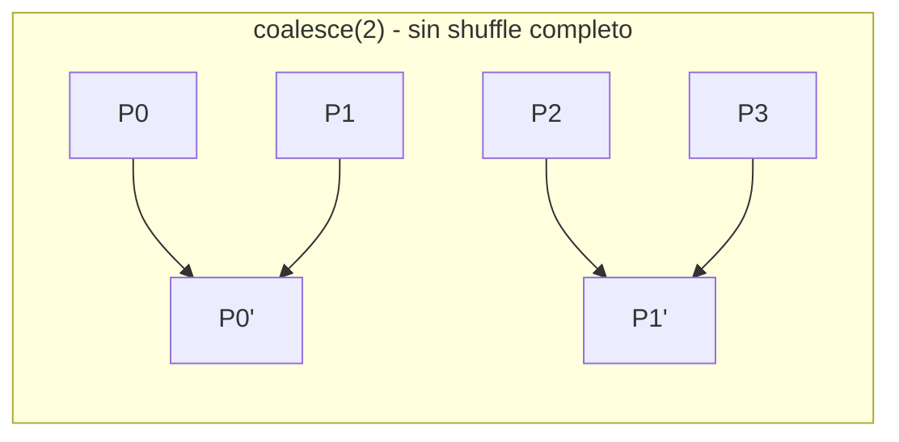

# Particionamiento Físico en Spark

## Índice

1. [Dos capas de partición que no debes confundir](#1-dos-capas-de-partición-que-no-debes-confundir)
2. [Bloques en almacenamiento: HDFS y Cloud Storage](#2-bloques-en-almacenamiento-hdfs-y-cloud-storage)
3. [Particiones en memoria: la unidad de trabajo de Spark](#3-particiones-en-memoria-la-unidad-de-trabajo-de-spark)
4. [El puente entre bloques y particiones: cómo Spark decide el particionamiento inicial](#4-el-puente-entre-bloques-y-particiones-cómo-spark-decide-el-particionamiento-inicial)
5. [Mapeo de Tasks a cores físicos](#5-mapeo-de-tasks-a-cores-físicos)
6. [Controlando el particionamiento manualmente](#6-controlando-el-particionamiento-manualmente)
7. [Particionamiento en escritura: `partitionBy` en disco](#7-particionamiento-en-escritura-partitionby-en-disco)
8. [Localidad de datos (Data Locality)](#8-localidad-de-datos-data-locality)
9. [Ejemplo end-to-end: siguiendo un archivo desde el disco hasta el core](#9-ejemplo-end-to-end-siguiendo-un-archivo-desde-el-disco-hasta-el-core)
10. [Errores comunes y diagnóstico](#10-errores-comunes-y-diagnóstico)
11. [Resumen mental (cheatsheet)](#11-resumen-mental-cheatsheet)

---

## 1. Dos capas de partición que no debes confundir

Uno de los puntos donde más se confunden los que empiezan con Spark es que existen **dos conceptos de "partición" completamente distintos**, en dos capas diferentes del sistema:



| | Bloques (almacenamiento) | Particiones (memoria/cómputo) |
|---|---|---|
| **Dónde viven** | Disco distribuido (HDFS, S3, GCS, ADLS) | RAM de los Executors, durante la ejecución del Job |
| **Quién los define** | El sistema de archivos distribuido, al momento de escribir los datos | Spark, al leer los datos o tras un shuffle |
| **Tamaño típico** | Fijo (128MB en HDFS por defecto) | Variable, gobernado por configuraciones de Spark |
| **Duración** | Persistente | Efímera — vive solo durante la ejecución del Job |
| **Se puede cambiar** | Reescribiendo el dataset físicamente | En caliente, con `.repartition()` / `.coalesce()` |

Este documento cubre ambas capas y, sobre todo, **cómo Spark traduce una a la otra**.

---

## 2. Bloques en almacenamiento: HDFS y Cloud Storage

### 2.1 HDFS: el modelo clásico de bloques fijos

En HDFS, cada archivo se divide físicamente en **bloques de tamaño fijo** (por defecto 128MB, configurable con `dfs.blocksize`) y estos bloques se replican (normalmente x3) entre distintos DataNodes para tolerancia a fallos.



Cuando Spark lee este archivo, **por defecto crea una partición en memoria por cada bloque de entrada** (mecanismo heredado de `InputFormat` de Hadoop), de modo que un archivo de 500MB dividido en 4 bloques de HDFS produce inicialmente **4 particiones en memoria**.

```python
df = spark.read.csv("hdfs://namenode/data/ventas.csv")
print(df.rdd.getNumPartitions())
# ~4, si el archivo pesa ~500MB con bloques de 128MB
```

### 2.2 Cloud Storage: S3, GCS, ADLS — sin bloques reales

Aquí está una diferencia estructural importante: **S3, GCS y Azure Data Lake Storage NO son sistemas de archivos con bloques fijos como HDFS**. Son almacenes de objetos (*object stores*) planos: un archivo es un objeto único, sin subdivisión física real en el almacenamiento.

Spark **simula** el comportamiento de "bloques" dividiendo lógicamente el archivo en fragmentos según la configuración `spark.sql.files.maxPartitionBytes` (128MB por defecto, el mismo valor que el bloque típico de HDFS, por convención heredada).

```python
spark.conf.get("spark.sql.files.maxPartitionBytes")
# '134217728' bytes = 128 MB

df = spark.read.parquet("s3a://mi-bucket/ventas/")
# Si el total de datos en esa ruta pesa 1GB y maxPartitionBytes = 128MB,
# Spark generará aproximadamente 8 particiones lógicas
```

**Consecuencia práctica importante**: en cloud storage, si tienes **muchos archivos pequeños** (el clásico "small files problem" — ej. miles de archivos de 1MB cada uno provenientes de streaming o micro-batches), Spark generará **una partición por archivo pequeño como mínimo**, sin importar `maxPartitionBytes`, generando overhead masivo de scheduling con Tasks diminutas.

```python
# Mitigación típica del "small files problem":
spark.conf.set("spark.sql.files.openCostInBytes", 4194304)  # ayuda a agrupar archivos pequeños en una misma partición
```

---

## 3. Particiones en memoria: la unidad de trabajo de Spark

Una **partición en memoria** es un **subconjunto lógico y contiguo de un RDD/DataFrame** que:

- Es procesado íntegramente por **una sola Task**.
- Vive en la memoria (o spill a disco) de **un único Executor** a la vez.
- Es la unidad atómica de paralelismo: no se puede dividir el trabajo dentro de una partición entre varios cores.

```python
df = spark.read.parquet("ventas.parquet")
print(f"Número de particiones: {df.rdd.getNumPartitions()}")

# Ver la distribución de filas por partición (útil para detectar skew)
from pyspark.sql.functions import spark_partition_id

df.withColumn("particion", spark_partition_id()) \
  .groupBy("particion") \
  .count() \
  .orderBy("particion") \
  .show(50)
```

Salida ilustrativa (evidenciando un caso de **skew**, donde una partición concentra muchísimos más registros):

```
+---------+-------+
|particion|  count|
+---------+-------+
|        0| 120000|
|        1| 118500|
|        2| 900000|   <-- partición desbalanceada (skew)
|        3| 121200|
+---------+-------+
```

---

## 4. El puente entre bloques y particiones: cómo Spark decide el particionamiento inicial

El número de particiones al leer un dataset depende de una combinación de factores:



**Regla práctica aproximada** (simplificada; el algoritmo real de Spark, `FilePartition.maxSplitBytes`, es algo más sofisticado):

```
particiones ≈ tamaño_total_de_datos / spark.sql.files.maxPartitionBytes
```

```python
# Ejemplo numérico:
# Dataset total: 10 GB en Parquet, sin cambios en config por defecto
# maxPartitionBytes = 128 MB
# 10240 MB / 128 MB ≈ 80 particiones iniciales

df = spark.read.parquet("s3a://bucket/dataset_10gb/")
print(df.rdd.getNumPartitions())  # ~80
```

> **Nota sobre RDDs vs DataFrames**: para RDDs creados con `sc.parallelize(coleccion, numParticiones)`, tú controlas el número de particiones explícitamente. Para DataFrames leídos de archivos, es Spark quien decide el número inicial según las reglas de arriba — pero siempre puedes sobreescribirlo después con `.repartition()`.

---

## 5. Mapeo de Tasks a cores físicos

Una vez que tienes N particiones en memoria, cada una se convierte en **exactamente una Task**, y cada Task se ejecuta en **un core (slot)** de algún Executor.



Con **12 particiones y 6 slots**, el trabajo se completa en **2 oleadas** (*waves*) de ejecución. Esto tiene una implicación directa de rendimiento: si una sola partición de la primera oleada es mucho más pesada que las demás (skew), **retrasa el inicio de toda la segunda oleada**, aunque el resto de cores estén libres.

### 5.1 La fórmula práctica de paralelismo total

```
Paralelismo máximo simultáneo = spark.executor.instances × spark.executor.cores
```

```python
spark.conf.set("spark.executor.instances", "10")
spark.conf.set("spark.executor.cores", "5")
# Paralelismo máximo = 10 x 5 = 50 Tasks corriendo simultáneamente
```

**Regla de tuning ampliamente usada**: intenta que el número de particiones sea **2 a 4 veces** el número total de cores disponibles. Esto da margen para que, si alguna Task termina antes (por variabilidad natural), otras particiones "rellenen" ese core inmediatamente, evitando que el clúster quede ocioso esperando a la Task más lenta de la última oleada.

```python
total_cores = 50
particiones_objetivo = total_cores * 3   # ~150
df = df.repartition(particiones_objetivo)
```

---

## 6. Controlando el particionamiento manualmente

### 6.1 `repartition()` — shuffle completo, redistribución uniforme

```python
df_repartido = df.repartition(200)                       # 200 particiones, hash aleatorio
df_repartido_columna = df.repartition(200, "pais")        # 200 particiones, agrupadas por 'pais' (mismo pais -> misma partición)
```

- Implica un **shuffle completo** (mueve datos entre todos los Executors).
- Bueno para **aumentar** el número de particiones o para **balancear** una distribución desigual.
- Costoso: siempre escribe y lee vía red/disco.

### 6.2 `coalesce()` — reducir particiones sin shuffle completo

```python
df_reducido = df.coalesce(10)   # reduce de N a 10 particiones
```

- Combina particiones existentes **fusionándolas dentro del mismo Executor** cuando es posible, evitando un shuffle completo.
- Solo sirve para **reducir** el número de particiones (no para aumentar).
- Mucho más barato que `repartition()`, pero puede generar particiones desbalanceadas si las particiones originales ya eran desiguales.





### 6.3 Tabla de decisión

| Necesitas... | Usa | Costo |
|---|---|---|
| Aumentar particiones | `repartition(n)` | Alto (shuffle completo) |
| Reducir particiones tras un filtro agresivo | `coalesce(n)` | Bajo (sin shuffle, si es posible) |
| Balancear una distribución con skew | `repartition(n)` o `repartition(n, columna)` | Alto, pero necesario |
| Reducir particiones antes de escribir a disco (evitar muchos archivos pequeños de salida) | `coalesce(n)` | Bajo |

---

## 7. Particionamiento en escritura: `partitionBy` en disco

Distinto de `.repartition()` (que actúa sobre las particiones **en memoria** durante el cómputo), `.partitionBy()` en un `DataFrameWriter` organiza los **archivos físicos de salida** en subdirectorios según el valor de una o más columnas — el patrón clásico de **particionamiento Hive-style**.

```python
(
    df.write
    .partitionBy("anio", "mes")
    .parquet("s3a://bucket/ventas_particionadas/")
)
```

Esto genera una estructura de directorios como:

```
ventas_particionadas/
├── anio=2025/
│   ├── mes=11/
│   │   └── part-00000.parquet
│   └── mes=12/
│       └── part-00000.parquet
└── anio=2026/
    └── mes=01/
        └── part-00000.parquet
```

**Beneficio clave**: al leer después con un filtro sobre esas columnas, Spark puede aplicar **partition pruning** — ignorar directorios enteros sin siquiera abrirlos — acelerando drásticamente consultas selectivas.

```python
# Gracias al partitionBy anterior, este filtro NO necesita leer todo el dataset:
spark.read.parquet("s3a://bucket/ventas_particionadas/") \
    .filter("anio = 2026 AND mes = 1") \
    .show()
```

> **Cuidado con la cardinalidad**: particionar por una columna de alta cardinalidad (ej. `cliente_id` con millones de valores únicos) genera el "small files problem" al escribir — miles de directorios con archivos diminutos. Reserva `partitionBy` para columnas de baja-media cardinalidad usadas frecuentemente en filtros (fecha, país, categoría).

---

## 8. Localidad de datos (Data Locality)

Cuando el TaskScheduler asigna una Task a un Executor, intenta respetar niveles de **localidad de datos**, de mejor a peor:

| Nivel | Significado |
|---|---|
| `PROCESS_LOCAL` | Los datos ya están en la memoria del mismo proceso Executor (ej. datos cacheados) |
| `NODE_LOCAL` | Los datos están en el mismo nodo físico (ej. mismo DataNode de HDFS), aunque en otro proceso |
| `RACK_LOCAL` | Los datos están en un nodo distinto pero en el mismo rack de red |
| `ANY` | Los datos deben transferirse por red sin ninguna afinidad especial |

```python
spark.conf.get("spark.locality.wait")  # tiempo que Spark espera antes de "degradar" el nivel de localidad, default 3s
```

En **cloud storage (S3, GCS)**, el concepto de `NODE_LOCAL`/`RACK_LOCAL` pierde relevancia real porque el almacenamiento está desacoplado del cómputo (los Executors no corren físicamente "sobre" los datos como en HDFS) — todo el acceso a datos es efectivamente a través de la red interna del proveedor cloud.

---

## 9. Ejemplo end-to-end: siguiendo un archivo desde el disco hasta el core

```python
from pyspark.sql import SparkSession

spark = (
    SparkSession.builder
    .appName("ParticionamientoFisico")
    .config("spark.executor.instances", "4")
    .config("spark.executor.cores", "4")          # 16 slots totales
    .config("spark.sql.files.maxPartitionBytes", 64 * 1024 * 1024)  # forzar particiones de 64MB
    .getOrCreate()
)

# 1. LECTURA: archivo de 1GB en S3 -> Spark calcula ~16 particiones lógicas (1GB / 64MB)
df = spark.read.parquet("s3a://bucket/dataset_1gb/")
print("Particiones tras lectura:", df.rdd.getNumPartitions())  # ~16

# 2. TRANSFORMACIÓN NARROW: no cambia el número de particiones
filtrado = df.filter(df.activo == True)
print("Particiones tras filter:", filtrado.rdd.getNumPartitions())  # sigue ~16

# 3. WIDE TRANSFORMATION: el número de particiones cambia a shuffle.partitions
agregado = filtrado.groupBy("categoria").count()
print("Particiones tras groupBy:", agregado.rdd.getNumPartitions())  # 200 por defecto (spark.sql.shuffle.partitions)

# 4. CONTROL MANUAL antes de escribir: evitar 200 archivos pequeños de salida
agregado_final = agregado.coalesce(4)
print("Particiones tras coalesce:", agregado_final.rdd.getNumPartitions())  # 4

# 5. ESCRITURA: 4 particiones -> 4 archivos de salida como máximo
agregado_final.write.mode("overwrite").parquet("s3a://bucket/resultado/")

# Con 16 slots disponibles y solo 4 particiones en el paso final,
# 12 cores quedarían ociosos en esa última Stage -> trade-off consciente
# entre "menos archivos de salida" vs. "menos paralelismo en el último paso"
```

---

## 10. Errores comunes y diagnóstico

| Síntoma | Causa relacionada al particionamiento físico | Solución |
|---|---|---|
| Miles de Tasks diminutas, overhead de scheduling enorme | "Small files problem": muchos archivos pequeños de entrada | Compactar archivos de origen, o subir `spark.sql.files.openCostInBytes` |
| Pocas Tasks pero cada una tarda muchísimo y hace *spill* a disco | Particiones demasiado grandes (pocas particiones para mucho volumen) | `.repartition()` con más particiones, o bajar `maxPartitionBytes` |
| Cientos de archivos diminutos al escribir a disco | Demasiadas particiones en memoria al momento del `.write()` | `.coalesce(n)` antes de escribir |
| Un filtro por fecha sigue escaneando todo el dataset | No se usó `partitionBy` sobre la columna de fecha al escribir, o el filtro no es "sargable" | Reescribir el dataset con `partitionBy("fecha")`, filtrar con predicados directos sobre esa columna |
| Algunas Tasks tardan 10x más en la misma Stage | Skew: partición con muchos más datos que las demás | `repartition()` con salting de claves, o dejar que AQE (`spark.sql.adaptive.skewJoin.enabled`) lo resuelva automáticamente |

---

## 11. Resumen mental (cheatsheet)

- **Bloques** (HDFS/Cloud) viven en **disco persistente**; **particiones** viven en **memoria durante la ejecución** del Job.
- HDFS tiene bloques físicos reales (128MB típico); S3/GCS/ADLS son *object stores* sin bloques reales — Spark **simula** la división vía `spark.sql.files.maxPartitionBytes`.
- El número inicial de particiones al leer ≈ tamaño total de datos / `maxPartitionBytes`, ajustado por número y tamaño de archivos individuales.
- **1 partición = 1 Task**, y cada Task corre en **1 core** de un Executor.
- Paralelismo máximo simultáneo = `spark.executor.instances × spark.executor.cores`.
- `repartition()` = shuffle completo, sirve para aumentar particiones o balancear skew. `coalesce()` = fusión barata sin shuffle completo, solo para reducir.
- `.partitionBy()` en escritura organiza **archivos en disco** por columnas (Hive-style), habilitando *partition pruning* en lecturas futuras — no confundir con `.repartition()`, que actúa en memoria.
- La **localidad de datos** (`PROCESS_LOCAL` → `ANY`) pierde relevancia en almacenamiento cloud desacoplado del cómputo.
