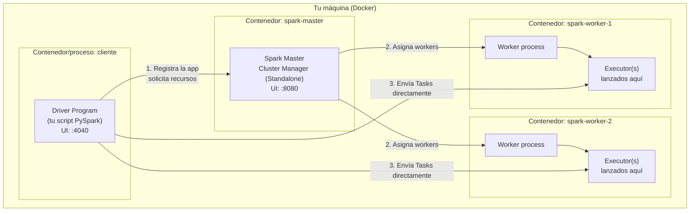
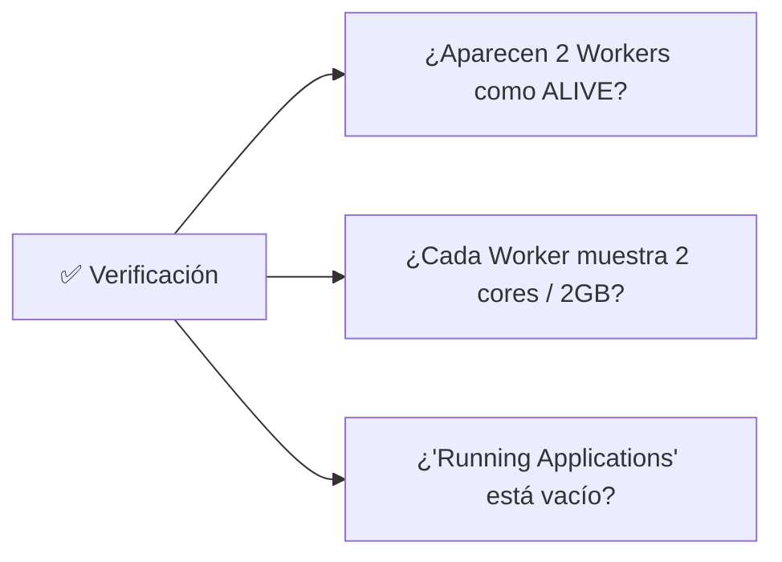
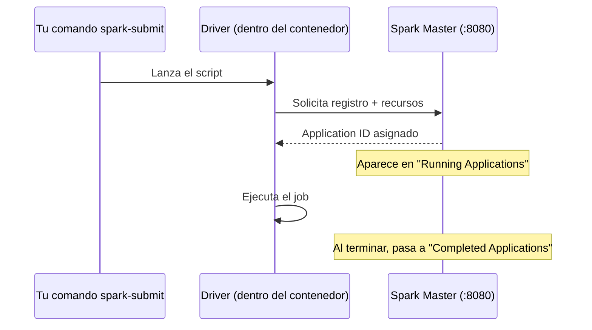
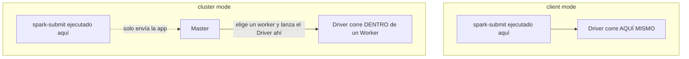

# Laboratorio de Pruebas: Arquitectura Topológica y Computacional de Spark

> Objetivo: montar un clúster Spark **Standalone multi-nodo real** (usando Docker) para poder observar en vivo — no en teoría — todo lo cubierto en la Sección 1: Driver, Cluster Manager, Executors, Jobs/Stages/Tasks y Particionamiento Físico.

## Índice

1. [Por qué este diseño de laboratorio](#1-por-qué-este-diseño-de-laboratorio)
2. [Arquitectura del laboratorio](#2-arquitectura-del-laboratorio)
3. [Prerrequisitos](#3-prerrequisitos)
4. [Paso 1: Estructura de carpetas del proyecto](#4-paso-1-estructura-de-carpetas-del-proyecto)
5. [Paso 2: `docker-compose.yml` del clúster Standalone](#5-paso-2-docker-composeyml-del-clúster-standalone)
6. [Paso 3: Levantar el clúster](#6-paso-3-levantar-el-clúster)
7. [✅ Comprobación 1 — El Cluster Manager está vivo](#7--comprobación-1--el-cluster-manager-está-vivo)
8. [Paso 4: Generar datos de prueba](#8-paso-4-generar-datos-de-prueba)
9. [✅ Comprobación 2 — El Driver se conecta y negocia recursos](#9--comprobación-2--el-driver-se-conecta-y-negocia-recursos)
10. [✅ Comprobación 3 — Los Executors tienen la forma que configuraste](#10--comprobación-3--los-executors-tienen-la-forma-que-configuraste)
11. [✅ Comprobación 4 — Client mode vs Cluster mode](#11--comprobación-4--client-mode-vs-cluster-mode)
12. [✅ Comprobación 5 — Jobs, Stages y Tasks visibles en el DAG](#12--comprobación-5--jobs-stages-y-tasks-visibles-en-el-dag)
13. [✅ Comprobación 6 — Particionamiento físico end-to-end](#13--comprobación-6--particionamiento-físico-end-to-end)
14. [Laboratorio opcional avanzado: simulando Cloud Storage con MinIO](#14-laboratorio-opcional-avanzado-simulando-cloud-storage-con-minio)
15. [Laboratorio opcional avanzado: YARN y Kubernetes (mención)](#15-laboratorio-opcional-avanzado-yarn-y-kubernetes-mención)
16. [Troubleshooting](#16-troubleshooting)
17. [Checklist final de validación](#17-checklist-final-de-validación)
18. [Apagar y limpiar el laboratorio](#18-apagar-y-limpiar-el-laboratorio)

---

## 1. Por qué este diseño de laboratorio

Con `master("local[*]")` (lo que usa casi todo el mundo para "probar Spark rápido") **el Driver y los Executors viven en el mismo proceso JVM**. Esto es cómodo pero **oculta exactamente lo que queremos observar**: no hay negociación real con un Cluster Manager, no hay Executors como procesos separados, y no puedes ver comunicación de red Driver↔Executor.

Por eso este laboratorio usa **Spark Standalone con Docker Compose**: un contenedor Master + varios contenedores Worker, cada uno lanzando sus propios procesos Executor reales, todo en tu máquina local pero como **procesos separados y observables**. Es la forma más simple de tener una arquitectura Master-Worker *de verdad* sin necesitar un clúster físico ni una cuenta cloud.

---

## 2. Arquitectura del laboratorio



Con esto podrás:
- Ver el **Cluster Manager** (Spark Master UI) como un servicio real, separado del Driver.
- Ver **Executors** como procesos independientes en contenedores distintos, con su memoria y cores configurados.
- Alternar entre `--deploy-mode client` y `--deploy-mode cluster`.
- Observar el **Spark UI del Driver** (`:4040`) con el DAG real de Jobs/Stages/Tasks.
- Practicar particionamiento físico con archivos reales de distintos tamaños.

---

## 3. Prerrequisitos

| Herramienta | Verificación | Instalación si falta |
|---|---|---|
| Docker | `docker --version` | https://docs.docker.com/get-docker/ |
| Docker Compose | `docker compose version` | Incluido en Docker Desktop moderno |
| Al menos 4GB de RAM libres para Docker | Revisar en Docker Desktop → Settings → Resources | Ajustar el límite de memoria de Docker |
| Python 3.9+ (solo si enviarás jobs desde tu host, no desde un contenedor) | `python3 --version` | https://www.python.org/downloads/ |

```bash
# Comprobación rápida de todo lo anterior en una sola línea
docker --version && docker compose version && python3 --version
```

Salida esperada (versiones exactas pueden variar):
```
Docker version 27.x.x, build ...
Docker Compose version v2.x.x
Python 3.11.x
```

---

## 4. Paso 1: Estructura de carpetas del proyecto

```bash
mkdir -p lab-spark-arquitectura/{apps,data,output}
cd lab-spark-arquitectura
```

Estructura resultante:

```
lab-spark-arquitectura/
├── docker-compose.yml
├── apps/            # aquí irán tus scripts .py que se envían al clúster
├── data/            # datos de entrada generados para las pruebas
└── output/          # salidas de los jobs (útil para inspeccionar particionamiento)
```

---

## 5. Paso 2: `docker-compose.yml` del clúster Standalone

Crea el archivo `docker-compose.yml` en la raíz del proyecto con el siguiente contenido. Usamos la imagen oficial mantenida `bitnami/spark`, que trae Spark preconfigurado y lista para Standalone.

```yaml
version: "3.8"

services:
  spark-master:
    image: bitnami/spark:3.5
    container_name: spark-master
    environment:
      - SPARK_MODE=master
      - SPARK_RPC_AUTHENTICATION_ENABLED=no
      - SPARK_RPC_ENCRYPTION_ENABLED=no
      - SPARK_LOCAL_STORAGE_ENCRYPTION_ENABLED=no
      - SPARK_SSL_ENABLED=no
    ports:
      - "8080:8080"   # UI del Cluster Manager (Spark Master)
      - "7077:7077"   # Puerto RPC del Master (para spark-submit --master spark://...)
      - "4040:4040"   # UI del Driver, cuando el driver corre en este contenedor
    volumes:
      - ./apps:/opt/apps
      - ./data:/opt/data
      - ./output:/opt/output

  spark-worker-1:
    image: bitnami/spark:3.5
    container_name: spark-worker-1
    environment:
      - SPARK_MODE=worker
      - SPARK_MASTER_URL=spark://spark-master:7077
      - SPARK_WORKER_CORES=2
      - SPARK_WORKER_MEMORY=2G
      - SPARK_RPC_AUTHENTICATION_ENABLED=no
      - SPARK_RPC_ENCRYPTION_ENABLED=no
      - SPARK_LOCAL_STORAGE_ENCRYPTION_ENABLED=no
      - SPARK_SSL_ENABLED=no
    depends_on:
      - spark-master
    ports:
      - "8081:8081"   # UI de este Worker
    volumes:
      - ./apps:/opt/apps
      - ./data:/opt/data
      - ./output:/opt/output

  spark-worker-2:
    image: bitnami/spark:3.5
    container_name: spark-worker-2
    environment:
      - SPARK_MODE=worker
      - SPARK_MASTER_URL=spark://spark-master:7077
      - SPARK_WORKER_CORES=2
      - SPARK_WORKER_MEMORY=2G
      - SPARK_RPC_AUTHENTICATION_ENABLED=no
      - SPARK_RPC_ENCRYPTION_ENABLED=no
      - SPARK_LOCAL_STORAGE_ENCRYPTION_ENABLED=no
      - SPARK_SSL_ENABLED=no
    depends_on:
      - spark-master
    ports:
      - "8082:8081"   # UI de este Worker (mapeado a 8082 en el host para no chocar con worker-1)
    volumes:
      - ./apps:/opt/apps
      - ./data:/opt/data
      - ./output:/opt/output
```

> **Nota didáctica**: cada Worker está configurado con `SPARK_WORKER_CORES=2` y `SPARK_WORKER_MEMORY=2G`. Con 2 Workers, esto nos da un **total de 4 cores y 4GB** disponibles para Executors en todo el clúster — un tamaño perfecto para observar el comportamiento de particionamiento y paralelismo sin saturar tu máquina local.

---

## 6. Paso 3: Levantar el clúster

```bash
docker compose up -d
```

```bash
# Verifica que los 3 contenedores estén corriendo
docker compose ps
```

Salida esperada:
```
NAME              IMAGE               STATUS
spark-master      bitnami/spark:3.5   Up
spark-worker-1    bitnami/spark:3.5   Up
spark-worker-2    bitnami/spark:3.5   Up
```

---

## 7. ✅ Comprobación 1 — El Cluster Manager está vivo

Abre en tu navegador: **http://localhost:8080**

Deberías ver la **UI del Spark Master (Cluster Manager en modo Standalone)**, confirmando:

- **Workers (2)**: la sección "Workers" debe listar `spark-worker-1` y `spark-worker-2`, cada uno con estado `ALIVE`.
- Cada worker debe reportar **2 Cores** y **2.0 GB Memory** disponibles (coincidiendo con tu `docker-compose.yml`).
- **Running Applications**: vacío por ahora, porque aún no hemos enviado ningún Driver.



Si algo falla aquí, **detente**: nada de lo siguiente funcionará hasta resolver esto. Ver la sección [Troubleshooting](#16-troubleshooting).

---

## 8. Paso 4: Generar datos de prueba

Crea `apps/generar_datos.py`. Este script genera datasets de distintos tamaños para poder practicar particionamiento físico más adelante (incluyendo un caso deliberado de "muchos archivos pequeños").

```python
# apps/generar_datos.py
from pyspark.sql import SparkSession
from pyspark.sql.functions import rand, expr

spark = (
    SparkSession.builder
    .appName("GenerarDatosLab")
    .master("spark://spark-master:7077")
    .getOrCreate()
)

# Dataset mediano (~50MB), en pocas particiones grandes -> bueno para practicar repartition/coalesce
df_ventas = (
    spark.range(0, 3_000_000)
    .withColumn("cliente_id", (rand() * 10000).cast("int"))
    .withColumn("categoria", expr("element_at(array('electro','hogar','moda','deporte'), (rand()*4 + 1)::int)"))
    .withColumn("pais", expr("element_at(array('PE','CO','CL','MX'), (rand()*4 + 1)::int)"))
    .withColumn("monto", rand() * 500)
)

df_ventas.write.mode("overwrite").parquet("/opt/data/ventas_normal/")
print("Escrito: /opt/data/ventas_normal/")

# Dataset con SKEW deliberado: 90% de las filas con el mismo cliente_id
df_skew = (
    spark.range(0, 1_000_000)
    .withColumn(
        "cliente_id",
        expr("CASE WHEN rand() < 0.9 THEN 1 ELSE cast(rand()*10000 as int) END")
    )
    .withColumn("monto", rand() * 500)
)
df_skew.write.mode("overwrite").parquet("/opt/data/ventas_skew/")
print("Escrito: /opt/data/ventas_skew/ (con skew deliberado en cliente_id=1)")

# Dataset de "muchos archivos pequeños" (small files problem)
df_pequeno = spark.range(0, 1000).withColumn("valor", rand())
df_pequeno.repartition(200).write.mode("overwrite").parquet("/opt/data/muchos_archivos_pequenos/")
print("Escrito: /opt/data/muchos_archivos_pequenos/ (200 archivos diminutos)")

spark.stop()
```

Ejecútalo enviándolo al clúster desde el contenedor master (así no necesitas instalar PySpark en tu host):

```bash
docker exec -it spark-master spark-submit \
  --master spark://spark-master:7077 \
  --deploy-mode client \
  /opt/apps/generar_datos.py
```

Verifica que los datos se generaron:

```bash
ls -la data/ventas_normal/ data/ventas_skew/ data/muchos_archivos_pequenos/
```

Deberías ver archivos `.parquet` dentro de cada carpeta. En `muchos_archivos_pequenos/` deberías contar **~200 archivos** (uno por partición forzada con `.repartition(200)`).

---

## 9. ✅ Comprobación 2 — El Driver se conecta y negocia recursos

Mientras un job está corriendo (por ejemplo, vuelve a lanzar el script anterior o cualquiera de los siguientes), revisa:

**a) La UI del Driver**, en `http://localhost:4040` (ya expusimos el puerto 4040 desde `spark-master` en el `docker-compose.yml`):

- Pestaña **"Executors"**: debe listar el Driver + los Executors activos.
- El campo `applicationId` visible arriba a la izquierda confirma que el Driver **sí obtuvo un ID del Cluster Manager**.

**b) La UI del Master** (`:8080`), sección **"Running Applications"**: mientras el job corre, debe aparecer tu aplicación (`GenerarDatosLab`) con estado `RUNNING`, y al terminar debe pasar a la sección **"Completed Applications"** con estado `FINISHED`.



**Checklist de esta comprobación:**
- [ ] `applicationId` visible en la UI del Driver (`:4040`)
- [ ] La app aparece como `RUNNING` en la UI del Master mientras corre
- [ ] La app pasa a `FINISHED` en "Completed Applications" al terminar

---

## 10. ✅ Comprobación 3 — Los Executors tienen la forma que configuraste

Crea `apps/verificar_executors.py`:

```python
# apps/verificar_executors.py
from pyspark.sql import SparkSession

spark = (
    SparkSession.builder
    .appName("VerificarExecutors")
    .master("spark://spark-master:7077")
    .config("spark.executor.instances", "2")   # uno por worker
    .config("spark.executor.cores", "2")
    .config("spark.executor.memory", "1g")
    .getOrCreate()
)

sc = spark.sparkContext
print(f"Application ID: {sc.applicationId}")
print(f"Default parallelism (= total de cores de executors): {sc.defaultParallelism}")

# Forzamos actividad para que los executors se registren activamente
spark.range(0, 1000000).count()

input("Presiona Enter para mantener la app viva y revisar la UI...")  # deja la app corriendo
spark.stop()
```

```bash
docker exec -it spark-master spark-submit \
  --master spark://spark-master:7077 \
  /opt/apps/verificar_executors.py
```

**Mientras el script espera el `input()`** (a propósito, para darte tiempo de inspeccionar), ve a `http://localhost:4040` → pestaña **"Executors"**.

**Debes confirmar:**

| Campo esperado | Valor esperado | Por qué |
|---|---|---|
| Número de Executors (sin contar el Driver) | 2 | `spark.executor.instances = 2` |
| Cores por Executor | 2 | `spark.executor.cores = 2` |
| Memoria por Executor | ~1024 MB (menos el overhead reservado) | `spark.executor.memory = 1g` |
| `defaultParallelism` impreso en consola | 4 | 2 executors × 2 cores |

Si `defaultParallelism` no coincide, revisa que ambos workers estén `ALIVE` en `:8080` y que tengan suficientes cores/memoria libres (no ocupados por otro job anterior que no cerraste).

---

## 11. ✅ Comprobación 4 — Client mode vs Cluster mode

En Standalone también podemos alternar el `--deploy-mode` para observar la diferencia práctica:

```bash
# CLIENT MODE: el Driver corre en el proceso donde ejecutas spark-submit (el contenedor spark-master aquí)
docker exec -it spark-master spark-submit \
  --master spark://spark-master:7077 \
  --deploy-mode client \
  /opt/apps/verificar_executors.py
```

```bash
# CLUSTER MODE: el Driver es enviado y corre DENTRO de uno de los Workers
docker exec -it spark-master spark-submit \
  --master spark://spark-master:7077 \
  --deploy-mode cluster \
  /opt/apps/verificar_executors.py
```

**Comprobación**: en `--deploy-mode cluster`, revisa la UI del Master (`:8080`) → sección **"Drivers"** (aparece solo en modo cluster). Debe listar tu Driver con un `Driver ID` propio y mostrar **en qué Worker está corriendo** — confirmando que el Driver ya no vive en tu terminal/contenedor cliente, sino dentro del clúster.



> Nota: en modo `cluster`, el `input()` de tu script no podrá interactuar contigo desde la terminal, así que para esta prueba puedes quitar temporalmente esa línea o simplemente observar los logs con `docker exec -it spark-worker-1 ls /opt/bitnami/spark/work/` para ver el directorio de trabajo del Driver que se ejecutó ahí.

---

## 12. ✅ Comprobación 5 — Jobs, Stages y Tasks visibles en el DAG

Crea `apps/verificar_jobs_stages.py`, diseñado deliberadamente para producir **2 Jobs**, cada uno con **2 Stages** (una antes y otra después de un shuffle):

```python
# apps/verificar_jobs_stages.py
from pyspark.sql import SparkSession
import time

spark = (
    SparkSession.builder
    .appName("VerificarJobsStagesTasks")
    .master("spark://spark-master:7077")
    .config("spark.executor.instances", "2")
    .config("spark.executor.cores", "2")
    .config("spark.sql.shuffle.partitions", "8")  # bajamos de 200 a 8 para que sea fácil de contar en la UI
    .getOrCreate()
)

df = spark.read.parquet("/opt/data/ventas_normal/")

filtrado = df.filter(df.monto > 100).select("cliente_id", "categoria", "monto")  # Narrow: misma Stage que la lectura

# --- JOB 1: 2 Stages (lectura+filtro, luego el shuffle del groupBy) ---
resultado1 = filtrado.groupBy("categoria").count()
resultado1.show()

time.sleep(2)

# --- JOB 2: reutiliza 'filtrado' SIN cache -> vuelve a leer y filtrar desde cero ---
resultado2 = filtrado.groupBy("cliente_id").count()
resultado2.write.mode("overwrite").parquet("/opt/output/por_cliente/")

print("Revisa la UI en :4040 -> pestaña Jobs. Deben verse 2 Jobs, cada uno con 2 Stages.")
time.sleep(120)  # tiempo para inspeccionar la UI antes de que la app termine
spark.stop()
```

```bash
docker exec -it spark-master spark-submit \
  --master spark://spark-master:7077 \
  /opt/apps/verificar_jobs_stages.py
```

Mientras el script duerme (`time.sleep(120)`), ve a `http://localhost:4040`:

**Pestaña "Jobs":**
- [ ] Deben aparecer **2 Jobs** (uno por cada Action: el primer `.show()` y el `.write()` final).
- [ ] Cada Job debe mostrar **"Stages: 2/2"** (o similar), confirmando la frontera de shuffle en el `groupBy`.

**Pestaña "Stages":**
- [ ] Entra a las Stages del Job 1. La primera Stage debe tener **tantas Tasks como particiones tenga `ventas_normal/`** (revisa cuántos archivos `.parquet` se generaron). La segunda Stage debe tener **8 Tasks** (por `spark.sql.shuffle.partitions=8`).
- [ ] Confirma visualmente en "DAG Visualization" (dentro del detalle de un Job) que hay un salto/frontera correspondiente al `Exchange` (shuffle) entre ambas Stages.

**Pestaña "SQL / DataFrame":**
- [ ] Abre el plan de cualquiera de las dos queries y localiza el nodo **`Exchange`** — confirmando en el plan físico exactamente dónde ocurre la frontera de Stage.

**Comprobación extra (repetición de cómputo sin cache):** compara el tiempo total del Job 2 contra el Job 1. Como `filtrado` no está cacheado, el Job 2 **repite la lectura y el filtro desde cero** — revisa en la Stage 0 del Job 2 que efectivamente vuelve a aparecer la operación de lectura de `ventas_normal/`.

---

## 13. ✅ Comprobación 6 — Particionamiento físico end-to-end

Crea `apps/verificar_particionamiento.py`:

```python
# apps/verificar_particionamiento.py
from pyspark.sql import SparkSession
from pyspark.sql.functions import spark_partition_id

spark = (
    SparkSession.builder
    .appName("VerificarParticionamiento")
    .master("spark://spark-master:7077")
    .config("spark.executor.instances", "2")
    .config("spark.executor.cores", "2")
    .config("spark.sql.files.maxPartitionBytes", 8 * 1024 * 1024)  # forzamos particiones pequeñas (8MB) para verlo claro
    .getOrCreate()
)

print("\n=== 1) Dataset normal ===")
df = spark.read.parquet("/opt/data/ventas_normal/")
print("Particiones al leer:", df.rdd.getNumPartitions())

print("\n=== 2) Dataset con SKEW: distribución de filas por partición ===")
df_skew = spark.read.parquet("/opt/data/ventas_skew/")
df_skew.groupBy("cliente_id").count().orderBy("cliente_id").show(5)  # cliente_id=1 debe dominar
(
    df_skew.withColumn("particion", spark_partition_id())
    .groupBy("particion")
    .count()
    .orderBy("particion")
    .show(20)
)

print("\n=== 3) Small files problem ===")
df_pequeno = spark.read.parquet("/opt/data/muchos_archivos_pequenos/")
print("Particiones al leer muchos archivos pequeños:", df_pequeno.rdd.getNumPartitions())

print("\n=== 4) repartition() vs coalesce() ===")
df_rep = df.repartition(6)
print("Tras repartition(6):", df_rep.rdd.getNumPartitions())
df_coal = df_rep.coalesce(2)
print("Tras coalesce(2):", df_coal.rdd.getNumPartitions())

print("\n=== 5) partitionBy en escritura ===")
df.write.mode("overwrite").partitionBy("pais").parquet("/opt/output/ventas_por_pais/")
print("Escrito con partitionBy('pais') en /opt/output/ventas_por_pais/")

spark.stop()
```

```bash
docker exec -it spark-master spark-submit \
  --master spark://spark-master:7077 \
  /opt/apps/verificar_particionamiento.py
```

**Comprobaciones a partir de la salida en consola y del sistema de archivos:**

| Comprobación | Cómo verificarla | Resultado esperado |
|---|---|---|
| Particionamiento inicial respeta `maxPartitionBytes` | Salida de "Particiones al leer" en consola | Más particiones que con la config por defecto (128MB), porque forzamos 8MB |
| El skew es visible por partición | Tabla de conteo por `particion` en consola | Una o dos particiones con MUCHOS más registros que las demás |
| `groupBy("cliente_id")` confirma el skew lógico | `.show(5)` ordenado | `cliente_id = 1` con un conteo muchísimo mayor al resto |
| Small files genera muchas particiones pequeñas | "Particiones al leer muchos archivos pequeños" | Cercano a 200 (una por archivo pequeño generado antes) |
| `repartition(6)` sube el número exacto solicitado | Salida en consola | Exactamente 6 |
| `coalesce(2)` baja sin shuffle completo | Salida en consola | Exactamente 2 |
| `partitionBy("pais")` crea subdirectorios | `ls output/ventas_por_pais/` en tu host | Carpetas `pais=PE/`, `pais=CO/`, `pais=CL/`, `pais=MX/` |

```bash
ls output/ventas_por_pais/
# esperado: pais=CL  pais=CO  pais=MX  pais=PE
```

---

## 14. Laboratorio opcional avanzado: simulando Cloud Storage con MinIO

Para observar la diferencia entre HDFS (bloques reales) y almacenamiento tipo objeto (S3), puedes añadir **MinIO** (compatible con la API S3) a tu `docker-compose.yml`:

```yaml
  minio:
    image: minio/minio
    container_name: minio
    command: server /data --console-address ":9001"
    environment:
      - MINIO_ROOT_USER=admin
      - MINIO_ROOT_PASSWORD=admin1234
    ports:
      - "9000:9000"   # API S3
      - "9001:9001"   # Consola web
    volumes:
      - ./minio-data:/data
```

Después de `docker compose up -d`, entra a `http://localhost:9001` (usuario `admin` / clave `admin1234`), crea un bucket `lab-spark`, y configura Spark para leer/escribir en `s3a://lab-spark/...` añadiendo los jars de `hadoop-aws` y configurando `spark.hadoop.fs.s3a.endpoint` apuntando a `http://minio:9000`. Esto te permite **comparar en la práctica** cómo cambia el número de particiones iniciales al leer el mismo dataset desde el "HDFS simulado" del contenedor Spark vs. desde este almacenamiento tipo objeto.

---

## 15. Laboratorio opcional avanzado: YARN y Kubernetes (mención)

Montar YARN o Kubernetes completos añade complejidad significativa que no es necesaria para entender los conceptos de la Sección 1 (ya los cubre perfectamente el Standalone). Si más adelante quieres profundizar específicamente en esos gestores:

- **YARN**: la forma más simple es una imagen Docker con un mini-clúster Hadoop+YARN preconfigurado (ej. `bde2020/hadoop-*`), y lanzar `spark-submit --master yarn`.
- **Kubernetes**: usar `minikube` o `kind` localmente, instalar el *Spark Operator*, y enviar aplicaciones con `--master k8s://https://<api-server>`.

Estos quedan fuera del alcance de este laboratorio base, pero la lógica de comprobación (UI del Driver en `:4040`, conteo de Executors, DAG de Jobs/Stages) es **exactamente la misma** independientemente del Cluster Manager usado.

---

## 16. Troubleshooting

| Problema | Causa probable | Solución |
|---|---|---|
| `docker compose ps` muestra un worker en estado `Restarting` | Memoria insuficiente asignada a Docker Desktop | Sube el límite de RAM de Docker a al menos 4-6GB |
| La UI de `:8080` no carga | El contenedor `spark-master` no terminó de iniciar, o el puerto está ocupado | `docker compose logs spark-master`; verifica que no haya otro proceso usando el puerto 8080 |
| Los Workers no aparecen como `ALIVE` en el Master | `SPARK_MASTER_URL` mal escrito en el worker, o el master no estaba listo cuando el worker arrancó | Revisa `docker compose logs spark-worker-1`; reinicia con `docker compose restart spark-worker-1` |
| `spark-submit` se queda colgado en "Initial job has not accepted any resources" | No hay suficientes cores/memoria libres en el clúster para lo que pide tu `SparkSession` | Baja `spark.executor.instances`/`cores`/`memory` en tu script, o cierra apps anteriores que no liberaron recursos |
| No puedes abrir `localhost:4040` | El puerto no está expuesto en el `docker-compose.yml` del contenedor donde corre el Driver | Agrega `"4040:4040"` a los `ports` del servicio correspondiente (ya incluido arriba para `spark-master`) |
| Los archivos de salida no aparecen en tu carpeta `output/` local | Rutas usadas dentro del script no coinciden con los volúmenes montados | Verifica que uses `/opt/output/...` dentro del script, que corresponde al volumen `./output:/opt/output` |

---

## 17. Checklist final de validación

Marca cada ítem solo cuando lo hayas comprobado tú mismo en tu laboratorio, no solo leído:

- [ ] `docker compose ps` muestra 3 contenedores `Up` (master + 2 workers)
- [ ] La UI `:8080` muestra 2 Workers `ALIVE` con los cores/memoria configurados
- [ ] Un job enviado aparece en `:8080` como `RUNNING` y luego `FINISHED`
- [ ] La UI `:4040` del Driver muestra un `applicationId` válido
- [ ] El número de Executors, cores y memoria en la pestaña "Executors" de `:4040` coincide exactamente con tu configuración
- [ ] Confirmaste la diferencia entre `--deploy-mode client` y `--deploy-mode cluster` (viendo la sección "Drivers" en `:8080` solo en modo cluster)
- [ ] Un Job con un `groupBy` muestra **2 Stages** en la UI, separadas por un `Exchange` en el plan físico
- [ ] Reutilizar un DataFrame sin `.cache()` en dos Actions genera **recómputo visible** (Stage repetida) en el segundo Job
- [ ] El número de particiones al leer un archivo cambia al modificar `spark.sql.files.maxPartitionBytes`
- [ ] Detectaste visualmente el *skew* en la tabla de conteo por partición del dataset `ventas_skew`
- [ ] `repartition(n)` y `coalesce(n)` producen el número exacto de particiones esperado
- [ ] `partitionBy("pais")` genera subdirectorios `pais=XX/` reales en disco

Si todos estos ítems están marcados, tienes un dominio **práctico y verificado**, no solo teórico, de toda la Sección 1.

---

## 18. Apagar y limpiar el laboratorio

```bash
# Detener los contenedores (conserva los datos generados)
docker compose stop

# Volver a levantar más adelante
docker compose start

# Eliminar todo por completo (contenedores + red), conservando las carpetas locales data/ y output/
docker compose down

# Limpieza total, incluyendo volúmenes/datos generados dentro de Docker (si usaste MinIO, por ejemplo)
docker compose down -v
```
