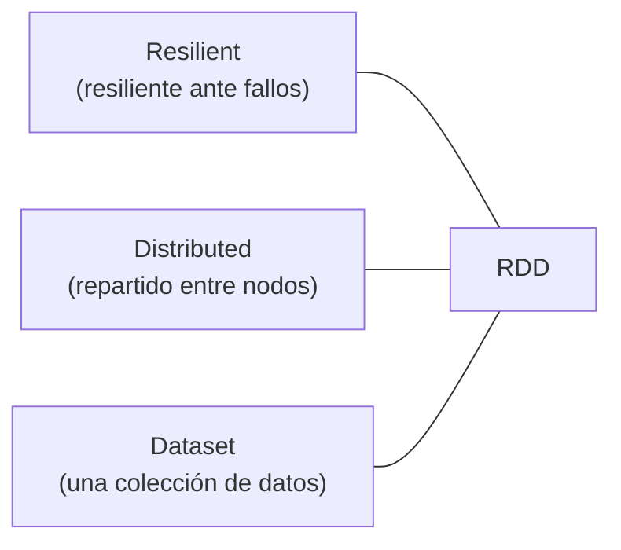
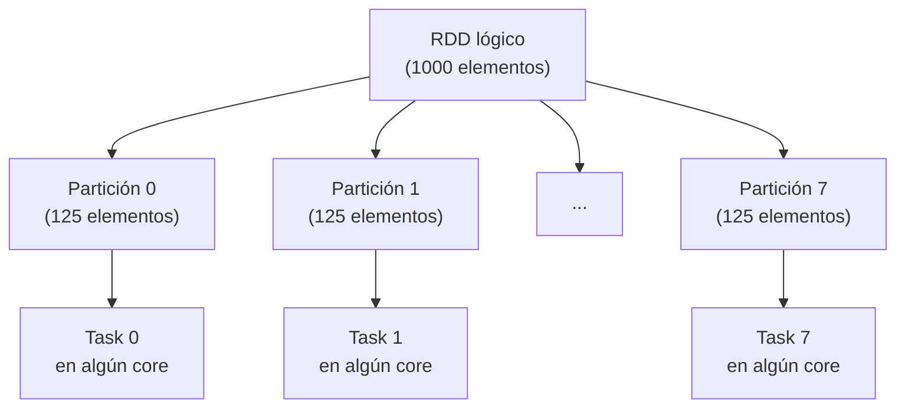
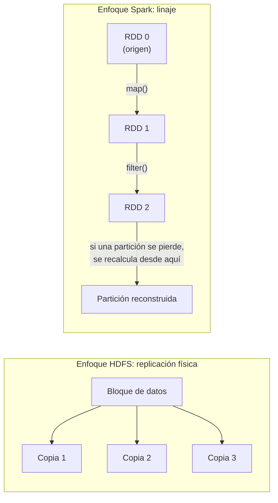
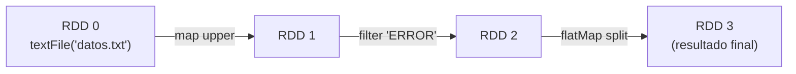
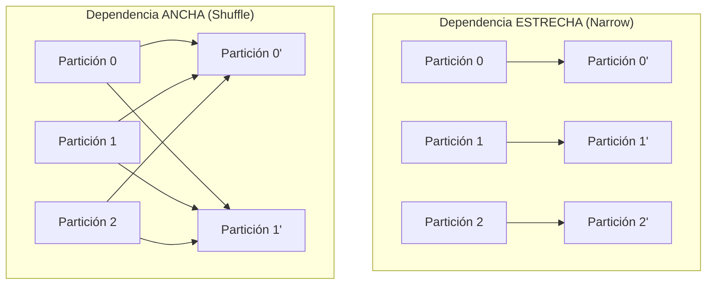
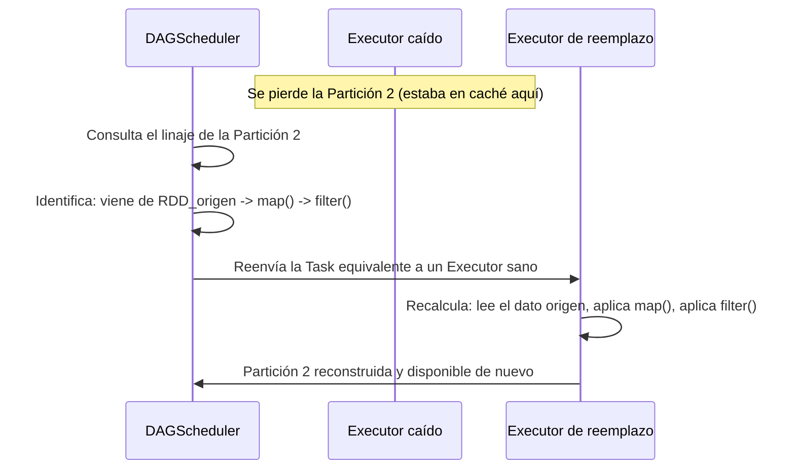
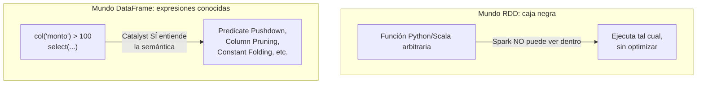

# Resilient Distributed Datasets (RDDs)

## Índice

1. [Qué es un RDD, en una frase](#1-qué-es-un-rdd-en-una-frase)
2. [Características fundacionales](#2-características-fundacionales)
   - [2.1 Inmutabilidad](#21-inmutabilidad)
   - [2.2 Particionamiento](#22-particionamiento)
   - [2.3 Tolerancia a fallos](#23-tolerancia-a-fallos)
3. [Concepto de Linaje (Lineage) y grafos de dependencia](#3-concepto-de-linaje-lineage-y-grafos-de-dependencia)
   - [3.1 Qué es el linaje](#31-qué-es-el-linaje)
   - [3.2 Dependencias Estrechas vs Anchas](#32-dependencias-estrechas-vs-anchas)
   - [3.3 Recuperación ante fallos usando el linaje](#33-recuperación-ante-fallos-usando-el-linaje)
   - [3.4 El costo del linaje largo y el `checkpoint()`](#34-el-costo-del-linaje-largo-y-el-checkpoint)
4. [Opacidad semántica: por qué el optimizador no entiende un RDD](#4-opacidad-semántica-por-qué-el-optimizador-no-entiende-un-rdd)
   - [4.1 El RDD como caja negra funcional](#41-el-rdd-como-caja-negra-funcional)
   - [4.2 Comparación directa: mismo trabajo, RDD vs DataFrame](#42-comparación-directa-mismo-trabajo-rdd-vs-dataframe)
   - [4.3 Consecuencias prácticas de la opacidad](#43-consecuencias-prácticas-de-la-opacidad)
5. [Ejemplo end-to-end integrador](#5-ejemplo-end-to-end-integrador)
6. [Errores comunes](#6-errores-comunes)
7. [Resumen mental (cheatsheet)](#7-resumen-mental-cheatsheet)

---

## 1. Qué es un RDD, en una frase

Un **RDD (Resilient Distributed Dataset)** es la abstracción de datos **original y de más bajo nivel** en Spark: una **colección inmutable, particionada y distribuida de objetos**, que Spark puede reconstruir automáticamente ante fallos gracias a que recuerda **cómo** fue creada, no dónde está guardada.



Cada palabra del nombre es, literalmente, una promesa de diseño: los datos están **distribuidos** físicamente entre particiones en distintos Executors, y el conjunto es **resiliente** porque puede reconstruirse solo si algo falla.

---

## 2. Características fundacionales

### 2.1 Inmutabilidad

Un RDD, una vez creado, **nunca se modifica**. Cualquier transformación (`map`, `filter`, `union`, etc.) no altera el RDD original: **produce un RDD completamente nuevo**.

```python
rdd_original = sc.parallelize([1, 2, 3, 4, 5])

rdd_duplicado = rdd_original.map(lambda x: x * 2)

print(rdd_original.collect())   # [1, 2, 3, 4, 5]  <- sin cambios
print(rdd_duplicado.collect())  # [2, 4, 6, 8, 10]  <- un RDD nuevo e independiente
```

**¿Por qué diseñar Spark así, si suena ineficiente crear "uno nuevo" cada vez?**

- **Consistencia en un entorno distribuido**: si los datos pudieran mutar in situ, sincronizar esas mutaciones entre decenas de nodos de forma segura sería un problema de concurrencia enorme (locks distribuidos, condiciones de carrera). La inmutabilidad elimina ese problema de raíz.
- **Habilita el linaje** (ver sección 3): como cada RDD nuevo solo *referencia* a su(s) RDD(s) padre(s) más la función aplicada, Spark puede reconstruir cualquier RDD reproduciendo esa cadena de transformaciones, sin necesitar "versionar" datos mutables.
- **Es la base para la evaluación perezosa**: si los RDDs fueran mutables, no tendría sentido diferir su ejecución — el estado podría cambiar entre que "programas" la operación y el momento en que realmente se ejecuta.

> **Importante**: la inmutabilidad es del **RDD como estructura**, no necesariamente de los objetos individuales que contiene si usas estructuras mutables de Python/Scala dentro de tus funciones — pero esa es responsabilidad tuya como programador, no una garantía de Spark.

### 2.2 Particionamiento

Un RDD no es un bloque monolítico de datos: está **dividido internamente en particiones**, cada una de las cuales puede residir en un nodo Worker distinto y ser procesada por una Task independiente (tal como vimos en la Sección 1).

```python
rdd = sc.parallelize(range(0, 1000), numSlices=8)  # fuerzas 8 particiones explícitamente
print(rdd.getNumPartitions())  # 8

# Ver cuántos elementos cayeron en cada partición
def contar_particion(indice, iterador):
    yield (indice, sum(1 for _ in iterador))

print(rdd.mapPartitionsWithIndex(contar_particion).collect())
# [(0, 125), (1, 125), (2, 125), (3, 125), (4, 125), (5, 125), (6, 125), (7, 125)]
```

Cada partición es la unidad mínima de paralelismo: **una Task procesa exactamente una partición completa**, nunca "un pedazo" de una partición ni "varias particiones a la vez" dentro de la misma Task.



El particionamiento se puede controlar explícitamente con funciones como `.repartition(n)`, `.coalesce(n)`, o mediante un `Partitioner` personalizado (`HashPartitioner`, `RangePartitioner`) cuando trabajas con RDDs clave-valor (`PairRDD`), algo que veremos con detalle en el módulo de particionamiento avanzado.

### 2.3 Tolerancia a fallos

Los sistemas distribuidos clásicos (como HDFS) logran tolerancia a fallos mediante **replicación física de datos** (guardar 3 copias del mismo bloque en nodos distintos). Spark, en cambio, logra tolerancia a fallos de una manera radicalmente distinta y más eficiente en memoria: **no replica los datos en RAM, sino que recuerda cómo recrearlos**.



Si un Executor muere y con él se pierden las particiones que tenía en memoria, Spark **no necesita ir a buscar una copia de respaldo**: simplemente vuelve a ejecutar, en otro Executor disponible, la secuencia exacta de transformaciones que originalmente produjo esa partición — usando el linaje, que veremos en la siguiente sección con detalle.

---

## 3. Concepto de Linaje (Lineage) y grafos de dependencia

### 3.1 Qué es el linaje

El **linaje (lineage)** de un RDD es el **registro completo de cómo ese RDD fue derivado**, transformación por transformación, desde su origen (una fuente de datos externa, o una colección paralelizada). Técnicamente, Spark construye esto como un **DAG (Grafo Acíclico Dirigido) de dependencias entre RDDs**, donde cada nodo "sabe" quién es su padre y qué función se le aplicó.

```python
rdd_a = sc.textFile("datos.txt")               # RDD 0: origen
rdd_b = rdd_a.map(lambda linea: linea.upper())  # RDD 1: depende de RDD 0 + map()
rdd_c = rdd_b.filter(lambda l: "ERROR" in l)    # RDD 2: depende de RDD 1 + filter()
rdd_d = rdd_c.flatMap(lambda l: l.split(" "))   # RDD 3: depende de RDD 2 + flatMap()

# Puedes inspeccionar el linaje directamente:
print(rdd_d.toDebugString().decode("utf-8"))
```

Salida ilustrativa de `toDebugString()`:

```
(2) PythonRDD[3] at RDD at PythonRDD.scala:53 []
 |  MapPartitionsRDD[2] at flatMap at ...
 |  PythonRDD[1] at RDD at PythonRDD.scala:53 []
 |  MapPartitionsRDD[0] at textFile at ...
 |  datos.txt HadoopRDD[...] at textFile at ...
```

Cada línea de esa salida representa **un nodo del linaje**: Spark sabe exactamente qué operación produjo cada RDD y a partir de qué RDD padre, formando una cadena trazable hasta el origen.



### 3.2 Dependencias Estrechas vs Anchas

El linaje no es solo una lista lineal: es un **grafo de dependencias**, y el *tipo* de dependencia entre cada RDD y su padre es crítico tanto para la planificación de Stages (Sección 1) como para cómo se realiza la recuperación ante fallos.

| Tipo | Nombre técnico | Relación entre particiones | Ejemplos |
|---|---|---|---|
| Estrecha | `NarrowDependency` | Cada partición hija depende de **como mucho una** partición padre | `map`, `filter`, `union` |
| Ancha | `ShuffleDependency` | Cada partición hija puede depender de **múltiples** particiones padre (requiere shuffle) | `groupByKey`, `join`, `repartition` |



Esta distinción es, de hecho, exactamente lo que usa el **DAGScheduler** (visto en la Sección 1) para decidir dónde cortar el grafo en Stages: cada `ShuffleDependency` marca una frontera de Stage.

```python
pares = sc.parallelize([("a", 1), ("b", 2), ("a", 3), ("c", 4)])

# Dependencia estrecha: cada partición se transforma de forma aislada
mapeado = pares.map(lambda kv: (kv[0], kv[1] * 10))
print(mapeado.dependencies())  # [<pyspark.rdd.OneToOneDependency ...>]

# Dependencia ancha: requiere reorganizar datos entre particiones (shuffle)
agrupado = pares.groupByKey()
print(agrupado.dependencies())  # [<pyspark.rdd.ShuffleDependency ...>]
```

### 3.3 Recuperación ante fallos usando el linaje

Cuando una partición se pierde (por ejemplo, porque el Executor que la tenía en memoria caché murió), Spark consulta el linaje para saber **exactamente qué recalcular**, y hasta dónde retroceder.



**Punto crucial**: gracias a las **dependencias estrechas**, en muchos casos Spark solo necesita recalcular **la partición perdida específica**, sin tocar las demás particiones ni depender de otros Executors. Con **dependencias anchas**, la reconstrucción puede ser más costosa, porque puede requerir volver a leer o recalcular datos desde múltiples particiones padre (potencialmente en varios Executors) para regenerar el archivo de shuffle perdido.

```python
rdd_base = sc.textFile("datos_grandes.txt")
rdd_transformado = rdd_base.map(procesar).filter(es_valido)
rdd_transformado.cache()  # se cachea en memoria de los Executors

rdd_transformado.count()  # Job 1: calcula y cachea

# Si un Executor muere DESPUÉS de esto, perdiendo algunas particiones cacheadas,
# el siguiente Action las recalculará automáticamente usando el linaje,
# SIN que tu código tenga que hacer nada especial:
rdd_transformado.count()  # Job 2: usa caché donde sobrevive, recalcula donde se perdió
```

### 3.4 El costo del linaje largo y el `checkpoint()`

Un linaje **muy largo** (por ejemplo, en algoritmos iterativos como los de Machine Learning, con cientos de transformaciones encadenadas) tiene un costo real: si algo falla al final de la cadena, Spark podría necesitar **recalcular decenas de pasos previos**, lo cual puede ser más lento que simplemente haber guardado un punto de control.

Para estos casos, Spark ofrece `.checkpoint()`: **trunca el linaje** guardando físicamente el RDD en almacenamiento confiable (HDFS, S3), de modo que futuras reconstrucciones no necesiten retroceder más allá de ese punto.

```python
sc.setCheckpointDir("hdfs://cluster/checkpoints/")

rdd = sc.textFile("datos.txt")
for i in range(50):  # 50 transformaciones encadenadas (ejemplo iterativo)
    rdd = rdd.map(lambda x: transformacion_costosa(x, i))

    if i == 25:
        rdd.checkpoint()   # trunca el linaje aquí; ahora el "origen" efectivo es este punto
        rdd.count()        # una Action es necesaria para materializar el checkpoint

# A partir de aquí, si algo falla, Spark recalcula desde el checkpoint (paso 25),
# no desde el archivo de texto original (paso 0)
```

> **Diferencia clave con `.cache()`**: `.cache()` guarda en **memoria** (rápido pero volátil — se puede perder si el Executor muere) y **no trunca el linaje** (Spark sigue "recordando" cómo se generó, por si necesita recalcular). `.checkpoint()` guarda en **almacenamiento estable** (más lento, pero sobrevive a fallos) y sí **trunca el linaje** de forma permanente.

---

## 4. Opacidad semántica: por qué el optimizador no entiende un RDD

### 4.1 El RDD como caja negra funcional

Cuando escribes transformaciones sobre un RDD (`.map(funcion)`, `.filter(funcion)`), le estás entregando a Spark **una función arbitraria de Python/Scala/Java** — código genérico que Spark **no puede inspeccionar ni entender semánticamente**. Para Spark, esa función es literalmente una caja negra: sabe que debe ejecutarla sobre cada elemento, pero **no sabe qué hace la función por dentro**, ni qué tipos de datos produce con precisión, ni qué columnas usa o descarta.

```python
rdd = sc.textFile("ventas.csv")

# Esta función es COMPLETAMENTE opaca para Spark:
# no sabe que solo necesita la columna 2 (monto), ni que descarta las demás,
# ni que hay un filtro de negocio escondido en el medio
def procesar_linea(linea):
    campos = linea.split(",")
    monto = float(campos[2])
    if monto > 100:
        return (campos[0], monto * 1.18)  # aplica IGV, por ejemplo
    return None

resultado = rdd.map(procesar_linea).filter(lambda x: x is not None)
```

Comparemos esto con el mundo Catalyst (DataFrames), donde las operaciones se expresan como **expresiones declarativas conocidas por Spark de antemano**:

```python
from pyspark.sql.functions import col

df = spark.read.csv("ventas.csv", header=True, inferSchema=True)

# Catalyst SÍ entiende exactamente qué está pasando aquí:
resultado_df = (
    df.filter(col("monto") > 100)
    .select("cliente", (col("monto") * 1.18).alias("monto_con_igv"))
)
```



### 4.2 Comparación directa: mismo trabajo, RDD vs DataFrame

| Aspecto | RDD | DataFrame |
|---|---|---|
| **Qué recibe Spark** | Una función de callback opaca (closure serializado) | Un árbol de expresiones declarativas (AST) |
| **¿Spark conoce el esquema/tipos?** | No — solo sabe que maneja "objetos genéricos" (ej. `RDD[String]`, `RDD[Any]`) | Sí — esquema explícito (`StructType`) con tipos concretos por columna |
| **¿Puede aplicar Predicate Pushdown?** | No — no sabe qué condiciones hay dentro de tu función `filter` | Sí — puede empujar el filtro hasta la fuente de datos (ej. Parquet, JDBC) |
| **¿Puede aplicar Column Pruning?** | No — no sabe qué columnas usas realmente dentro de tu función | Sí — puede leer solo las columnas referenciadas en el plan |
| **¿Puede reordenar operaciones?** | No — el orden de tus `.map()`/`.filter()` se ejecuta literal y secuencialmente | Sí — Catalyst puede reordenar filtros antes que proyecciones, fusionar operadores, etc. |
| **Serialización entre JVM y Python (PySpark)** | Cada elemento pasa por Pickle y por un socket entre procesos (alto overhead) | Ejecución mayormente dentro de la JVM, evitando ese overhead en la mayoría de operaciones nativas |

### 4.3 Consecuencias prácticas de la opacidad

- **El Optimizador Catalyst (que veremos en la Sección 4) simplemente no interviene en el pipeline de RDDs.** Si escribes tu lógica con la API de RDDs, Spark ejecuta tus transformaciones **tal cual las escribiste**, en el orden exacto que las escribiste, sin heurísticas de optimización lógica ni física aplicadas sobre ellas.
- Esto significa que, si tu código con RDDs hace algo ineficiente — como filtrar después de traer todas las columnas, o hacer un `.map()` costoso antes de un `.filter()` que hubiera descartado el 90% de los datos —, **Spark no lo va a corregir por ti**. Con DataFrames, en cambio, Catalyst frecuentemente reordena estas operaciones automáticamente (ej. empujando filtros lo antes posible).
- Es, en esencia, la razón central por la que **la recomendación moderna es usar DataFrames/Datasets siempre que sea posible**, reservando la API de RDDs para casos de bajo nivel muy específicos (control fino sobre particionamiento físico, estructuras de datos no tabulares, algoritmos que no se expresan naturalmente en SQL/álgebra relacional).

```python
# Con RDDs: el filtro ocurre DESPUÉS de tu map, tal cual lo escribiste,
# sin que Spark pueda "adelantarlo" aunque sería más eficiente
rdd_resultado = (
    rdd.map(transformacion_pesada)     # se ejecuta sobre EL 100% de los registros
       .filter(lambda x: x.es_valido)  # el descarte llega demasiado tarde
)

# Con DataFrames: Catalyst puede decidir aplicar el filtro
# ANTES de columnas/transformaciones costosas si la semántica lo permite
df_resultado = (
    df.filter(col("es_valido"))         # Catalyst puede intentar aplicarlo lo antes posible
      .withColumn("resultado", transformacion_pesada_sql(col("valor")))
)
```

---

## 5. Ejemplo end-to-end integrador

```python
from pyspark.sql import SparkSession

spark = SparkSession.builder.appName("DemoRDDCompleto").master("local[4]").getOrCreate()
sc = spark.sparkContext
sc.setCheckpointDir("/tmp/checkpoints")

# 1. INMUTABILIDAD: cada paso genera un RDD nuevo, el anterior nunca cambia
rdd_origen = sc.parallelize(range(1, 1000001), numSlices=8)
rdd_pares = rdd_origen.filter(lambda x: x % 2 == 0)          # dependencia estrecha
rdd_cuadrados = rdd_pares.map(lambda x: x ** 2)               # dependencia estrecha

# 2. PARTICIONAMIENTO: 8 particiones heredadas del origen (narrow deps las conservan)
print("Particiones:", rdd_cuadrados.getNumPartitions())  # 8

# 3. LINAJE: podemos inspeccionar cómo se construyó este RDD
print(rdd_cuadrados.toDebugString().decode("utf-8"))

# 4. DEPENDENCIA ANCHA: forzamos un shuffle con groupBy
rdd_agrupado_por_resto = rdd_cuadrados.groupBy(lambda x: x % 5)  # ShuffleDependency
print("Tipo de dependencia:", rdd_agrupado_por_resto.dependencies())

# 5. TOLERANCIA A FALLOS EN ACCIÓN: cacheamos, y aunque "perdiéramos" una partición,
#    Spark la reconstruiría automáticamente reproduciendo el linaje de arriba
rdd_cuadrados.cache()
print("Total tras cache:", rdd_cuadrados.count())  # Job 1: calcula y cachea

# 6. CHECKPOINT: truncamos el linaje explícitamente en un punto de control
rdd_cuadrados.checkpoint()
rdd_cuadrados.count()  # una Action materializa el checkpoint físicamente

# 7. OPACIDAD SEMÁNTICA: Spark NUNCA supo que 'lambda x: x % 2 == 0' era un filtro simple,
#    ni que 'lambda x: x ** 2' no necesitaba ver el dataset completo antes de operar.
#    Ejecutó tal cual, sin optimización lógica ni física de por medio.

spark.stop()
```

---

## 6. Errores comunes

| Síntoma / creencia errónea | Realidad |
|---|---|
| "Si modifico el RDD con `.map()`, cambio los datos originales" | Falso: cada transformación crea un RDD **nuevo**; el original permanece intacto |
| "El linaje se pierde si el proceso Driver se reinicia" | El linaje vive en la memoria del Driver como parte del grafo de objetos RDD; si el Driver muere, la Application entera termina — no es un mecanismo de persistencia entre aplicaciones distintas |
| "`.cache()` y `.checkpoint()` hacen lo mismo" | `.cache()` es en memoria y no trunca el linaje; `.checkpoint()` escribe a almacenamiento estable y sí trunca el linaje |
| "Como Spark tiene Catalyst, va a optimizar igual aunque use RDDs" | Falso: Catalyst **no interviene en absoluto** sobre la API de RDDs; solo opera sobre DataFrames/Datasets/SQL |
| "Una dependencia ancha siempre implica recalcular todo el dataset ante un fallo" | No necesariamente todo, pero sí puede requerir recalcular múltiples particiones padre para regenerar los datos de shuffle de la partición perdida — más costoso que una dependencia estrecha, pero no equivalente a "desde el origen absoluto" si hay checkpoints intermedios |

---

## 7. Resumen mental (cheatsheet)

- **Inmutabilidad**: cada transformación produce un RDD nuevo; el original nunca cambia. Habilita el linaje y la evaluación perezosa.
- **Particionamiento**: un RDD se divide en particiones; cada partición = una Task = procesada por un core.
- **Tolerancia a fallos**: Spark no replica datos en memoria como HDFS; **recalcula** particiones perdidas usando el **linaje**.
- **Linaje**: el DAG de "quién es el padre de quién y con qué transformación" — visible con `.toDebugString()`.
- **Dependencias Estrechas** (`map`, `filter`): 1 partición hija ↔ 1 partición padre; recuperación barata.
- **Dependencias Anchas** (`groupByKey`, `join`): N:N entre particiones; requieren shuffle; recuperación más costosa; marcan fronteras de Stage.
- `.checkpoint()` trunca el linaje escribiendo a almacenamiento estable; `.cache()` solo guarda en memoria sin truncar el linaje.
- **Opacidad semántica**: las funciones que le das a un RDD (`map`, `filter`) son cajas negras para Spark — no hay Predicate Pushdown, Column Pruning ni reordenamiento automático de operaciones. Catalyst solo optimiza DataFrames/Datasets/SQL, nunca RDDs puros.
