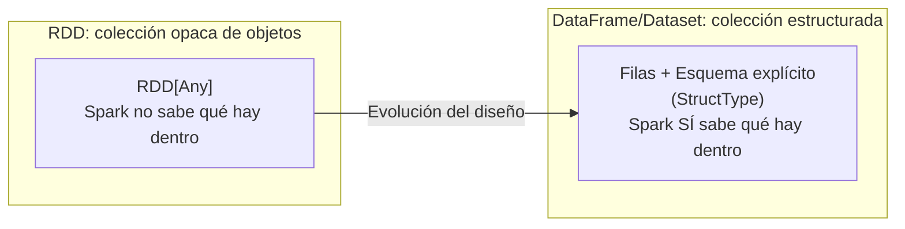
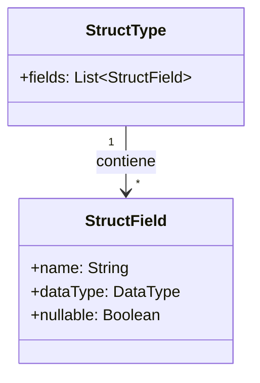
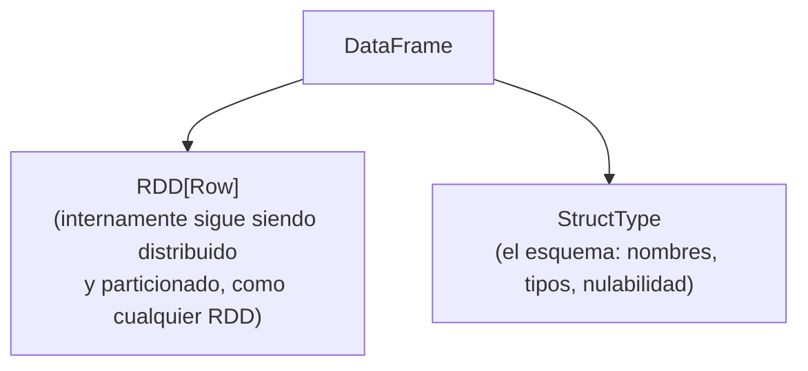
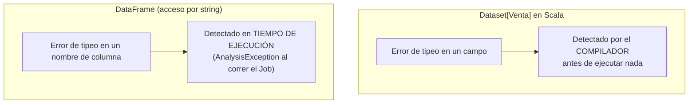
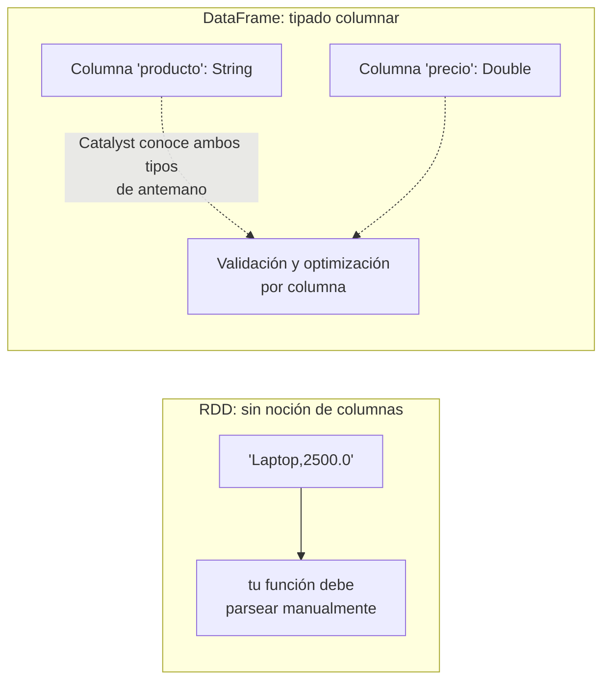
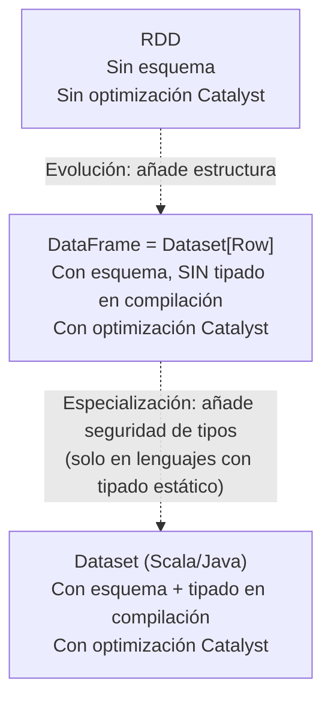

# Evolución hacia la Abstracción Estructurada: DataFrames y Datasets

## Índice

1. [Por qué evolucionar más allá de los RDDs](#1-por-qué-evolucionar-más-allá-de-los-rdds)
2. [Esquemas explícitos: `StructType` y `StructField`](#2-esquemas-explícitos-structtype-y-structfield)
3. [DataFrames: RDD + Esquema](#3-dataframes-rdd--esquema)
4. [Datasets: el punto intermedio con seguridad de tipos](#4-datasets-el-punto-intermedio-con-seguridad-de-tipos)
5. [Tipado columnar: cómo se almacenan realmente los datos](#5-tipado-columnar-cómo-se-almacenan-realmente-los-datos)
6. [DataFrame vs Dataset vs RDD: comparación completa](#6-dataframe-vs-dataset-vs-rdd-comparación-completa]
7. [Inferencia de esquema vs esquema explícito](#7-inferencia-de-esquema-vs-esquema-explícito)
8. [Esquemas anidados y tipos complejos](#8-esquemas-anidados-y-tipos-complejos)
9. [Evolución y validación de esquemas](#9-evolución-y-validación-de-esquemas)
10. [Ejemplo end-to-end integrador](#10-ejemplo-end-to-end-integrador)
11. [Errores comunes](#11-errores-comunes)
12. [Resumen mental (cheatsheet)](#12-resumen-mental-cheatsheet)

---

## 1. Por qué evolucionar más allá de los RDDs

En el manual anterior vimos el problema central de los RDDs: son **opacos semánticamente**. Spark ejecuta tus funciones `map`/`filter` sin entender qué hacen, qué tipos manejan, ni qué columnas usan — por lo tanto, el optimizador Catalyst **no puede intervenir en absoluto**.

La solución de diseño que adoptó Spark (inspirada en las bases de datos relacionales y en frameworks como Pandas/R) fue introducir una **abstracción estructurada**: en lugar de "una colección de objetos genéricos", pasar a "una colección de **filas con un esquema conocido**", donde cada columna tiene **nombre y tipo explícitos**.



Esta evolución es la que **habilita todo lo que viene después en el temario**: el Optimizador Catalyst, el motor Tungsten, AQE — ninguno de ellos puede operar sobre datos de los que Spark no conoce la estructura.

---

## 2. Esquemas explícitos: `StructType` y `StructField`

Un **esquema** en Spark es la definición formal de la "forma" de los datos: qué columnas existen, en qué orden, con qué nombre, con qué tipo de dato, y si aceptan valores nulos. Se representa con dos clases:

- **`StructType`**: la definición completa del esquema — una lista ordenada de campos.
- **`StructField`**: la definición de **un solo campo** dentro de ese esquema — nombre, tipo de dato, y si permite nulos (`nullable`).

```python
from pyspark.sql.types import StructType, StructField, StringType, IntegerType, DoubleType, BooleanType

esquema_ventas = StructType([
    StructField("id_venta",   IntegerType(), nullable=False),
    StructField("cliente",    StringType(),  nullable=False),
    StructField("categoria",  StringType(),  nullable=True),
    StructField("monto",      DoubleType(),  nullable=False),
    StructField("es_online",  BooleanType(), nullable=True),
])

print(esquema_ventas)
```

Salida:

```
StructType([
  StructField('id_venta', IntegerType(), False),
  StructField('cliente', StringType(), False),
  StructField('categoria', StringType(), True),
  StructField('monto', DoubleType(), False),
  StructField('es_online', BooleanType(), True)
])
```



### 2.1 Aplicando un esquema explícito al leer datos

```python
df = spark.read.schema(esquema_ventas).csv("ventas.csv", header=True)

df.printSchema()
```

Salida de `printSchema()`:

```
root
 |-- id_venta: integer (nullable = false)
 |-- cliente: string (nullable = false)
 |-- categoria: string (nullable = true)
 |-- monto: double (nullable = false)
 |-- es_online: boolean (nullable = true)
```

### 2.2 Por qué preferir un esquema explícito en vez de dejar que Spark lo infiera

| Con esquema explícito (`.schema(...)`) | Sin esquema, inferido (`inferSchema=True`) |
|---|---|
| Spark **no necesita leer los datos dos veces** para deducir tipos | Spark hace una pasada extra de lectura completa solo para inferir tipos (costoso en datasets grandes) |
| Los tipos son exactamente los que tú decides (control total) | Spark puede "adivinar mal" (ej. una columna de códigos postales como `"00234"` puede inferirse como `Integer`, perdiendo el cero inicial) |
| Falla rápido y explícito si los datos no coinciden con lo esperado | Falla de forma más silenciosa/tardía, con tipos potencialmente incorrectos |
| Recomendado para **producción** | Aceptable para **exploración rápida** en desarrollo |

```python
# Ejemplo del problema clásico de inferencia mal hecha:
df_inferido = spark.read.csv("clientes.csv", header=True, inferSchema=True)
df_inferido.printSchema()
# codigo_postal podría inferirse como 'integer', perdiendo ceros a la izquierda como en "00234" -> 234
```

---

## 3. DataFrames: RDD + Esquema

Conceptualmente, un **DataFrame es un RDD de objetos `Row`, acompañado de un `StructType`** que describe su estructura. Es, en esencia, la fusión de la resiliencia/distribución de los RDDs con el conocimiento estructural de una tabla relacional.



```python
from pyspark.sql import Row

df = spark.createDataFrame([
    Row(id_venta=1, cliente="Ana", monto=150.0),
    Row(id_venta=2, cliente="Luis", monto=89.5),
])

df.show()
```

```
+--------+-------+-----+
|id_venta|cliente|monto|
+--------+-------+-----+
|       1|    Ana|150.0|
|       2|   Luis| 89.5|
+--------+-------+-----+
```

Un `DataFrame` en Python/PySpark es, técnicamente, un `Dataset[Row]` — es decir, un caso particular de Dataset donde el tipo de cada fila es el genérico `Row` (una estructura dinámica tipo diccionario/tupla, sin verificación de tipos en tiempo de compilación). Esto es importante para entender la siguiente sección.

---

## 4. Datasets: el punto intermedio con seguridad de tipos

Un **Dataset** extiende la idea del DataFrame añadiendo **seguridad de tipos en tiempo de compilación** (*type safety*), algo que solo tiene sentido plenamente en lenguajes con tipado estático como **Scala** y **Java** (Python, al ser dinámicamente tipado, no distingue realmente entre DataFrame y Dataset — en PySpark, `DataFrame` **es** el único tipo estructurado disponible).

```scala
// Scala — Dataset tipado
case class Venta(idVenta: Int, cliente: String, monto: Double)

import spark.implicits._

val ds: Dataset[Venta] = spark.read
  .schema(Encoders.product[Venta].schema)
  .csv("ventas.csv")
  .as[Venta]   // <-- conversión a Dataset fuertemente tipado

// El compilador de Scala VALIDA esto en tiempo de compilación:
val montos = ds.map(venta => venta.monto * 1.18)   // acceso a 'venta.monto' verificado por el compilador

// Esto NO compilaría (error detectado ANTES de ejecutar nada):
// val error = ds.map(venta => venta.montoo * 1.18)   // typo -> error de compilación
```

Comparado con la equivalente sobre un DataFrame "sin tipar" (acceso por nombre de columna como string, verificado solo en tiempo de ejecución):

```scala
val df: DataFrame = spark.read.csv("ventas.csv")

// Esto SÍ compila, pero falla en TIEMPO DE EJECUCIÓN si la columna no existe o el nombre está mal escrito:
val montosDf = df.select(col("montoo") * 1.18)   // typo -> AnalysisException al ejecutar
```



### 4.1 Por qué PySpark no tiene "Datasets" reales

Python es un lenguaje de **tipado dinámico**: no existe un paso de "compilación" donde Python pueda verificar de antemano que `venta.montoo` es un typo. Por lo tanto, la ventaja central de los Datasets (seguridad de tipos verificada en compilación) **no puede materializarse en Python**. Por eso, en PySpark, **DataFrame es la única y máxima abstracción estructurada disponible**, y de hecho es literalmente `Dataset[Row]` bajo el capó, incluso en la JVM.

---

## 5. Tipado columnar: cómo se almacenan realmente los datos

"Tipado columnar" se refiere a que, dado un esquema explícito, Spark sabe con precisión el tipo de dato de **cada columna individual**, lo cual le permite:

1. **Empaquetar los datos de forma compacta y eficiente en memoria** (esto se profundiza en el manual del Motor Tungsten, que usa esta información de tipos para su formato binario).
2. **Aplicar operaciones vectorizadas por columna** en lugar de procesar fila por fila con código genérico.
3. **Validar operaciones en tiempo de análisis**: por ejemplo, sumar una columna `StringType` con una `IntegerType` puede detectarse como un error de tipos antes incluso de ejecutar el Job (fase de Análisis de Catalyst).

```python
from pyspark.sql.types import StructType, StructField, StringType, DoubleType

esquema = StructType([
    StructField("producto", StringType(), True),
    StructField("precio", DoubleType(), True),
])

df = spark.createDataFrame([("Laptop", 2500.0), ("Mouse", 45.0)], schema=esquema)

df.printSchema()
# root
#  |-- producto: string (nullable = true)
#  |-- precio: double (nullable = true)

# Catalyst conoce el tipo EXACTO de cada columna, así que esto genera
# un error de análisis ANTES de ejecutar nada, sin necesidad de leer datos:
try:
    df.select(df.producto + df.precio).show()
except Exception as e:
    print("Error de tipos detectado en fase de análisis:", type(e).__name__)
```

Este conocimiento por columna es exactamente lo que le falta a un RDD: un `RDD[String]` no le dice a Spark "esta es una columna de tipo producto y esta otra de tipo precio" — es solo una cadena de texto genérica que tu función deberá parsear e interpretar por tu cuenta, sin ninguna garantía ni optimización de por medio.



---

## 6. DataFrame vs Dataset vs RDD: comparación completa

| Característica | RDD | DataFrame | Dataset (solo Scala/Java) |
|---|---|---|---|
| Esquema conocido por Spark | No | Sí (`StructType`) | Sí (`StructType`) |
| Seguridad de tipos en compilación | N/A (tipado dinámico o genérico) | No (acceso por nombre de columna, `AnalysisException` en runtime) | Sí (objetos fuertemente tipados) |
| Optimizado por Catalyst | No | Sí | Sí |
| Disponible en PySpark | Sí | Sí | No (PySpark solo tiene DataFrame = `Dataset[Row]`) |
| Rendimiento típico | Menor (sin optimización, overhead de serialización en Python) | Alto | Alto |
| Cuándo usarlo | Control de bajo nivel, datos no tabulares, algoritmos personalizados | Uso general recomendado en la mayoría de casos | Cuando se necesita seguridad de tipos en Scala/Java sin perder optimización |



---

## 7. Inferencia de esquema vs esquema explícito

Spark puede **inferir** el esquema automáticamente a partir de los datos, en formatos que lo permiten:

```python
# Parquet ya trae el esquema embebido en sus metadatos -> inferencia instantánea y confiable
df_parquet = spark.read.parquet("ventas.parquet")
df_parquet.printSchema()   # exacto, sin necesidad de pasada extra

# JSON: Spark necesita leer (potencialmente) todo el archivo para inferir tipos y detectar campos variables
df_json = spark.read.option("inferSchema", "true").json("eventos.json")

# CSV: requiere una pasada de lectura completa adicional si se activa inferSchema
df_csv = spark.read.option("header", "true").option("inferSchema", "true").csv("ventas.csv")
```

| Formato | ¿Trae esquema embebido? | Costo de inferencia |
|---|---|---|
| Parquet / ORC | Sí (metadata binaria) | Prácticamente nulo — se lee de metadatos, no de los datos |
| JSON | No | Alto — requiere escanear registros (potencialmente todos) para deducir tipos y campos |
| CSV | No | Alto — requiere una pasada de lectura completa extra |
| JDBC (bases de datos) | Sí (vía metadata del driver JDBC) | Bajo — se consulta el catálogo de la base de datos |

> **Recomendación práctica**: en producción, para formatos como CSV o JSON, siempre define el esquema con `StructType`/`StructField` explícitamente. Reserva `inferSchema=True` para notebooks de exploración rápida donde la velocidad de iteración importa más que la robustez.

---

## 8. Esquemas anidados y tipos complejos

`StructType` no se limita a columnas planas: puede anidarse para representar estructuras jerárquicas (JSON anidado, por ejemplo), y combinarse con `ArrayType` y `MapType`.

```python
from pyspark.sql.types import StructType, StructField, StringType, ArrayType, MapType, IntegerType

esquema_pedido = StructType([
    StructField("id_pedido", StringType(), False),
    StructField("cliente", StructType([                     # <-- struct anidado
        StructField("nombre", StringType(), True),
        StructField("email", StringType(), True),
    ]), True),
    StructField("productos", ArrayType(StringType()), True),   # <-- lista de strings
    StructField("cantidades", MapType(StringType(), IntegerType()), True),  # <-- diccionario
])

df_pedidos = spark.read.schema(esquema_pedido).json("pedidos.json")
df_pedidos.printSchema()
```

Salida:

```
root
 |-- id_pedido: string (nullable = false)
 |-- cliente: struct (nullable = true)
 |    |-- nombre: string (nullable = true)
 |    |-- email: string (nullable = true)
 |-- productos: array (nullable = true)
 |    |-- element: string (containsNull = true)
 |-- cantidades: map (nullable = true)
 |    |-- key: string
 |    |-- value: integer (valueContainsNull = true)
```

```python
# Acceso a campos anidados con notación de punto
df_pedidos.select("cliente.nombre", "productos").show(truncate=False)
```

---

## 9. Evolución y validación de esquemas

Cuando lees múltiples archivos que podrían tener esquemas ligeramente distintos (algo común en Data Lakes que reciben datos incrementales), Spark ofrece controles explícitos:

```python
# mergeSchema: combina esquemas de distintos archivos Parquet en el mismo directorio
df = spark.read.option("mergeSchema", "true").parquet("s3a://bucket/eventos/")

# Validación estricta: falla si los datos no cumplen el esquema declarado
df_validado = spark.read.schema(esquema_ventas).option("mode", "FAILFAST").csv("ventas.csv")

# Modo permisivo: las filas corruptas o que no calzan con el esquema se marcan, no detienen el job
df_permisivo = (
    spark.read
    .schema(esquema_ventas)
    .option("mode", "PERMISSIVE")
    .option("columnNameOfCorruptRecord", "_corrupto")
    .csv("ventas.csv")
)
```

| Modo | Comportamiento ante datos que no calzan con el esquema |
|---|---|
| `PERMISSIVE` (por defecto) | Pone `null` en los campos problemáticos, opcionalmente registra el registro crudo en una columna de "corruptos" |
| `DROPMALFORMED` | Descarta silenciosamente las filas que no calzan con el esquema |
| `FAILFAST` | Detiene la ejecución inmediatamente lanzando una excepción |

---

## 10. Ejemplo end-to-end integrador

```python
from pyspark.sql import SparkSession
from pyspark.sql.types import StructType, StructField, StringType, IntegerType, DoubleType, TimestampType

spark = SparkSession.builder.appName("DemoAbstraccionEstructurada").master("local[4]").getOrCreate()

# 1. ESQUEMA EXPLÍCITO
esquema = StructType([
    StructField("id_venta",  IntegerType(),   False),
    StructField("cliente",   StringType(),    False),
    StructField("categoria", StringType(),    True),
    StructField("monto",     DoubleType(),    False),
    StructField("fecha",     TimestampType(), True),
])

# 2. LECTURA CON ESQUEMA (sin necesidad de inferencia costosa)
df = (
    spark.read
    .schema(esquema)
    .option("header", "true")
    .option("mode", "PERMISSIVE")
    .option("columnNameOfCorruptRecord", "_corrupto")
    .csv("ventas.csv")
)

# 3. VALIDACIÓN EN FASE DE ANÁLISIS: Catalyst conoce los tipos, así que detecta
#    errores de tipos ANTES de ejecutar (compárese con la opacidad total de un RDD)
df.printSchema()

# 4. TIPADO COLUMNAR EN ACCIÓN: operaciones validadas por columna
df_con_igv = df.withColumn("monto_con_igv", df.monto * 1.18)

# 5. DataFrame internamente sigue siendo un RDD[Row] particionado y distribuido:
print("Particiones subyacentes:", df.rdd.getNumPartitions())

df_con_igv.show(5)
spark.stop()
```

---

## 11. Errores comunes

| Síntoma | Causa | Solución |
|---|---|---|
| `AnalysisException: cannot resolve column` | Se referencia una columna que no existe en el esquema (típicamente un typo) | Revisar `df.printSchema()` antes de referenciar columnas |
| Números como `"00234"` se convierten en `234` | Se usó `inferSchema=True` y Spark asumió tipo numérico | Definir el esquema explícitamente con `StringType()` para esa columna |
| Lectura de CSV/JSON muy lenta en datasets grandes | `inferSchema=True` obliga a una pasada completa extra de lectura | Definir `StructType` explícito, o migrar a formatos con esquema embebido (Parquet) |
| `mergeSchema` cambia tipos inesperadamente entre archivos | Archivos Parquet con esquemas ligeramente distintos en el mismo directorio | Estandarizar el esquema en el proceso de escritura, o revisar cuidadosamente qué tipos se están fusionando |
| Confundir DataFrame con Dataset en PySpark | En PySpark no existen "Datasets" tipados reales; `DataFrame` ya es `Dataset[Row]` | Recordar que la seguridad de tipos en compilación solo aplica a Scala/Java |

---

## 12. Resumen mental (cheatsheet)

- **`StructType`** = el esquema completo (lista de campos). **`StructField`** = un campo individual (nombre, tipo, nulabilidad).
- Un **DataFrame** = un `RDD[Row]` + un esquema explícito — la fusión de distribución/resiliencia con estructura conocida.
- Un **Dataset** añade **seguridad de tipos en tiempo de compilación**, pero solo tiene sentido pleno en Scala/Java; en PySpark, `DataFrame` es la única abstracción estructurada disponible (es literalmente `Dataset[Row]`).
- **Tipado columnar** significa que Spark conoce el tipo exacto de cada columna, habilitando validación temprana de tipos y, más adelante, el empaquetado eficiente en memoria del motor Tungsten.
- Preferir **esquema explícito** sobre `inferSchema=True` en producción: evita una pasada extra de lectura y previene inferencias incorrectas de tipo.
- Parquet/ORC traen esquema embebido (inferencia casi gratuita); CSV/JSON requieren escanear datos para inferir (costoso).
- `StructType` puede anidarse y combinarse con `ArrayType`/`MapType` para representar estructuras jerárquicas.
- Es precisamente este conocimiento estructural (ausente en los RDDs) lo que **habilita** al Optimizador Catalyst y al motor Tungsten, que veremos a continuación.
