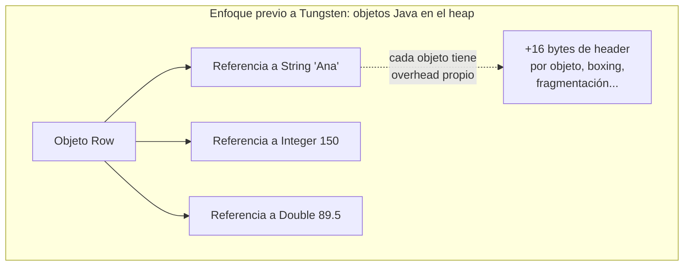
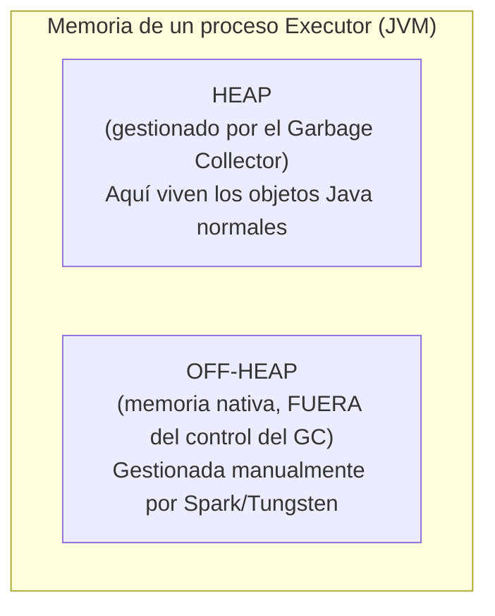
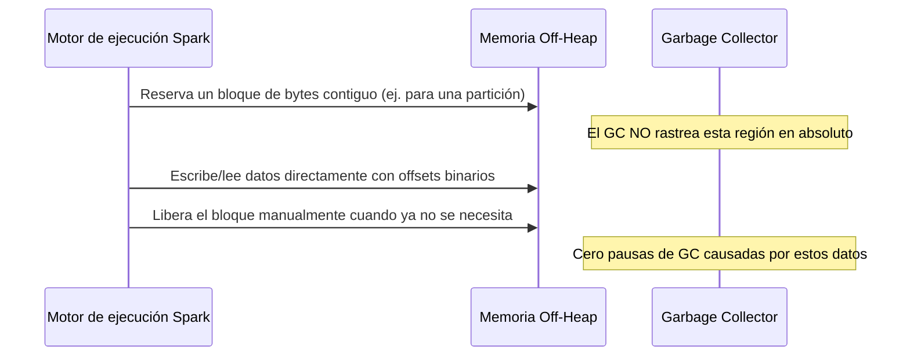
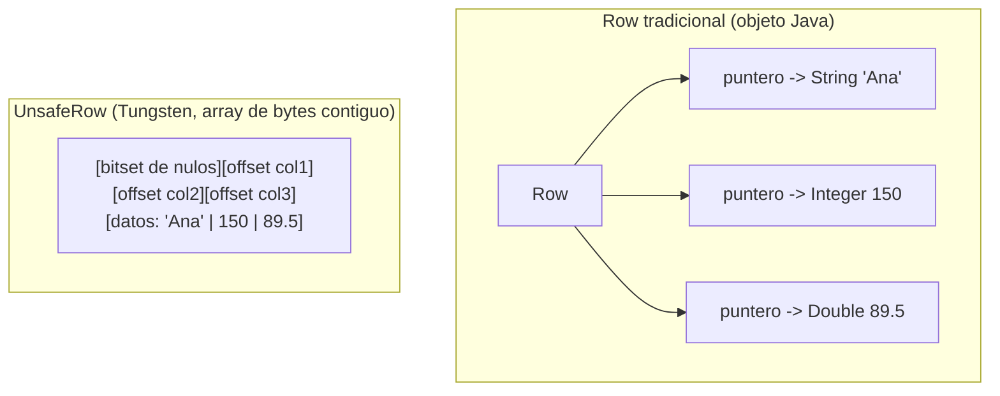
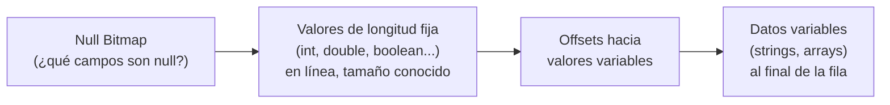
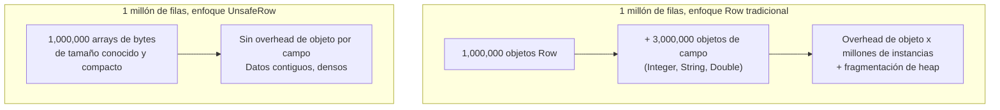
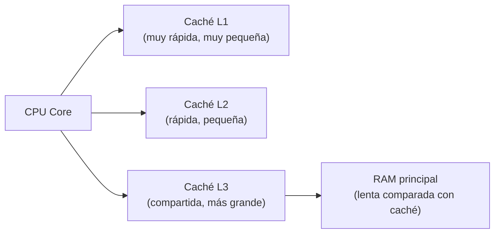
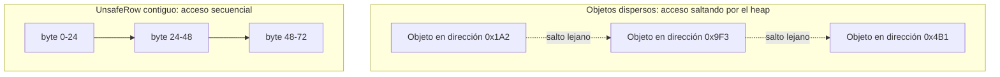
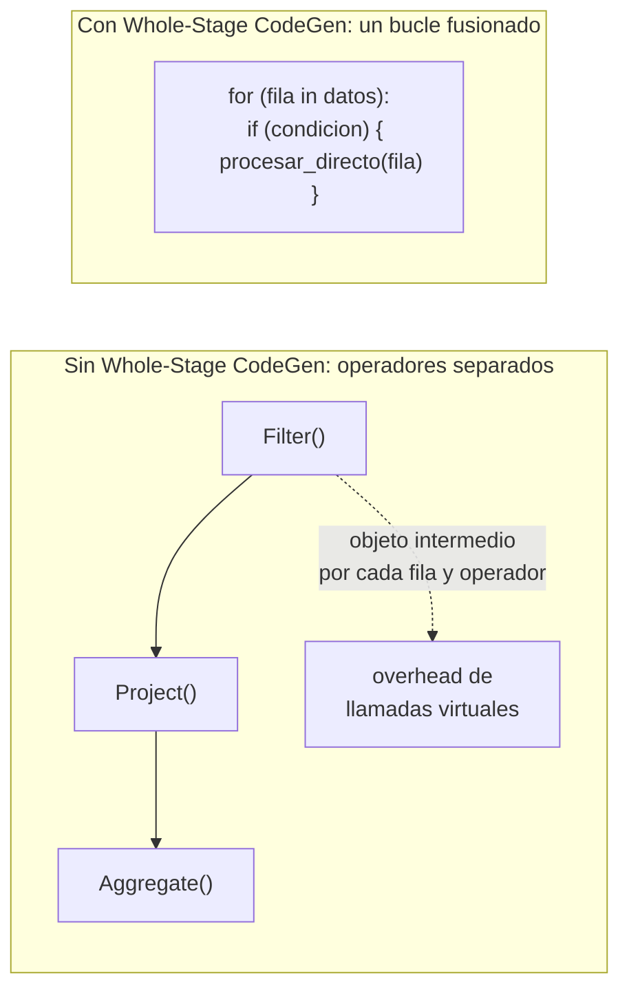
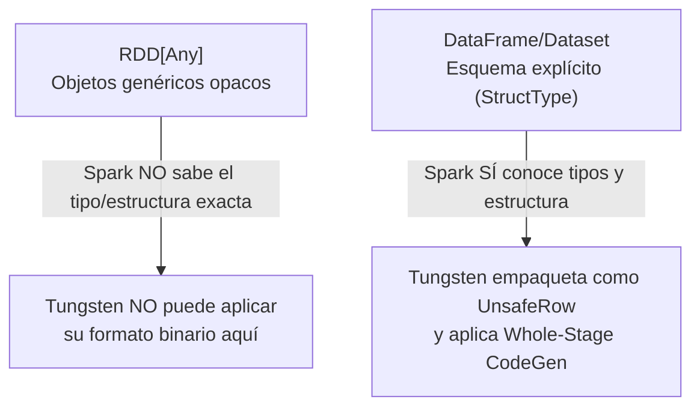

# El Motor Tungsten

## Índice

1. [El problema que Tungsten vino a resolver](#1-el-problema-que-tungsten-vino-a-resolver)
2. [Repaso rápido: cómo funciona la memoria en la JVM](#2-repaso-rápido-cómo-funciona-la-memoria-en-la-jvm)
3. [Gestión de memoria explícita (Off-Heap Memory Management)](#3-gestión-de-memoria-explícita-off-heap-memory-management)
4. [Formatos de datos binarios: `UnsafeRow`](#4-formatos-de-datos-binarios-unsaferow)
5. [Empaquetado en memoria: por qué esto ahorra tanto espacio](#5-empaquetado-en-memoria-por-qué-esto-ahorra-tanto-espacio)
6. [Cache-aware computation: diseñado para el hardware real](#6-cache-aware-computation-diseñado-para-el-hardware-real)
7. [Whole-Stage Code Generation: la otra mitad de Tungsten](#7-whole-stage-code-generation-la-otra-mitad-de-tungsten)
8. [Tungsten en acción: observando el efecto en la práctica](#8-tungsten-en-acción-observando-el-efecto-en-la-práctica)
9. [Por qué Tungsten no puede ayudar a los RDDs](#9-por-qué-tungsten-no-puede-ayudar-a-los-rdds)
10. [Ejemplo end-to-end integrador](#10-ejemplo-end-to-end-integrador)
11. [Errores comunes y mala interpretación](#11-errores-comunes-y-mala-interpretación)
12. [Resumen mental (cheatsheet)](#12-resumen-mental-cheatsheet)

---

## 1. El problema que Tungsten vino a resolver

Spark corre sobre la **JVM (Java Virtual Machine)**, y la JVM trae consigo un componente que, aunque fundamental para la gestión automática de memoria, se convierte en un **cuello de botella serio** en cargas de trabajo intensivas en datos: el **Garbage Collector (GC)**.

Antes de Tungsten (introducido a partir de Spark 1.4-1.5 y madurado en versiones posteriores), Spark almacenaba los datos como **objetos Java normales** en el heap de la JVM — por ejemplo, una fila de un DataFrame podía representarse como un objeto `Row` compuesto de referencias a otros objetos Java (`String`, `Integer`, `Double`, etc.).



**Los tres problemas concretos con este enfoque:**

1. **Overhead de memoria por objeto**: cada objeto Java (incluso un simple `Integer`) carga metadata interna de la JVM (headers de objeto, punteros de clase) que puede pesar **más que el dato útil en sí**. Un `Integer` que representa el número `5` puede ocupar 16 bytes en la JVM, cuando el dato real cabría en 4 bytes.
2. **Presión sobre el Garbage Collector**: con millones/miles de millones de filas, cada una compuesta de múltiples objetos pequeños, el GC tiene que rastrear una cantidad enorme de objetos vivos. Esto genera pausas de GC largas y frecuentes (*GC pauses*), que detienen la ejecución de la aplicación mientras el recolector hace su trabajo.
3. **Mal uso de la caché de CPU**: los objetos Java dispersos en el heap no están garantizados a estar en memoria contigua, lo que genera patrones de acceso a memoria ineficientes para el hardware moderno (más *cache misses*).

Tungsten ataca **directamente estos tres problemas**, con dos grandes pilares: **gestión de memoria off-heap** y un **formato binario compacto y propio**.

---

## 2. Repaso rápido: cómo funciona la memoria en la JVM

Para entender por qué Tungsten es necesario, hace falta un mínimo de contexto sobre la memoria en la JVM:



- **Heap**: la región de memoria donde normalmente "viven" todos los objetos Java. El **Garbage Collector** rastrea constantemente qué objetos siguen en uso y libera los que ya no lo están. Cuanto más grande y más ocupado esté el heap, más caro es cada ciclo de recolección.
- **Off-heap**: memoria nativa gestionada directamente por el sistema operativo (vía llamadas de bajo nivel como `sun.misc.Unsafe` en Java), **completamente fuera de la vigilancia del Garbage Collector**. Si algo vive aquí, el GC ni siquiera sabe que existe.

---

## 3. Gestión de memoria explícita (Off-Heap Memory Management)

La estrategia central de Tungsten es simple de enunciar y compleja de implementar bien: **sacar los datos del heap gestionado por el GC, y administrarlos manualmente como bloques binarios de bytes** (arrays de bytes contiguos), exactamente como lo haría un programa escrito en C.

```python
# Habilitar memoria off-heap explícitamente (deshabilitada por defecto en muchas distribuciones)
spark = (
    SparkSession.builder
    .config("spark.memory.offHeap.enabled", "true")
    .config("spark.memory.offHeap.size", "2g")   # tamaño reservado para off-heap
    .getOrCreate()
)
```



**Beneficios concretos de este enfoque:**

- **Elimina la presión de GC** causada por los datos de las filas/columnas: si los datos viven fuera del heap, el GC nunca necesita escanearlos, marcarlos ni moverlos.
- **Evita el "boxing" de tipos primitivos**: en Java, un `int` primitivo dentro de una colección genérica se convierte automáticamente en un objeto `Integer` (boxing), con el overhead ya mencionado. Tungsten trabaja directamente con representaciones binarias de tipos primitivos, sin pasar por ese boxing.
- **Permite un control preciso del layout de memoria**: Spark decide exactamente cómo se organizan los bytes de cada fila, optimizando para acceso secuencial eficiente (relevante para la sección 6, sobre *cache-awareness*).

> **Nota importante**: aunque `spark.memory.offHeap.enabled` es una configuración explícita que puedes activar o no, **gran parte del trabajo de Tungsten con su formato binario (`UnsafeRow`, ver siguiente sección) ocurre igualmente dentro del heap por defecto** — simplemente como arrays de bytes (`byte[]`) en lugar de objetos Java dispersos. Activar off-heap explícitamente es un paso adicional que mueve esos mismos bytes fuera del heap por completo, reduciendo aún más la superficie que el GC necesita vigilar.

---

## 4. Formatos de datos binarios: `UnsafeRow`

El corazón técnico de Tungsten es una estructura llamada **`UnsafeRow`**: una representación **binaria y compacta** de una fila de datos, almacenada como un array de bytes con un layout fijo y predecible, en lugar de un objeto Java con referencias dispersas.



### 4.1 Anatomía simplificada de un `UnsafeRow`

Una `UnsafeRow` se organiza aproximadamente así:

1. **Bitset de nulos (null bitmap)**: un bloque de bits al inicio, donde cada bit indica si el campo correspondiente es `null` — permite chequear nulabilidad sin necesidad de "objetos nulos" o chequeos costosos.
2. **Región de valores de longitud fija**: para tipos primitivos (`int`, `long`, `double`, `boolean`), el valor se almacena **directamente en línea**, en una posición fija y conocida de antemano.
3. **Región de valores de longitud variable**: para tipos como `String` o `Array`, se almacena un puntero/offset hacia el final de la fila, donde vive el contenido variable, junto con su longitud.



### 4.2 Por qué este formato es dramáticamente más eficiente

```python
# Con datos "cotidianos" del negocio, comparemos conceptualmente:

# Enfoque Row tradicional: cada Row apunta a 3 objetos distintos dispersos en el heap
# id_venta (Integer, ~16 bytes con overhead), cliente (String, overhead propio),
# monto (Double, ~16 bytes con overhead)
# => la fila "lógica" puede terminar ocupando MUCHO más que la suma de sus datos útiles

# Enfoque UnsafeRow: todo empaquetado en un único array de bytes contiguo,
# sin overhead de objeto por campo, sin punteros dispersos
```

| Aspecto | `Row` tradicional (objetos Java) | `UnsafeRow` (Tungsten) |
|---|---|---|
| Ubicación de los datos de una fila | Dispersos en el heap (varios objetos con punteros) | Contiguos en un único array de bytes |
| Overhead por campo | Header de objeto + boxing de primitivos | Ninguno — acceso directo por offset binario |
| Visibilidad para el GC | Total (cada objeto es rastreado) | Mínima o nula (según se use heap normal como `byte[]` u off-heap real) |
| Acceso a un campo | Deferenciar un puntero de objeto | Leer directamente en un offset binario conocido |
| Comparación/ordenamiento | Requiere deserializar objetos | Puede hacerse **directamente sobre los bytes** en muchos casos (comparación binaria) |

---

## 5. Empaquetado en memoria: por qué esto ahorra tanto espacio

Cuando Tungsten organiza millones de filas como `UnsafeRow` contiguas, el ahorro de memoria frente al enfoque de objetos Java dispersos puede ser sustancial — Spark documenta mejoras de **varias veces menos consumo de memoria** para el mismo dataset lógico, dependiendo del tipo de datos y la cardinalidad de columnas variables.



**Ejemplo numérico ilustrativo** (valores aproximados, dependen de la JVM/arquitectura exacta):

| Representación | Overhead aproximado por fila (3 columnas: int, string corto, double) |
|---|---|
| Objetos Java (`Row` con boxing) | Puede superar 100 bytes por fila solo en overhead de objetos, antes de contar los datos reales |
| `UnsafeRow` (Tungsten) | Cercano al tamaño real de los datos + unos pocos bytes de metadata (bitset de nulos, offsets) |

Esta densidad de empaquetado tiene un efecto en cascada: **más filas caben en la misma cantidad de RAM**, lo que reduce la necesidad de *spill* a disco durante operaciones de shuffle, sort o agregación — y menos spill significa Jobs más rápidos.

---

## 6. Cache-aware computation: diseñado para el hardware real

Un aspecto menos citado pero igualmente importante de Tungsten es que su diseño **tiene en cuenta explícitamente la jerarquía de caché de la CPU moderna** (L1, L2, L3), no solo la RAM en abstracto.



Los datos organizados de forma **contigua y compacta** (como los `UnsafeRow`) se benefician de **localidad espacial**: cuando la CPU trae un bloque de memoria a su caché L1/L2, es mucho más probable que los siguientes datos que se necesiten **ya estén ahí**, en lugar de tener que ir hasta la RAM (o peor, seguir punteros dispersos que saltan por todo el heap). Esto reduce drásticamente los *cache misses*, que son órdenes de magnitud más lentos que un acceso a caché exitoso.



Este principio de diseño ("cache-aware" / "cache-conscious computation") es tomado prestado de técnicas clásicas de bases de datos de alto rendimiento y sistemas de bajo nivel, aplicadas aquí al motor de ejecución de Spark.

---

## 7. Whole-Stage Code Generation: la otra mitad de Tungsten

Aunque el detalle completo de *Whole-Stage Code Generation* corresponde al ciclo de vida del Optimizador Catalyst (Fase 4, en otro módulo del temario), es importante mencionarlo aquí porque **trabaja en conjunto con el formato binario de Tungsten**: no basta con tener los datos empaquetados eficientemente si el código que los procesa sigue siendo genérico e interpretado paso a paso.

Tungsten incluye un generador de **bytecode Java optimizado en tiempo de ejecución**, que fusiona múltiples operadores (`filter` + `project` + `aggregate`, por ejemplo) en **un único bucle compilado**, que opera directamente sobre los bytes de las `UnsafeRow`, evitando:

- Llamadas de función virtuales repetidas por cada fila y por cada operador.
- Creación de objetos intermedios entre cada etapa del procesamiento.



---

## 8. Tungsten en acción: observando el efecto en la práctica

Tungsten opera de forma transparente cuando usas DataFrames/Datasets/SQL — no necesitas invocarlo explícitamente. Puedes, sin embargo, observar su efecto indirectamente:

```python
spark = (
    SparkSession.builder
    .appName("DemoTungsten")
    .master("local[4]")
    .config("spark.memory.offHeap.enabled", "true")
    .config("spark.memory.offHeap.size", "1g")
    .getOrCreate()
)

df = spark.range(0, 20_000_000).selectExpr(
    "id",
    "id * 2 as doble",
    "cast(id as string) as texto"
)

# El plan físico revela el uso de Whole-Stage Code Generation con el símbolo '*'
df.filter("id % 2 = 0").selectExpr("id", "doble * 1.1 as ajustado").explain(True)
```

Fragmento representativo de la salida de `.explain(True)` (plan físico):

```
== Physical Plan ==
*(1) Project [id#0L, (doble#1L * 1.1) AS ajustado#7]
+- *(1) Filter ((id#0L % 2) = 0)
   +- *(1) Range (0, 20000000, step=1, splits=4)
```

> El asterisco `*(1)` antes de cada operador indica que **Whole-Stage Code Generation está activo** para ese fragmento del plan — Project, Filter y Range fueron **fusionados en un único bucle compilado**, operando sobre los datos ya organizados en `UnsafeRow` por Tungsten.

Puedes también comparar el consumo de memoria y la frecuencia de pausas de GC en la pestaña **"Executors"** del Spark UI, columna de métricas de GC (`Task Time (GC Time)`), al correr la misma carga de trabajo equivalente sobre RDDs puros (sin estructura) vs. sobre DataFrames.

---

## 9. Por qué Tungsten no puede ayudar a los RDDs

Este es el hilo directo que conecta con los dos manuales anteriores: **Tungsten depende fundamentalmente de que Spark conozca el esquema y los tipos exactos de los datos** para poder construir el layout binario compacto de `UnsafeRow` (saber cuántos bytes reservar para cada campo, dónde va el bitset de nulos, qué campos son de longitud fija vs. variable).



Un RDD de objetos Python/Scala arbitrarios **no tiene un esquema fijo y conocido de antemano** que Tungsten pueda usar para decidir el layout binario. Por eso, trabajar con la API de RDDs **renuncia no solo a la optimización lógica de Catalyst** (visto en el manual de opacidad semántica), **sino también a todos los beneficios de rendimiento físico de Tungsten** — ambos dependen de la misma base: el conocimiento estructural que solo DataFrames/Datasets proveen.

---

## 10. Ejemplo end-to-end integrador

```python
from pyspark.sql import SparkSession
import time

spark = (
    SparkSession.builder
    .appName("DemoTungstenCompleto")
    .master("local[4]")
    .config("spark.memory.offHeap.enabled", "true")
    .config("spark.memory.offHeap.size", "1g")
    .getOrCreate()
)
sc = spark.sparkContext

N = 5_000_000

# --- CAMINO 1: RDD puro, sin esquema, sin Tungsten ---
inicio = time.time()
rdd = sc.parallelize(range(N))
resultado_rdd = rdd.map(lambda x: (x, x * 2, str(x))).filter(lambda t: t[0] % 2 == 0).count()
tiempo_rdd = time.time() - inicio
print(f"RDD -> {resultado_rdd} filas en {tiempo_rdd:.2f}s (sin optimización de Tungsten)")

# --- CAMINO 2: DataFrame, con esquema conocido, con Tungsten activo ---
inicio = time.time()
df = spark.range(0, N).selectExpr("id", "id * 2 as doble", "cast(id as string) as texto")
resultado_df = df.filter("id % 2 = 0").count()
tiempo_df = time.time() - inicio
print(f"DataFrame -> {resultado_df} filas en {tiempo_df:.2f}s (con UnsafeRow + Whole-Stage CodeGen)")

print(f"\nDiferencia: el DataFrame se benefició de formato binario compacto (UnsafeRow),")
print(f"menor presión de GC, y código fusionado generado en tiempo de ejecución.")

spark.stop()
```

> En datasets suficientemente grandes, es común observar que el camino DataFrame es notablemente más rápido y estable (menos variabilidad por pausas de GC) que el camino RDD equivalente — precisamente por la combinación de Tungsten (formato binario + gestión de memoria) y Catalyst (optimización lógica/física) actuando juntos, algo que el camino RDD nunca puede aprovechar.

---

## 11. Errores comunes y mala interpretación

| Creencia errónea | Realidad |
|---|---|
| "Tungsten es una configuración que hay que activar" | Tungsten es el **motor de ejecución interno** de DataFrames/Datasets; siempre está activo cuando usas esa API. Lo único opcional/configurable es específicamente el uso de memoria **off-heap real** (`spark.memory.offHeap.enabled`) |
| "Off-heap significa que Spark usa menos memoria total" | No necesariamente menos memoria **total**, sino memoria organizada de forma que el GC no necesita vigilarla, reduciendo pausas — el ahorro real de espacio viene principalmente del formato `UnsafeRow` en sí, no solo de estar fuera del heap |
| "Si uso RDDs, igual me beneficio de Tungsten porque está siempre activo" | Falso: Tungsten requiere esquema conocido (`StructType`) para construir su formato binario; los RDDs no tienen esa información, así que quedan completamente fuera de su alcance |
| "Activar `spark.memory.offHeap.enabled` siempre mejora el rendimiento" | No automáticamente — mal dimensionado (`offHeap.size` insuficiente o excesivo respecto al resto de la memoria del Executor) puede generar *spills* o desperdicio de memoria reservada sin usar |
| "El asterisco `*` en `.explain()` es solo decorativo" | Indica específicamente qué operadores fueron fusionados por Whole-Stage Code Generation — es información de diagnóstico real, no cosmética |

---

## 12. Resumen mental (cheatsheet)

- Tungsten nace para resolver tres problemas del modelo de objetos Java estándar: **overhead de memoria por objeto**, **presión sobre el Garbage Collector**, y **mal aprovechamiento de la caché de CPU**.
- **Gestión de memoria explícita (off-heap)**: Spark puede administrar bloques de bytes fuera del heap vigilado por el GC, reduciendo pausas de recolección. Se activa con `spark.memory.offHeap.enabled` / `spark.memory.offHeap.size`.
- **`UnsafeRow`**: el formato binario compacto de Tungsten — filas empaquetadas como arrays de bytes contiguos, con bitset de nulos, valores fijos en línea, y offsets hacia valores variables al final.
- El **empaquetado en memoria** de `UnsafeRow` reduce drásticamente el overhead por fila comparado con objetos Java dispersos, permitiendo que quepan más datos en la misma RAM (menos *spill* a disco).
- El diseño es **cache-aware**: datos contiguos aprovechan la localidad espacial de las cachés L1/L2/L3 de la CPU, reduciendo *cache misses* costosos.
- **Whole-Stage Code Generation** complementa a Tungsten fusionando múltiples operadores en un único bucle de bytecode compilado, visible como `*(n)` en `.explain()`.
- Tungsten **requiere esquema explícito conocido** (`StructType`) para construir su formato binario — por eso **nunca beneficia a los RDDs puros**, que son opacos para Spark. Esta es la misma razón estructural por la que Catalyst tampoco puede optimizar RDDs.
