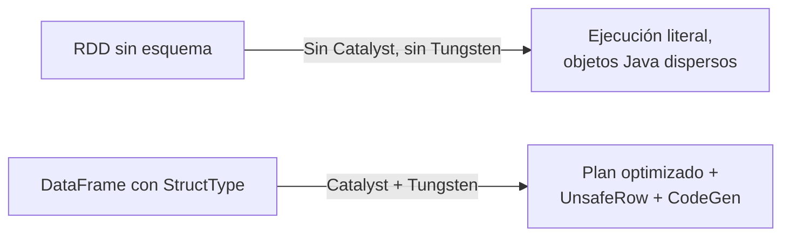

# Cheatsheet — Sección 2: Estructuras de Datos Computacionales (De RDDs a DataFrames)

## 1. RDDs: características fundacionales

| Característica | Qué significa |
|---|---|
| **Inmutabilidad** | Cada transformación crea un RDD **nuevo**; el original nunca cambia. Habilita linaje + lazy evaluation |
| **Particionamiento** | Dividido en particiones; 1 partición = 1 Task = procesada por 1 core |
| **Tolerancia a fallos** | NO replica datos en memoria (como HDFS); **recalcula** particiones perdidas usando el linaje |

```python
rdd = sc.parallelize(range(1000), numSlices=8)
rdd.getNumPartitions()          # 8
rdd2 = rdd.map(lambda x: x*2)   # RDD nuevo, rdd original intacto
```

---

## 2. Linaje (Lineage) y dependencias

- **Linaje** = DAG de "quién es el padre de quién + qué transformación se aplicó". Visible con `.toDebugString()`.

| Tipo de dependencia | Relación | Ejemplos | Recuperación |
|---|---|---|---|
| **Estrecha (Narrow)** | 1 partición hija ↔ ≤1 partición padre | `map`, `filter`, `union` | Barata: recalcula solo esa partición |
| **Ancha (Shuffle)** | N:N entre particiones | `groupByKey`, `join`, `repartition` | Más costosa: puede requerir varias particiones padre |

- Cada `ShuffleDependency` = frontera de **Stage** (conecta con Sección 1).

| `.cache()` | `.checkpoint()` |
|---|---|
| En memoria, volátil | En almacenamiento estable (HDFS/S3), persistente |
| **No** trunca el linaje | **Sí** trunca el linaje |
| Rápido | Más lento pero sobrevive a fallos |

```python
sc.setCheckpointDir("hdfs://.../checkpoints")
rdd.checkpoint()
rdd.count()   # Action necesaria para materializar el checkpoint
```

---

## 3. Opacidad semántica de los RDDs

- Las funciones (`map`, `filter`) son **cajas negras**: Spark no sabe qué hacen ni qué tipos manejan.
- **Catalyst NO puede optimizar RDDs**: sin Predicate Pushdown, sin Column Pruning, sin reordenamiento de operaciones.
- El orden de tus transformaciones se ejecuta **literal**, tal cual lo escribiste.

```python
# RDD: Spark ejecuta EXACTAMENTE en este orden, sin optimizar
rdd.map(transform_pesada).filter(es_valido)   # el filtro llega tarde, sin remedio

# DataFrame: Catalyst SÍ puede reordenar/optimizar
df.filter(col("valido")).withColumn("r", transform_sql(col("valor")))
```

---

## 4. DataFrames y Datasets: esquemas explícitos

| Clase | Qué es |
|---|---|
| `StructType` | El esquema completo (lista de campos) |
| `StructField` | Un campo: `(nombre, tipo, nullable)` |

```python
from pyspark.sql.types import StructType, StructField, IntegerType, StringType

esquema = StructType([
    StructField("id", IntegerType(), False),
    StructField("nombre", StringType(), True),
])
df = spark.read.schema(esquema).csv("archivo.csv", header=True)
```

- **DataFrame** = `RDD[Row]` + esquema explícito.
- **Dataset** = DataFrame + seguridad de tipos en **compilación** (solo Scala/Java).
- **PySpark no tiene Datasets reales** (Python es dinámico): `DataFrame` es literalmente `Dataset[Row]`.

| | RDD | DataFrame | Dataset (Scala/Java) |
|---|---|---|---|
| Esquema conocido | No | Sí | Sí |
| Type-safety en compilación | N/A | No (`AnalysisException` en runtime) | Sí |
| Optimizado por Catalyst | No | Sí | Sí |

---

## 5. Esquema: explícito vs. inferido

| Formato | ¿Esquema embebido? | Costo de inferencia |
|---|---|---|
| Parquet/ORC | Sí | ~Nulo (metadata) |
| JSON | No | Alto (escanea datos) |
| CSV | No | Alto (pasada extra) |
| JDBC | Sí (vía driver) | Bajo |

```python
# Preferir esquema explícito en producción:
spark.read.schema(esquema).csv(...)
# vs. exploración rápida:
spark.read.option("inferSchema", "true").csv(...)  # ojo: "00234" -> 234
```

**Modos ante datos corruptos:** `PERMISSIVE` (default, pone null) | `DROPMALFORMED` (descarta fila) | `FAILFAST` (lanza excepción).

```python
StructType([...])  # anidable con ArrayType(...) y MapType(...)
```

---

## 6. Motor Tungsten

**Problema que resuelve:** overhead de objetos Java + presión de Garbage Collector + mal uso de caché de CPU.

| Pilar | Qué hace |
|---|---|
| **Off-heap memory** | Bloques de bytes gestionados manualmente, **fuera** del GC |
| **`UnsafeRow`** | Formato binario compacto: bitset de nulos + valores fijos en línea + offsets a valores variables |
| **Cache-aware** | Datos contiguos → mejor uso de caché L1/L2/L3 de CPU |
| **Whole-Stage CodeGen** | Fusiona operadores en un único bucle de bytecode compilado |

```python
.config("spark.memory.offHeap.enabled", "true")
.config("spark.memory.offHeap.size", "2g")
```

```python
df.filter(...).explain(True)
# *(1) Project ...
# *(1) Filter ...
# El asterisco *(n) = Whole-Stage Code Generation activo
```

**Regla de oro:** Tungsten requiere **esquema conocido** (`StructType`) para construir su formato binario → **nunca beneficia a los RDDs puros**, misma razón estructural por la que Catalyst tampoco los optimiza.



---

## 7. Tabla resumen: la cadena completa de la Sección 2

| Sin estructura (RDD) | Con estructura (DataFrame/Dataset) |
|---|---|
| Funciones opacas (cajas negras) | Expresiones declarativas conocidas |
| Sin optimización lógica (Catalyst) | Predicate Pushdown, Column Pruning, reordenamiento |
| Sin optimización física (Tungsten) | `UnsafeRow`, off-heap, Whole-Stage CodeGen |
| Objetos Java dispersos, overhead de GC | Binario compacto, menor presión de GC |
| Recomendado solo para casos de bajo nivel | Recomendado por defecto en la mayoría de casos |

---

## 8. Errores comunes

| Síntoma | Causa | Solución |
|---|---|---|
| "Modifiqué el RDD y cambió el original" | Falso: cada transformación crea uno nuevo | Recordar inmutabilidad |
| `.cache()` no evita recomputo tras fallo total | `.cache()` no trunca linaje; si se pierde todo, se recalcula desde el origen | Usar `.checkpoint()` para linajes muy largos |
| "`00234"` se vuelve `234`| `inferSchema=True` mal interpretó el tipo | Definir `StringType()` explícito |
| Lectura CSV/JSON muy lenta | Pasada extra por `inferSchema=True` | Definir `StructType` explícito o usar Parquet |
| "Uso RDD pero espero que Catalyst/Tungsten optimicen" | Ambos requieren esquema explícito | Migrar a DataFrame/Dataset |
