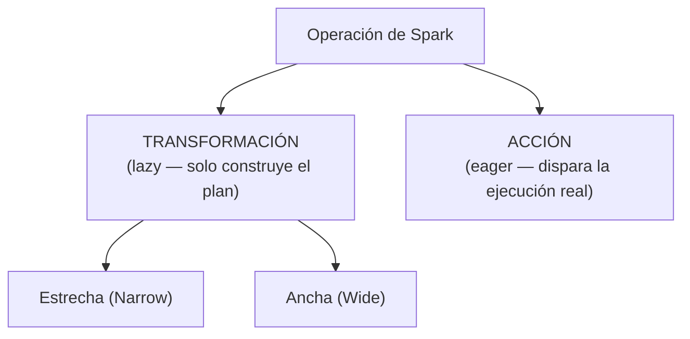
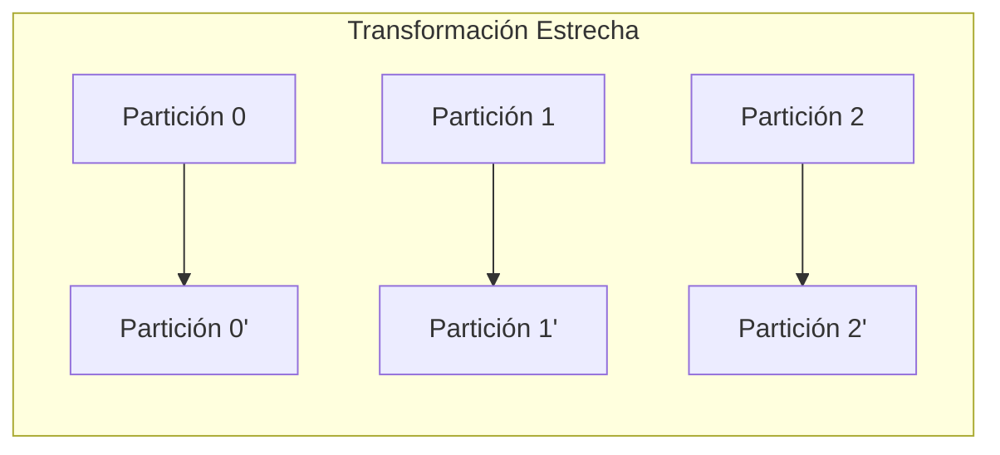
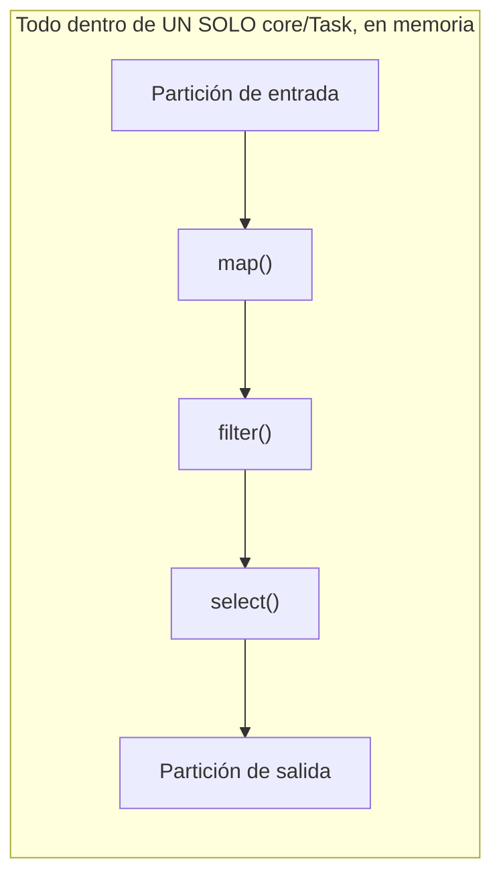
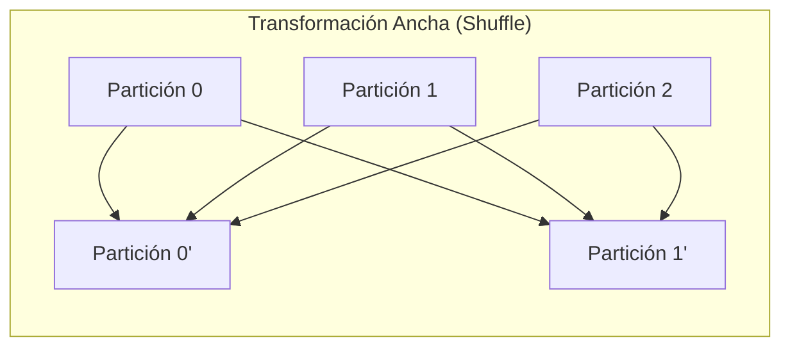
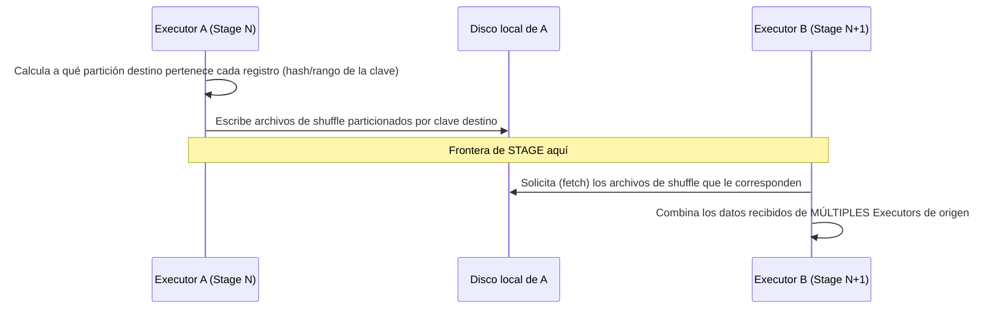
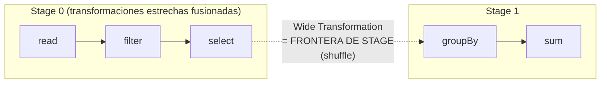
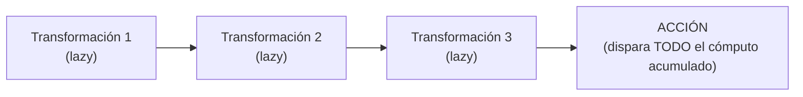
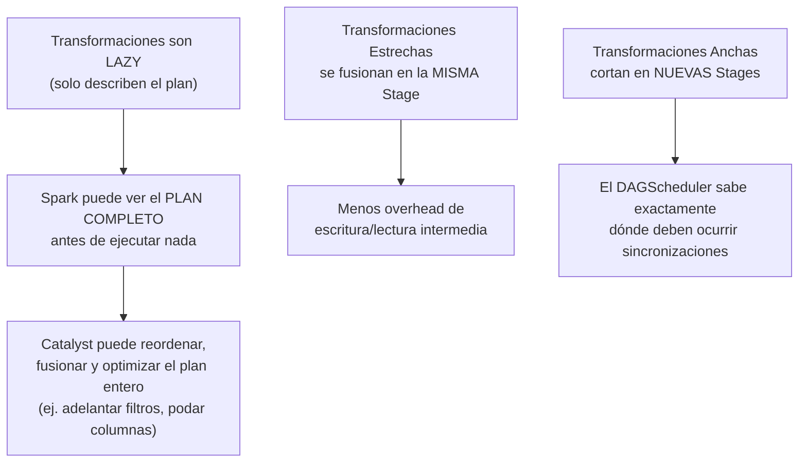

# Taxonomía de las Operaciones en Spark

## Índice

1. [Las dos grandes familias de operaciones](#1-las-dos-grandes-familias-de-operaciones)
2. [Transformaciones Estrechas (Narrow Transformations)](#2-transformaciones-estrechas-narrow-transformations)
3. [Transformaciones Anchas (Wide Transformations)](#3-transformaciones-anchas-wide-transformations)
4. [Acciones (Actions)](#4-acciones-actions)
5. [Por qué esta clasificación importa: el hilo conductor con la Sección 1](#5-por-qué-esta-clasificación-importa-el-hilo-conductor-con-la-sección-1)
6. [Tabla de referencia rápida por operación](#6-tabla-de-referencia-rápida-por-operación)
7. [Cómo identificar el tipo de una operación tú mismo](#7-cómo-identificar-el-tipo-de-una-operación-tú-mismo)
8. [Ejemplo end-to-end integrador](#8-ejemplo-end-to-end-integrador)
9. [Errores comunes](#9-errores-comunes)
10. [Resumen mental (cheatsheet)](#10-resumen-mental-cheatsheet)

---

## 1. Las dos grandes familias de operaciones

Toda operación que puedes invocar sobre un RDD o DataFrame en Spark cae en una de **dos categorías fundamentales**, y esta distinción es la base misma de la evaluación perezosa:



- **Transformaciones**: operaciones que **describen** cómo derivar un nuevo RDD/DataFrame a partir de otro, pero **no ejecutan nada de inmediato**. Se subdividen en **Estrechas** y **Anchas** según cómo se relacionan las particiones de entrada y salida.
- **Acciones**: operaciones que **fuerzan** la materialización física de todo el plan acumulado hasta ese punto, devolviendo un resultado concreto (al Driver, a disco, o a la consola).

Esta taxonomía es exactamente lo que le permite al **DAGScheduler** (visto en la Sección 1) decidir cuándo cortar el trabajo en Stages, y es el mecanismo detrás de la **Evaluación Perezosa**: nada se computa hasta que una Acción lo exige.

---

## 2. Transformaciones Estrechas (Narrow Transformations)

### 2.1 Definición

Una transformación es **estrecha** cuando **cada partición de salida depende como máximo de una única partición de entrada**. No se necesita mover ni combinar datos entre distintas particiones — cada partición puede procesarse de forma completamente **aislada e independiente** de las demás.



### 2.2 Ejemplos con código

```python
df = spark.read.parquet("ventas.parquet")

# map / select: cada fila se transforma de forma independiente, sin mirar otras filas
seleccionado = df.select("cliente", "monto")

# filter: cada fila se evalúa por sí sola contra la condición
filtrado = df.filter(df.monto > 100)

# withColumn: crea/transforma una columna sin necesitar datos de otras particiones
con_igv = df.withColumn("monto_igv", df.monto * 1.18)

# union: simplemente concatena particiones, sin reorganizar su contenido
otro_df = spark.read.parquet("ventas_2.parquet")
combinado = df.union(otro_df)
```

En la API de RDDs, esto se traduce en una **`NarrowDependency`** (específicamente `OneToOneDependency` para la mayoría de estos casos):

```python
rdd = sc.parallelize(range(100), numSlices=4)
rdd_mapeado = rdd.map(lambda x: x * 2)
print(rdd_mapeado.dependencies())
# [<pyspark.rdd.OneToOneDependency object at 0x...>]
```

### 2.3 Por qué son "ejecución in-memory"

Las transformaciones estrechas **no requieren escribir datos intermedios a disco ni transferirlos por red entre Executors**. Toda la cadena de transformaciones estrechas sobre una misma partición puede ejecutarse **de principio a fin dentro de un único core, en memoria**, sin ninguna sincronización con otras Tasks.



Esto es exactamente lo que permite que Spark **fusione múltiples transformaciones estrechas consecutivas en una única Stage** (y, con Whole-Stage Code Generation, incluso en un único bucle compilado — visto en el manual de Tungsten): no hay ninguna razón para "pausar" el trabajo entre un `filter` y un `select` si ambos pueden resolverse fila por fila sin depender de otras particiones.

### 2.4 Lista de transformaciones estrechas comunes

| Operación | Descripción |
|---|---|
| `map` / `mapPartitions` | Transforma cada elemento (o partición completa, en el caso de `mapPartitions`) |
| `filter` | Descarta elementos según una condición |
| `select`, `selectExpr` (DataFrame) | Proyecta columnas específicas |
| `withColumn`, `withColumnRenamed` | Añade/modifica/renombra columnas |
| `union` | Concatena dos RDDs/DataFrames con el mismo esquema |
| `sample` (sin reemplazo determinista entre particiones) | Toma una muestra aleatoria, partición por partición |
| `flatMap` | Expande cada elemento en cero o más elementos, sin mezclar particiones |

---

## 3. Transformaciones Anchas (Wide Transformations)

### 3.1 Definición

Una transformación es **ancha** cuando **una partición de salida puede depender de múltiples particiones de entrada**, lo que obliga a Spark a **reorganizar y mover datos entre distintos Executors** — el proceso conocido como **shuffle**.



### 3.2 Por qué son necesarias y qué las dispara

Las transformaciones anchas aparecen cuando la operación requiere **agrupar o combinar datos que, en su distribución original, están dispersos en particiones distintas**. Por ejemplo, para calcular una suma agrupada por `categoria`, Spark necesita garantizar que **todas** las filas de una misma categoría terminen en la **misma partición**, sin importar en qué partición estaban originalmente — y eso exige mover datos por la red.

```python
df = spark.read.parquet("ventas.parquet")

# groupBy: exige reagrupar filas de la misma clave en la misma partición
agrupado = df.groupBy("categoria").sum("monto")

# join: exige alinear filas con la misma clave de ambos DataFrames en la misma partición
otro_df = spark.read.parquet("clientes.parquet")
unido = df.join(otro_df, on="cliente_id")

# repartition: por definición, redistribuye TODO el dataset entre un nuevo número de particiones
redistribuido = df.repartition(50)

# distinct / dropDuplicates: necesita comparar filas potencialmente en particiones distintas
sin_duplicados = df.distinct()

# orderBy / sort global: requiere conocer el rango completo de valores para ordenar correctamente entre particiones
ordenado = df.orderBy("monto")
```

En la API de RDDs, esto se traduce en una **`ShuffleDependency`**:

```python
pares = sc.parallelize([("a", 1), ("b", 2), ("a", 3)], numSlices=4)
agrupado_rdd = pares.groupByKey()
print(agrupado_rdd.dependencies())
# [<pyspark.rdd.ShuffleDependency object at 0x...>]
```

### 3.3 El mecanismo físico del shuffle (resumen)



Este proceso de **escribir a disco local, transferir por red, y volver a leer** es exactamente por qué las Wide Transformations son consideradas **costosas** comparadas con las Narrow — no ocurre "en memoria" de principio a fin como en una transformación estrecha.

### 3.4 Fronteras de Stage (Stage boundaries)

Cada vez que el DAGScheduler encuentra una **dependencia ancha** en el plan, corta el grafo lógico y genera una **nueva Stage**. Esto conecta directamente con lo visto en la Sección 1 (Anatomía de una Aplicación: Jobs, Stages y Tasks):



En el plan físico (`.explain()`), una Wide Transformation aparece representada por un nodo **`Exchange`**:

```python
df.groupBy("categoria").sum("monto").explain()
```

```
== Physical Plan ==
*(2) HashAggregate(keys=[categoria], functions=[sum(monto)])
+- Exchange hashpartitioning(categoria, 200)
   +- *(1) HashAggregate(keys=[categoria], functions=[partial_sum(monto)])
      +- *(1) FileScan parquet [categoria,monto] ...
```

### 3.5 Lista de transformaciones anchas comunes

| Operación | Por qué requiere shuffle |
|---|---|
| `groupBy` / `groupByKey` | Debe reunir todas las filas de una misma clave en una partición |
| `join` (sin broadcast) | Debe alinear filas coincidentes de ambos datasets, potencialmente en particiones distintas |
| `repartition` | Por definición, redistribuye el dataset completo entre nuevas particiones |
| `distinct`, `dropDuplicates` | Debe comparar filas equivalentes que pueden estar en particiones distintas |
| `orderBy` / `sort` (global) | Requiere conocer el rango de valores completo para ordenar consistentemente entre particiones |
| `reduceByKey`, `aggregateByKey` | Debe combinar valores de la misma clave, dispersos entre particiones |
| `cogroup` | Combina múltiples RDDs por clave, requiriendo alinear particiones |

> **Nota de optimización**: `reduceByKey` es preferible a `groupByKey` cuando es posible, porque puede **combinar parcialmente los valores dentro de cada partición antes del shuffle** (una especie de "pre-agregación" o *map-side combine*), reduciendo la cantidad de datos que efectivamente viajan por la red — algo que `groupByKey` no hace, ya que necesita mover todos los valores crudos antes de agrupar.

---

## 4. Acciones (Actions)

### 4.1 Definición

Una **Acción** es una operación que **fuerza la ejecución real** de todo el plan de transformaciones (estrechas y anchas) acumulado hasta ese punto, y **devuelve un resultado concreto** — ya sea al programa Driver, a la consola, o escrito a un almacenamiento externo.



**Sin una Acción, absolutamente nada se ejecuta.** Puedes encadenar cientos de `.filter()`, `.map()`, `.groupBy()` — Spark solo construye y va enriqueciendo un **plan lógico**, sin tocar un solo byte de datos real, hasta que aparece una Acción.

```python
df = spark.read.parquet("ventas.parquet")
paso1 = df.filter(df.monto > 100)     # NO se ejecuta nada aún
paso2 = paso1.groupBy("categoria")     # NO se ejecuta nada aún
paso3 = paso2.sum("monto")             # NO se ejecuta nada aún

print("Hasta aquí, ningún dato ha sido leído ni procesado realmente.")

paso3.show()  # <-- AQUÍ, y solo aquí, se ejecuta TODO lo anterior de una vez
```

### 4.2 Categorías de Acciones

| Categoría | Ejemplos | Qué devuelve |
|---|---|---|
| **Recolección al Driver** | `.collect()`, `.take(n)`, `.first()`, `.top(n)` | Datos concretos traídos a la memoria del Driver |
| **Agregación simple** | `.count()`, `.sum()` (en RDDs numéricos), `.reduce()` | Un único valor calculado |
| **Escritura a almacenamiento** | `.write.parquet(...)`, `.write.csv(...)`, `.saveAsTextFile(...)` | Efecto persistido en disco/almacenamiento externo |
| **Visualización/depuración** | `.show()`, `.printSchema()` (esta última NO dispara Job, solo lee metadata) | Salida impresa en consola |
| **Iteración explícita** | `.foreach(funcion)` | Ejecuta una función por cada elemento, sin devolver un RDD/DataFrame |

```python
# Recolección al Driver — ¡cuidado con datasets grandes!
lista_completa = df.collect()          # riesgo de OutOfMemoryError si el DF es grande
primeras_filas = df.take(10)           # seguro: solo trae 10 filas

# Agregación simple
total_filas = df.count()

# Escritura a almacenamiento — la Acción más común en pipelines de producción
df.write.mode("overwrite").parquet("salida/")

# Iteración explícita (por ejemplo, para efectos secundarios como logging externo)
df.foreach(lambda fila: enviar_a_sistema_externo(fila))
```

### 4.3 `printSchema()` no es una Acción

Un matiz importante: `.printSchema()` **no dispara un Job** — el esquema ya es conocido por Spark (metadata) sin necesidad de leer ni procesar los datos reales. Es una operación de **metadata**, no de **materialización de datos**.

```python
df = spark.read.parquet("ventas.parquet")
df.printSchema()   # NO aparece como Job en la UI: solo lee metadata del esquema
df.count()          # SÍ aparece como Job: procesa datos reales
```

### 4.4 Cada Acción genera un Job nuevo (e independiente, salvo caché)

Como vimos en la Sección 1, **cada Acción dispara un Job independiente**. Si no cacheas resultados intermedios, cada Acción sobre el mismo linaje **recalcula todo desde el origen**:

```python
filtrado = df.filter(df.monto > 100)

filtrado.count()                          # Job 1: lee y filtra desde cero
filtrado.write.parquet("salida1/")        # Job 2: lee y filtra OTRA VEZ desde cero

filtrado.cache()
filtrado.count()                          # Job 3: lee, filtra, Y cachea
filtrado.write.parquet("salida2/")        # Job 4: reutiliza el caché, no relee el origen
```

---

## 5. Por qué esta clasificación importa: el hilo conductor con la Sección 1

Esta taxonomía **no es una curiosidad académica**: es literalmente el mecanismo que usa el DAGScheduler para construir Stages, y lo que hace posible la Evaluación Perezosa como estrategia de optimización.



Si Spark ejecutara cada operación de inmediato (evaluación *eager*, como haría por defecto Pandas), **perdería la posibilidad de ver el plan completo de antemano** y optimizarlo como un todo — tendría que ejecutar cada paso de forma aislada, sin contexto de lo que viene después. La combinación de **Lazy Evaluation + esta taxonomía de operaciones** es, en esencia, lo que habilita al Optimizador Catalyst (que se cubre en detalle en la siguiente sección del temario).

---

## 6. Tabla de referencia rápida por operación

| Operación | Tipo | Dispara Job |
|---|---|---|
| `map`, `flatMap`, `mapPartitions` | Transformación Estrecha | No |
| `filter` | Transformación Estrecha | No |
| `select`, `selectExpr`, `withColumn` | Transformación Estrecha | No |
| `union` | Transformación Estrecha | No |
| `groupBy`, `groupByKey` | Transformación Ancha | No (solo al encadenar una Acción después) |
| `join` (sin broadcast) | Transformación Ancha | No |
| `repartition` | Transformación Ancha | No |
| `distinct`, `dropDuplicates` | Transformación Ancha | No |
| `orderBy`, `sort` | Transformación Ancha | No |
| `reduceByKey`, `aggregateByKey` | Transformación Ancha (con pre-agregación local) | No |
| `collect`, `take`, `first` | Acción | Sí |
| `count`, `reduce` | Acción | Sí |
| `show` | Acción | Sí |
| `write.parquet/csv/json/...` | Acción | Sí |
| `foreach` | Acción | Sí |
| `printSchema` | Metadata (ninguna categoría) | No |

---

## 7. Cómo identificar el tipo de una operación tú mismo

Cuando no estés seguro si una operación es estrecha o ancha, hazte esta pregunta:

> **¿Para calcular una fila/partición de salida, necesito mirar datos que podrían estar en OTRA partición distinta?**

- Si la respuesta es **"no, me basta con los datos que ya tengo en mi propia partición"** → es **Narrow**.
- Si la respuesta es **"sí, necesito coordinar/combinar con datos que podrían estar en cualquier otra partición"** → es **Wide**.

Puedes confirmarlo empíricamente de dos formas:

```python
# Opción 1: inspeccionar dependencias directamente (API de RDDs)
rdd_resultado.dependencies()
# OneToOneDependency -> Narrow | ShuffleDependency -> Wide

# Opción 2: revisar el plan físico buscando el nodo 'Exchange' (API de DataFrames)
df_resultado.explain()
# La presencia de 'Exchange' confirma un shuffle, es decir, una operación Wide en el plan
```

---

## 8. Ejemplo end-to-end integrador

```python
from pyspark.sql import SparkSession

spark = SparkSession.builder.appName("TaxonomiaDemo").master("local[4]").getOrCreate()

df = spark.read.parquet("ventas.parquet")

# --- Cadena de Transformaciones Estrechas (se fusionan en Stage 0) ---
paso1 = df.filter(df.monto > 0)               # Narrow
paso2 = paso1.select("cliente_id", "categoria", "monto")  # Narrow
paso3 = paso2.withColumn("monto_igv", paso2.monto * 1.18)  # Narrow

print("Hasta aquí: CERO Jobs ejecutados (todo es lazy).")

# --- Transformación Ancha: aquí se corta una nueva Stage ---
paso4 = paso3.groupBy("categoria").sum("monto_igv")  # Wide -> Exchange en el plan

print("Aún CERO Jobs ejecutados: 'groupBy' + 'sum' siguen siendo lazy.")

# --- Acción: AHORA se ejecuta todo de una sola vez ---
resultado = paso4.collect()  # <-- Acción: dispara Job con 2 Stages (Narrow fusionadas + Wide)

print("Resultado:", resultado)
print("Recién ahora se ejecutó realmente todo el pipeline anterior.")

# Confirmación visual del plan:
paso4.explain()
# Deberías ver: FileScan -> Filter -> Project -> Exchange -> HashAggregate

spark.stop()
```

---

## 9. Errores comunes

| Creencia errónea | Realidad |
|---|---|
| "Cada `.filter()` o `.map()` que escribo ejecuta algo de inmediato" | Falso: son lazy. Solo las Acciones disparan ejecución real |
| "`printSchema()` cuenta como una Acción" | No dispara Job — solo lee metadata del esquema |
| "`repartition` es una Acción porque 'hace algo pesado'" | Sigue siendo una Transformación (Ancha); no ejecuta nada hasta que una Acción la materialice |
| "`groupByKey` y `reduceByKey` son equivalentes en costo" | `reduceByKey` pre-agrega localmente antes del shuffle; `groupByKey` mueve todos los valores crudos, siendo más costoso en la mayoría de casos |
| "Toda transformación ancha necesariamente escribe MUCHOS datos a disco" | El volumen depende de la cardinalidad de las claves y el tamaño de los datos; un shuffle sobre pocas claves puede ser barato, aunque el mecanismo (escritura+red+lectura) es el mismo |
| "Un `join` siempre es una operación ancha" | No siempre: un **Broadcast Join** (cuando una tabla es pequeña) evita el shuffle enviando una copia completa de la tabla pequeña a todos los Executors — se cubre en detalle en el módulo de AQE/Joins |

---

## 10. Resumen mental (cheatsheet)

- Toda operación en Spark es **Transformación** (lazy) o **Acción** (eager, dispara ejecución).
- **Transformación Estrecha**: 1 partición de salida ↔ ≤1 partición de entrada. Ejecuta en memoria, sin shuffle. Ej: `map`, `filter`, `select`.
- **Transformación Ancha**: requiere reorganizar datos entre particiones (shuffle: escribe a disco, transfiere por red, vuelve a leer). Marca una **frontera de Stage**. Ej: `groupBy`, `join`, `repartition`.
- **Acción**: dispara la materialización física de todo el plan acumulado. Sin Acción, nada se ejecuta. Ej: `collect`, `count`, `show`, `write`.
- `printSchema()` **no** es una Acción — solo consulta metadata.
- En el plan físico, un nodo **`Exchange`** = shuffle = Transformación Ancha.
- Sin `.cache()`, cada Acción sobre el mismo linaje **recalcula todo desde el origen**.
- Esta taxonomía es la base misma del DAGScheduler y de la Evaluación Perezosa: permite que Spark vea el plan **completo** antes de ejecutar nada, habilitando la optimización global del Optimizador Catalyst.
