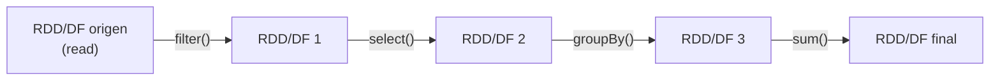
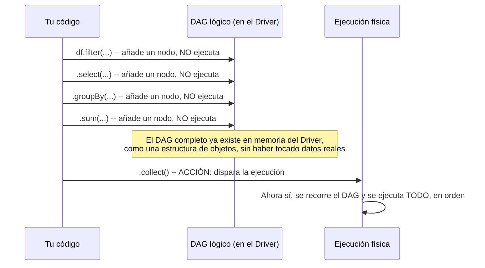
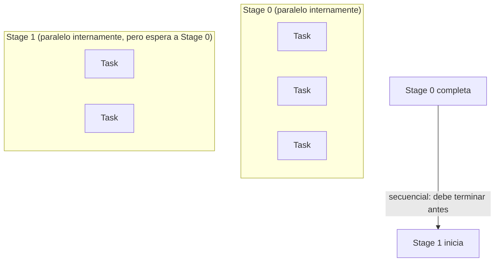
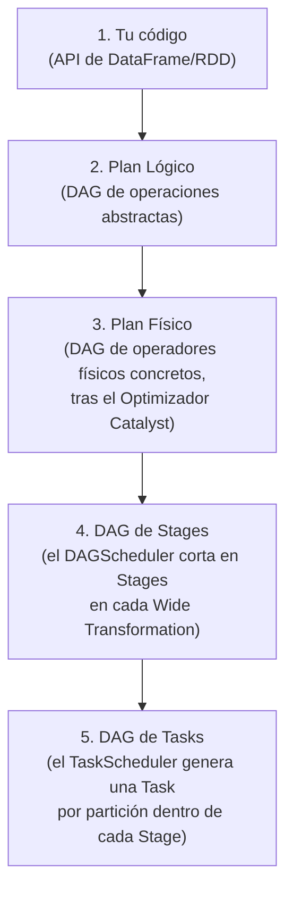
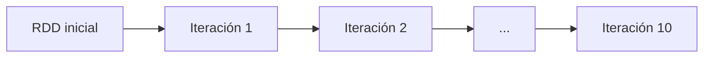
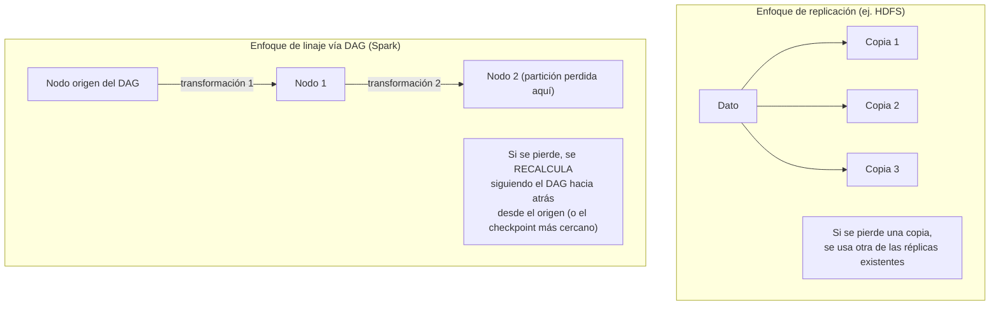
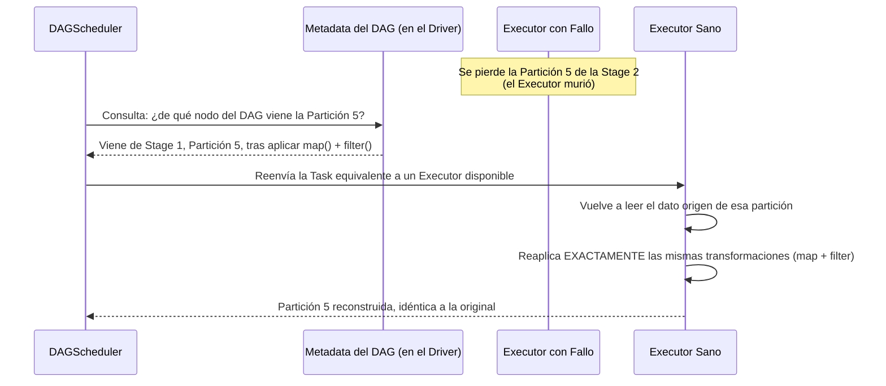
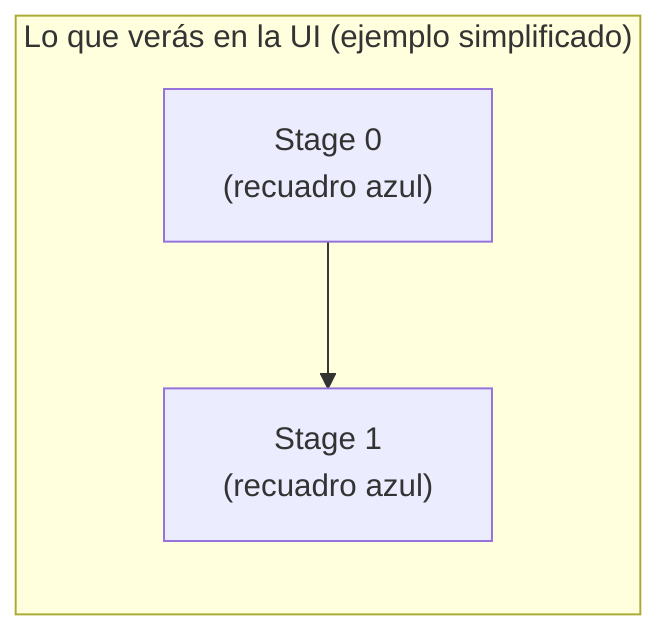
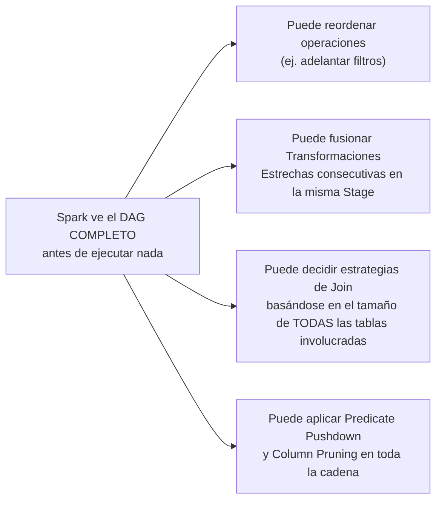

# El Grafo Acíclico Dirigido (DAG)

## Índice

1. [Qué es un DAG y por qué Spark lo necesita](#1-qué-es-un-dag-y-por-qué-spark-lo-necesita)
2. [Construcción lógica vs. ejecución física secuencial](#2-construcción-lógica-vs-ejecución-física-secuencial)
3. [Anatomía del DAG: de la API a las Tasks](#3-anatomía-del-dag-de-la-api-a-las-tasks)
4. [Por qué "Acíclico": la ausencia de bucles](#4-por-qué-acíclico-la-ausencia-de-bucles)
5. [Tolerancia a fallos: reconstrucción determinista vía linaje, no replicación](#5-tolerancia-a-fallos-reconstrucción-determinista-vía-linaje-no-replicación)
6. [Visualizando el DAG en el Spark UI](#6-visualizando-el-dag-en-el-spark-ui)
7. [El DAG y la optimización: qué gana Spark viendo el plan completo](#7-el-dag-y-la-optimización-qué-gana-spark-viendo-el-plan-completo)
8. [Ejemplo end-to-end integrador](#8-ejemplo-end-to-end-integrador)
9. [Errores comunes](#9-errores-comunes)
10. [Resumen mental (cheatsheet)](#10-resumen-mental-cheatsheet)

---

## 1. Qué es un DAG y por qué Spark lo necesita

Un **DAG (Directed Acyclic Graph / Grafo Acíclico Dirigido)** es una estructura matemática donde:

- **Dirigido**: las conexiones (aristas) entre nodos tienen una dirección clara — de "padre" a "hijo", nunca al revés.
- **Acíclico**: siguiendo las direcciones de las aristas, **es imposible volver a un nodo por el que ya pasaste**. No hay bucles.

En Spark, **cada RDD/DataFrame que creas es un nodo del DAG**, y cada transformación que aplicas es una arista dirigida desde el RDD/DataFrame padre hacia el nuevo RDD/DataFrame hijo.



**¿Por qué exactamente un DAG, y no otra estructura?**

- Spark necesita **modelar dependencias de cómputo** ("este resultado necesita primero que se calcule aquel otro") — un grafo es la estructura natural para representar esto.
- Necesita ser **acíclico** porque el cómputo de Spark es fundamentalmente **funcional y hacia adelante**: cada RDD nuevo se deriva de RDDs anteriores, nunca hay una operación que "vuelva atrás" a modificar un RDD ya definido (recordemos la inmutabilidad de los RDDs). Un ciclo implicaría una dependencia circular imposible de resolver ("A depende de B, que depende de A").
- Necesita ser **dirigido** para que el DAGScheduler sepa exactamente en qué **orden** deben resolverse las dependencias: no puedes calcular un `groupBy` antes de que exista el `filter` del que depende.

---

## 2. Construcción lógica vs. ejecución física secuencial

Este es el punto más importante del DAG en Spark, y el que más se conecta con la Evaluación Perezosa vista en el manual anterior: **el DAG se construye de forma lógica, completa, ANTES de que se ejecute nada físicamente**.



### 2.1 Dos fases claramente separadas

| Fase | Qué ocurre | Dónde |
|---|---|---|
| **Construcción lógica** | Cada transformación agrega un nuevo nodo al DAG (un nuevo RDD/DataFrame con una referencia a su padre y la función/operación aplicada) | En el **Driver**, en memoria, sin tocar datos reales |
| **Ejecución física secuencial** | El DAGScheduler recorre el DAG completo, lo traduce en Stages, y el TaskScheduler ejecuta las Tasks resultantes **en el orden que las dependencias exigen** | Distribuida entre los **Executors** |

```python
df = spark.read.parquet("ventas.parquet")   # Nodo 0 del DAG

paso1 = df.filter(df.monto > 100)            # Nodo 1: depende de Nodo 0
paso2 = paso1.select("categoria", "monto")   # Nodo 2: depende de Nodo 1
paso3 = paso2.groupBy("categoria")           # Nodo 3: depende de Nodo 2
paso4 = paso3.sum("monto")                   # Nodo 4: depende de Nodo 3

# Hasta aquí: el DAG completo (5 nodos) ya existe en el Driver.
# CERO datos han sido leídos o procesados.

resultado = paso4.collect()  # AHORA: se ejecuta todo el DAG, en el orden correcto
```

### 2.2 Por qué la ejecución física es "secuencial" (a nivel de Stages)

Aunque **dentro de una Stage las Tasks corren en paralelo**, las **Stages en sí se ejecutan en un orden secuencial estricto** determinado por sus dependencias en el DAG: una Stage que depende del resultado de un shuffle **no puede empezar** hasta que la Stage anterior termine de escribir esos datos de shuffle.



Esto es exactamente la dualidad del título de esta sección: **construcción lógica** (todo el DAG se arma de antemano, sin orden de ejecución todavía) vs. **ejecución física secuencial** (una vez que se dispara, las Stages respetan un orden estricto de dependencias, aunque las Tasks dentro de cada Stage sean paralelas).

---

## 3. Anatomía del DAG: de la API a las Tasks

El DAG en Spark no es un concepto único y monolítico — existen, en la práctica, **varias representaciones del mismo cómputo**, cada vez más concretas, a medida que se acerca la ejecución real:



| Nivel | Generado por | Ejemplo de cómo se ve |
|---|---|---|
| Plan Lógico | La API de DataFrame/RDD, al escribir el código | `Filter -> Project -> Aggregate` (abstracto) |
| Plan Físico | El Optimizador Catalyst (fases de optimización lógica y física — se cubre en detalle en la siguiente sección del temario) | `FileScan -> Filter -> Project -> Exchange -> HashAggregate` |
| DAG de Stages | El **DAGScheduler** | `Stage 0 [FileScan, Filter, Project] -> Stage 1 [HashAggregate]` |
| DAG de Tasks | El **TaskScheduler** | `Stage 0: 200 Tasks` + `Stage 1: 8 Tasks` |

```python
# Puedes inspeccionar los primeros dos niveles directamente:
resultado = df.filter(df.monto > 100).select("categoria", "monto").groupBy("categoria").sum("monto")

resultado.explain(extended=True)
# Muestra: == Parsed Logical Plan == / == Analyzed Logical Plan ==
#          == Optimized Logical Plan == / == Physical Plan ==
```

---

## 4. Por qué "Acíclico": la ausencia de bucles

Es útil detenerse en esto porque a veces genera confusión con algoritmos **iterativos** (por ejemplo, en Machine Learning, donde "repites" una operación muchas veces).

**Un algoritmo iterativo NO crea un ciclo en el DAG.** Cada iteración genera un **nuevo conjunto de nodos**, encadenados hacia adelante — nunca se vuelve literalmente a un nodo anterior para "reescribirlo".

```python
rdd = sc.parallelize(range(1000))

for i in range(10):  # 10 "iteraciones"
    rdd = rdd.map(lambda x: x + 1)  # cada vuelta crea un NUEVO nodo en el DAG

# El DAG resultante NO es un ciclo de 10 pasos que se repite:
# es una CADENA LINEAL de 10 nodos distintos, uno por cada iteración,
# cada uno apuntando hacia adelante al siguiente.
print(rdd.toDebugString().decode("utf-8"))
```



Esto es precisamente lo que hace posible que el **linaje** (visto en el manual de RDDs) sea reconstruible de forma **determinista**: como no hay ciclos, siempre existe un único camino claro, hacia atrás, desde cualquier nodo hasta el origen de los datos — sin ambigüedad sobre "qué se ejecutó primero" o posibilidad de quedar atrapado en un bucle infinito de dependencias.

> **Nota técnica**: en algoritmos genuinamente iterativos con muchísimas vueltas (como el descenso de gradiente en ML), aunque no hay ciclos, el DAG **sí crece linealmente en longitud** con cada iteración, lo cual reintroduce el problema de "linaje demasiado largo" visto en el manual de RDDs — de ahí la recomendación de usar `.checkpoint()` periódicamente en esos casos, para truncar la cadena y evitar planes de reconstrucción excesivamente largos ante un fallo.

---

## 5. Tolerancia a fallos: reconstrucción determinista de particiones perdidas desde el linaje en lugar de replicación de datos en memoria

Esta es la aplicación práctica más importante del DAG, y conecta directamente con la Sección 2 (RDDs). Vale la pena repasarla aquí con el vocabulario específico del DAG.

### 5.1 El contraste de fondo



### 5.2 Por qué es "determinista"

El término "determinista" es clave: dado el **mismo DAG** y los **mismos datos de origen**, Spark puede reproducir **exactamente el mismo resultado** para una partición perdida, ejecutando de nuevo la misma secuencia de transformaciones. No hay ambigüedad ni aleatoriedad involucrada en el proceso de reconstrucción — el DAG describe una función pura y reproducible.

> **Advertencia práctica importante**: esta garantía de determinismo asume que **tus propias funciones** (las que le pasas a `.map()`, `.filter()`, UDFs, etc.) también son **funciones puras y deterministas**. Si usas, por ejemplo, `random.random()` sin fijar una semilla dentro de una transformación, una reconstrucción tras un fallo podría producir valores **distintos** a la ejecución original — la responsabilidad del determinismo del *contenido* recae en tu código; Spark solo garantiza el determinismo de *qué secuencia de pasos* se vuelve a ejecutar.

### 5.3 El mecanismo paso a paso



### 5.4 Ventaja de eficiencia frente a la replicación

| Aspecto | Replicación (ej. HDFS) | Reconstrucción vía DAG/Linaje (Spark) |
|---|---|---|
| Uso de memoria/almacenamiento durante operación normal | Alto: se mantienen N copias siempre, incluso si nunca ocurre un fallo | Bajo: no se duplican datos "por si acaso"; solo se guarda la **receta** (el DAG) para recrearlos |
| Costo cuando SÍ ocurre un fallo | Bajo: simplemente se usa una réplica ya existente | Variable: depende de cuánto haya que recalcular (mitigable con `.checkpoint()`) |
| Escalabilidad de memoria | Peor (cada réplica ocupa espacio real) | Mejor (el "seguro" es casi gratis: solo metadata del DAG) |

Este es precisamente el balance de diseño que hace de Spark un motor eficiente para **cómputo en memoria a gran escala**: en el caso común (sin fallos), no se paga ningún costo de replicación; el costo de tolerancia a fallos solo se paga **si y cuando** efectivamente ocurre un fallo.

---

## 6. Visualizando el DAG en el Spark UI

El Spark UI (`:4040`) te permite ver el DAG real de cualquier Job ejecutado, en la pestaña **"Jobs"** → click en un Job específico → **"DAG Visualization"**.



Dentro de cada recuadro de Stage, verás los **operadores físicos** encadenados (Scan, Filter, Project, etc.), y las flechas **entre recuadros de Stage** representan exactamente los puntos de shuffle (transformaciones anchas) que el DAGScheduler usó para cortar el grafo.

```python
df.filter(df.monto > 100).groupBy("categoria").sum("monto").collect()
```

Al revisar la UI para este Job, deberías confirmar:

- [ ] Dos recuadros de Stage (uno antes y otro después del `groupBy`).
- [ ] Dentro del primer recuadro: nodos como `Scan parquet`, `Filter`.
- [ ] Dentro del segundo recuadro: nodos como `HashAggregate`.
- [ ] Una conexión entre ambos recuadros representando el shuffle.

---

## 7. El DAG y la optimización: qué gana Spark viendo el plan completo

Este punto conecta directamente con el manual de Taxonomía de Operaciones y anticipa la siguiente sección del temario (el Optimizador Catalyst):



Si Spark ejecutara cada operación **inmediatamente** al escribirla (como Pandas por defecto), **nunca tendría visibilidad del plan completo** — perdería la posibilidad de tomar decisiones globales de optimización, y solo podría optimizar operación por operación, de forma aislada y miope.

---

## 8. Ejemplo end-to-end integrador

```python
from pyspark.sql import SparkSession

spark = SparkSession.builder.appName("DAGDemo").master("local[4]").getOrCreate()
sc = spark.sparkContext

# === 1. CONSTRUCCIÓN LÓGICA: se arma el DAG completo, sin ejecutar nada ===
df = spark.read.parquet("ventas.parquet")
paso1 = df.filter(df.monto > 100)               # Nodo 1 del DAG
paso2 = paso1.select("categoria", "monto")       # Nodo 2 del DAG
paso3 = paso2.groupBy("categoria")               # Nodo 3 del DAG (Wide -> futura frontera de Stage)
paso4 = paso3.sum("monto")                       # Nodo 4 del DAG

print("DAG construido en el Driver. CERO Jobs ejecutados hasta ahora.")

# === 2. INSPECCIÓN DEL DAG EN SUS DISTINTAS REPRESENTACIONES ===
paso4.explain(extended=True)
# Verás: Parsed Logical Plan -> Analyzed Logical Plan -> Optimized Logical Plan -> Physical Plan

# === 3. EJECUCIÓN FÍSICA SECUENCIAL: la Acción dispara todo ===
resultado = paso4.collect()
print("Resultado:", resultado)

# === 4. TOLERANCIA A FALLOS DETERMINISTA (simulación conceptual con RDD + cache) ===
rdd = sc.parallelize(range(0, 1_000_000), numSlices=8).map(lambda x: x * 2).filter(lambda x: x % 3 == 0)
rdd.cache()
print("Primer count (calcula y cachea):", rdd.count())

# Si una partición cacheada se perdiera aquí (ej. Executor caído en un clúster real),
# el siguiente count() la reconstruiría automáticamente siguiendo el DAG hacia atrás:
print("Segundo count (usa caché, o reconstruye deterministicamente lo que falte):", rdd.count())

spark.stop()
```

---

## 9. Errores comunes

| Creencia errónea | Realidad |
|---|---|
| "El DAG se ejecuta en el mismo orden en que aparecen las Stages en el código" | El DAG se ejecuta según las **dependencias reales**, no según el orden textual del código — Catalyst puede incluso reordenar operaciones dentro del plan optimizado |
| "Un bucle `for` en mi código Python genera un ciclo en el DAG de Spark" | Falso: cada vuelta del bucle simplemente **añade nodos nuevos** hacia adelante; el DAG sigue siendo acíclico, aunque más largo |
| "El DAG completo se ejecuta de una sola vez, todo en paralelo" | Las **Stages** se ejecutan de forma secuencial respetando las dependencias; solo las **Tasks dentro de una misma Stage** corren en paralelo |
| "Si mi función tiene aleatoriedad, la reconstrucción tras un fallo dará el mismo resultado igual" | No necesariamente: el determinismo de Spark aplica a **qué secuencia se re-ejecuta**, no garantiza que tu código sea puro — usa semillas fijas si necesitas reproducibilidad exacta |
| "Ver el DAG en la UI es lo mismo que ver el código fuente de mi aplicación" | La UI muestra el **plan físico ya optimizado y dividido en Stages**, que puede diferir bastante del orden y la forma exacta en que escribiste el código |

---

## 10. Resumen mental (cheatsheet)

- Un **DAG** es un grafo **Dirigido** (dependencias con dirección clara) y **Acíclico** (sin bucles) — cada RDD/DataFrame es un nodo, cada transformación es una arista hacia adelante.
- **Construcción lógica**: el DAG se arma completo en el Driver, en memoria, sin ejecutar nada — gracias a la Evaluación Perezosa.
- **Ejecución física secuencial**: al llegar una Acción, el DAGScheduler traduce el DAG en Stages (cortando en cada Wide Transformation), y las Stages se ejecutan **en orden estricto de dependencias** (aunque las Tasks dentro de cada Stage sean paralelas).
- Los bucles `for` en tu código **no crean ciclos** en el DAG — generan cadenas lineales más largas de nodos nuevos.
- **Tolerancia a fallos determinista**: ante la pérdida de una partición, Spark no usa réplicas (como HDFS) — **recalcula** siguiendo el DAG/linaje hacia atrás, de forma reproducible, siempre que tus propias funciones sean deterministas.
- Este enfoque es más eficiente en memoria que la replicación en el caso común (sin fallos), pagando el costo de recomputo solo **si y cuando** ocurre un fallo real.
- Ver el DAG en la UI (`:4040` → Jobs → DAG Visualization) permite confirmar visualmente Stages, operadores físicos, y puntos exactos de shuffle.
- Que Spark vea el **DAG completo antes de ejecutar** es la base que habilita toda la optimización global del Optimizador Catalyst, cubierta en la siguiente sección del temario.
