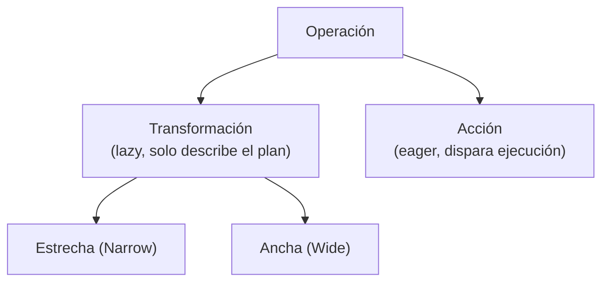
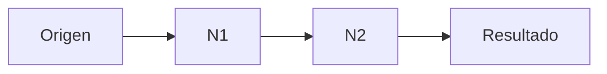
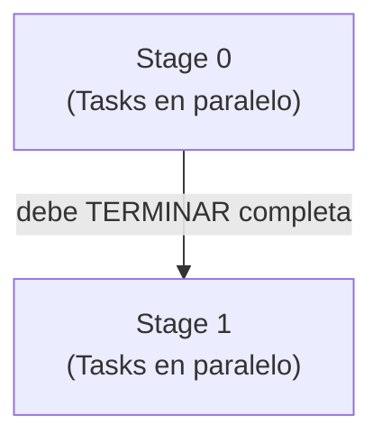

# Cheatsheet — Sección 3: Evaluación Perezosa (Lazy Evaluation) y el Grafo de Ejecución

## 1. Las dos familias de operaciones



**Sin una Acción, nada se ejecuta.** Puedes encadenar cientos de transformaciones sin tocar un solo byte de datos.

---

## 2. Transformaciones Estrechas (Narrow)

- 1 partición de salida ↔ **≤1** partición de entrada. Sin shuffle. Ejecuta **en memoria**.
- Se fusionan en la **misma Stage**.
- Dependencia: `OneToOneDependency`.

| Operaciones |
|---|
| `map`, `mapPartitions`, `flatMap` |
| `filter` |
| `select`, `selectExpr`, `withColumn` |
| `union` |

```python
rdd.map(f).dependencies()  # [<OneToOneDependency ...>]
```

---

## 3. Transformaciones Anchas (Wide)

- 1 partición de salida puede depender de **N** particiones de entrada → **shuffle** (disco + red + disco).
- Marca una **frontera de Stage**. En `.explain()` aparece como nodo **`Exchange`**.
- Dependencia: `ShuffleDependency`.

| Operaciones | Nota |
|---|---|
| `groupBy` / `groupByKey` | Reúne claves iguales en la misma partición |
| `join` (sin broadcast) | Alinea filas coincidentes entre datasets |
| `repartition` | Redistribuye TODO el dataset |
| `distinct`, `dropDuplicates` | Compara filas entre particiones |
| `orderBy` / `sort` (global) | Necesita el rango completo de valores |
| `reduceByKey`, `aggregateByKey` | Pre-agrega localmente antes del shuffle (más barato que `groupByKey`) |

```python
rdd.groupByKey().dependencies()  # [<ShuffleDependency ...>]
```

**Regla de preferencia:** `reduceByKey` > `groupByKey` cuando sea posible (menos datos viajan por la red).

---

## 4. Acciones (Actions)

| Categoría | Ejemplos |
|---|---|
| Recolección al Driver | `.collect()`, `.take(n)`, `.first()` |
| Agregación simple | `.count()`, `.reduce()` |
| Escritura | `.write.parquet/csv/...` |
| Iteración | `.foreach(f)` |
| Visualización | `.show()` |

⚠️ `.printSchema()` **NO** es una Acción — solo lee metadata, no dispara Job.

- Cada Acción genera **un Job nuevo e independiente**.
- Sin `.cache()`, cada Acción **recalcula todo el linaje desde el origen**.

```python
df.filter(...).count()             # Job 1: lee+filtra desde cero
df.filter(...).write.parquet(...)  # Job 2: lee+filtra OTRA VEZ desde cero
```

---

## 5. Cómo identificar Narrow vs Wide tú mismo

> ¿Para calcular una partición de salida necesito mirar datos de OTRA partición?
> - **No** → Narrow
> - **Sí** → Wide

```python
rdd_resultado.dependencies()   # OneToOneDependency | ShuffleDependency
df_resultado.explain()          # busca el nodo 'Exchange' = Wide
```

---

## 6. El DAG (Grafo Acíclico Dirigido)

- **Dirigido**: dependencias con dirección clara (padre → hijo).
- **Acíclico**: nunca se vuelve a un nodo ya visitado. Un `for` en tu código **no crea un ciclo** — genera una cadena lineal más larga.



### Las 4 representaciones del plan

```python
df.explain(extended=True)
```

| Nivel | Qué es |
|---|---|
| `Parsed Logical Plan` | Tu código, sin validar |
| `Analyzed Logical Plan` | Validado contra el catálogo (nombres de columnas resueltos) |
| `Optimized Logical Plan` | Tras reglas de Catalyst (pushdown, pruning...) |
| `Physical Plan` | Plan final, con nodos `Exchange` = shuffles |

### Construcción lógica vs. ejecución física

| Fase | Dónde | Qué pasa |
|---|---|---|
| Construcción lógica | Driver, en memoria | Cada transformación añade un nodo al DAG. Cero datos tocados |
| Ejecución física secuencial | Executors | DAGScheduler corta en Stages; **Stages se ejecutan en orden estricto** (Tasks dentro de una Stage sí son paralelas) |



---

## 7. Tolerancia a fallos: reconstrucción determinista

| | Replicación (HDFS) | Reconstrucción vía DAG (Spark) |
|---|---|---|
| Estrategia | Copias físicas (x3) siempre | Recalcula siguiendo el linaje hacia atrás |
| Costo en operación normal | Alto (memoria/disco usado siempre) | Bajo (solo metadata del DAG) |
| Costo ante fallo | Bajo (usa una réplica) | Variable (mitigable con `.checkpoint()`) |

- **Determinista** = misma secuencia de pasos, mismo resultado, siempre que tus funciones sean **puras**.
- ⚠️ `random.random()` sin semilla → resultado distinto en cada recomputo. El DAG garantiza reproducir los **pasos**, no el contenido de funciones impuras.

```python
sc.setCheckpointDir("hdfs://.../checkpoints")
rdd.checkpoint()   # trunca el linaje, útil en cadenas iterativas muy largas
```

---

## 8. Verificación rápida en el Spark UI

| Dónde | Qué confirmar |
|---|---|
| `:4040` → Jobs | 0 Jobs tras transformaciones; 1 Job nuevo tras cada Acción |
| `:4040` → Jobs → DAG Visualization | Recuadros de Stage + flechas de shuffle entre ellos |
| `:4040` → Stages | Una Stage en `Pending` mientras la anterior está `Active` (ejecución secuencial) |
| `.explain()` | Nodo `Exchange` = frontera de Stage / Wide Transformation |

---

## 9. Errores comunes

| Creencia errónea | Realidad |
|---|---|
| "Cada `.filter()`/`.map()` ejecuta algo de inmediato" | Lazy: solo las Acciones disparan ejecución |
| "`printSchema()` es una Acción" | No dispara Job, solo lee metadata |
| "Un bucle `for` crea un ciclo en el DAG" | Crea nodos nuevos en cadena, sigue siendo acíclico |
| "El DAG completo se ejecuta todo en paralelo" | Las Stages son secuenciales; solo las Tasks dentro de una Stage son paralelas |
| "La reconstrucción tras un fallo siempre da resultados idénticos" | Solo si las funciones que usas son deterministas (sin `random` sin semilla, sin estado externo) |
| "`groupByKey` y `reduceByKey` cuestan lo mismo" | `reduceByKey` pre-agrega localmente antes del shuffle, es más barato |
