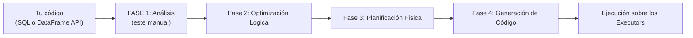
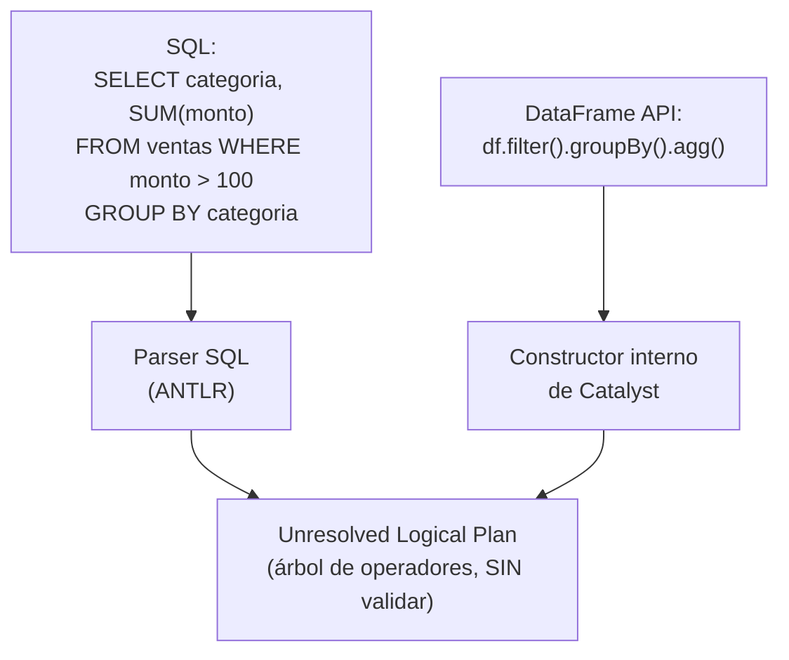
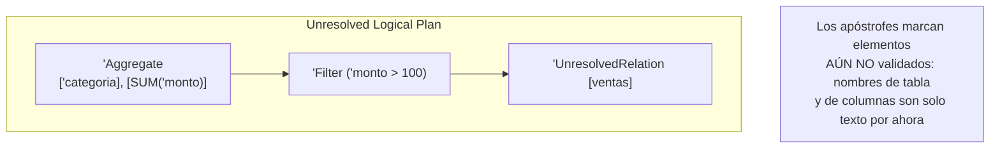
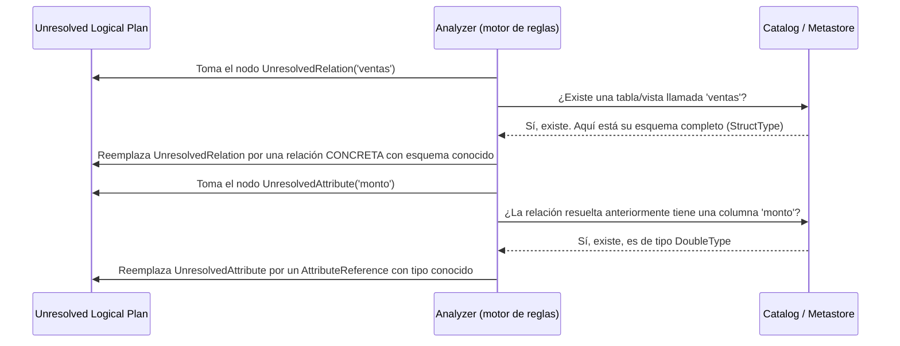
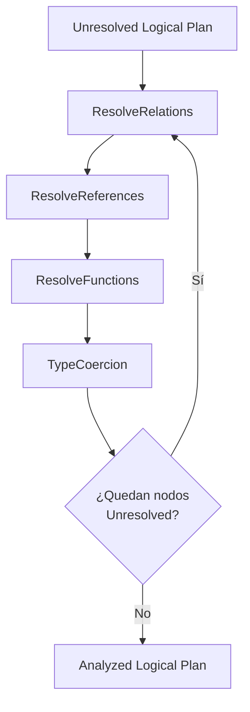
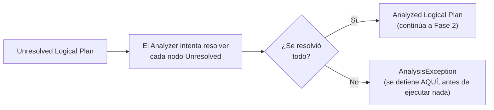
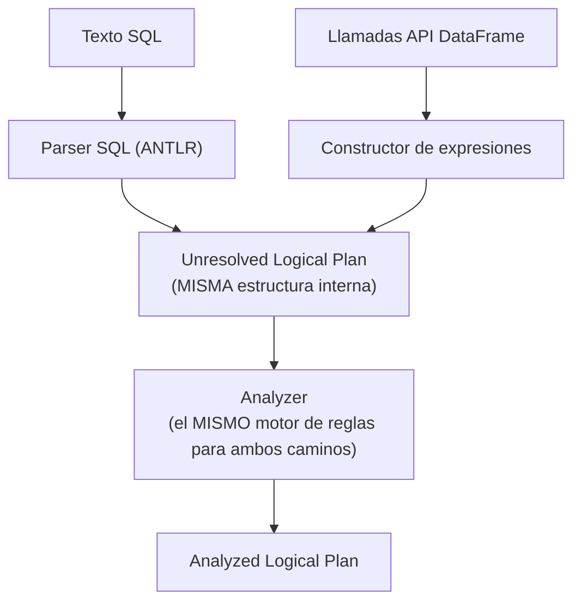

# El Optimizador Catalyst — Fase 1: Análisis (Analysis)

## Índice

1. [Ubicando la Fase 1 en el ciclo de vida completo](#1-ubicando-la-fase-1-en-el-ciclo-de-vida-completo)
2. [Punto de partida: tu código como texto/objetos, no como plan](#2-punto-de-partida-tu-código-como-textoobjetos-no-como-plan)
3. [Paso 1: Conversión a Plan Lógico Sin Resolver (Unresolved Logical Plan)](#3-paso-1-conversión-a-plan-lógico-sin-resolver-unresolved-logical-plan)
4. [Qué significa exactamente "Sin Resolver" (`UnresolvedRelation`, `UnresolvedAttribute`)](#4-qué-significa-exactamente-sin-resolver-unresolvedrelation-unresolvedattribute)
5. [Paso 2: Resolución contra el Catálogo (Catalog/Metastore)](#5-paso-2-resolución-contra-el-catálogo-catalogmetastore)
6. [El Analyzer: reglas de resolución paso a paso](#6-el-analyzer-reglas-de-resolución-paso-a-paso)
7. [Errores de análisis: `AnalysisException`](#7-errores-de-análisis-analysisexception)
8. [SQL vs DataFrame API: mismo destino, mismo Analyzer](#8-sql-vs-dataframe-api-mismo-destino-mismo-analyzer)
9. [Observando la Fase 1 en la práctica](#9-observando-la-fase-1-en-la-práctica)
10. [Ejemplo end-to-end integrador](#10-ejemplo-end-to-end-integrador)
11. [Errores comunes](#11-errores-comunes)
12. [Resumen mental (cheatsheet)](#12-resumen-mental-cheatsheet)

---

## 1. Ubicando la Fase 1 en el ciclo de vida completo

El Optimizador Catalyst procesa cada consulta (venga de SQL o de la API de DataFrame) a través de **cuatro fases secuenciales**. Este manual cubre en profundidad la **primera** de ellas: **Análisis (Analysis)** — el punto de entrada obligatorio antes de que cualquier optimización pueda siquiera considerarse.



**Por qué esta fase va primero, sin excepción**: antes de poder optimizar cualquier cosa, Catalyst necesita saber con certeza **qué significa** tu consulta — qué tablas existen, qué columnas tienen, de qué tipo son, y si las operaciones que pides son siquiera válidas. Sin esa validación previa, cualquier intento de optimización (Fase 2 en adelante) trabajaría sobre una base insegura.

---

## 2. Punto de partida: tu código como texto/objetos, no como plan

Antes de que exista cualquier "plan" en el sentido de Catalyst, lo único que existe es **tu código**, ya sea:

- Una cadena de texto SQL, que debe ser **parseada** (analizada sintácticamente) primero.
- Una cadena de llamadas a métodos de la API de DataFrame (`.filter()`, `.select()`, `.groupBy()`...), que Spark va registrando internamente a medida que las invocas.

```python
# Camino 1: SQL como texto plano
resultado_sql = spark.sql("""
    SELECT categoria, SUM(monto) AS total
    FROM ventas
    WHERE monto > 100
    GROUP BY categoria
""")

# Camino 2: API de DataFrame (llamadas a métodos)
df = spark.table("ventas")
resultado_df = (
    df.filter(df.monto > 100)
    .groupBy("categoria")
    .agg({"monto": "sum"})
)
```

**Punto clave**: ambos caminos, sin importar cuál elijas, **convergen en el mismo punto** dentro de Catalyst — ambos se traducen a la misma estructura interna de árbol lógico antes de seguir adelante. Profundizamos en esta convergencia en la sección 8.

---

## 3. Paso 1: Conversión a Plan Lógico Sin Resolver (Unresolved Logical Plan)

El primer paso concreto de la Fase de Análisis es transformar tu código (SQL parseado, o la secuencia de llamadas del DataFrame) en un **árbol de operadores lógicos** — una representación estructurada de "qué se quiere hacer", pero **todavía sin verificar si es correcto**.



Este árbol tiene la **forma correcta** de un plan (sabe que hay un `Filter`, luego un `Aggregate`, sobre una fuente de datos), pero **cada pieza individual todavía es una incógnita**: no sabe si la tabla `ventas` existe realmente, no sabe si la columna `monto` existe en esa tabla, ni de qué tipo es.

```
Ejemplo de Unresolved Logical Plan (representación simplificada):

'Aggregate ['categoria], ['SUM('monto) AS total]
+- 'Filter ('monto > 100)
   +- 'UnresolvedRelation [ventas]
```

> Nota de notación: en la representación interna de Spark, el apóstrofe (`'`) antes de un nombre (`'ventas`, `'monto`) es precisamente la marca visual de que **ese elemento aún no ha sido resuelto/validado**.

---

## 4. Qué significa exactamente "Sin Resolver" (`UnresolvedRelation`, `UnresolvedAttribute`)

Dentro del Unresolved Logical Plan, hay dos tipos de "huecos" que todavía deben llenarse:

### 4.1 `UnresolvedRelation`: referencias a tablas/fuentes de datos

Cuando escribes `FROM ventas` (o `spark.table("ventas")`), Catalyst crea un nodo `UnresolvedRelation` que simplemente **guarda el nombre** `"ventas"`, sin saber todavía:

- Si esa tabla existe.
- En qué base de datos vive.
- Cuál es su esquema real (columnas, tipos).
- Si es una tabla física, una vista, o un DataFrame temporal registrado.

```python
# Esto es sintácticamente válido y produce un UnresolvedRelation,
# aunque 'tabla_que_no_existe' jamás haya sido registrada:
plan_no_resuelto = spark.sql("SELECT * FROM tabla_que_no_existe")
# El error NO ocurre aquí todavía (el parseo SQL es válido).
```

### 4.2 `UnresolvedAttribute`: referencias a columnas

De forma análoga, cuando escribes `monto` o `categoria` en tu consulta, Catalyst crea un nodo `UnresolvedAttribute` que guarda el **nombre** de la columna, sin saber todavía:

- Si esa columna existe en la tabla/DataFrame referenciado.
- De qué tipo de dato es.
- A qué tabla pertenece exactamente (relevante en joins con nombres de columna ambiguos).



---

## 5. Paso 2: Resolución contra el Catálogo (Catalog/Metastore)

El segundo paso de la Fase de Análisis es donde ocurre la validación real: Spark toma el Unresolved Logical Plan y lo **resuelve** consultando el **Catálogo** (`Catalog`), que puede respaldarse en un **Metastore** externo (como el Hive Metastore) o en el catálogo en memoria de la sesión actual.



### 5.1 Qué es exactamente el Catálogo

El **Catálogo** es el componente de Spark que mantiene el registro de:

- **Bases de datos y tablas** disponibles (ya sean tablas administradas por Spark, vistas temporales, o tablas externas registradas vía Hive Metastore, AWS Glue Catalog, etc.).
- **Esquemas** de cada tabla (columnas, tipos, nulabilidad — exactamente los `StructType`/`StructField` vistos en la Sección 2 del temario).
- **Funciones registradas**, incluyendo funciones nativas de Spark SQL y UDFs que el usuario haya registrado explícitamente.

```python
# Puedes interactuar con el catálogo directamente:
spark.catalog.listDatabases()
spark.catalog.listTables("default")
spark.catalog.listColumns("ventas")

# Ejemplo de salida de listColumns:
# [Column(name='id_venta', dataType='int', nullable=False, ...),
#  Column(name='cliente', dataType='string', nullable=True, ...),
#  Column(name='monto', dataType='double', nullable=True, ...)]
```

### 5.2 El resultado: Analyzed Logical Plan

Una vez que **todos** los nodos `Unresolved*` han sido reemplazados por sus equivalentes resueltos y tipados, el árbol se convierte en el **Analyzed Logical Plan** — la primera representación del plan en la que Spark tiene **certeza total** sobre qué tablas, columnas y tipos están involucrados.

```
Ejemplo de Analyzed Logical Plan (representación simplificada, sin apóstrofes):

Aggregate [categoria#12], [SUM(monto#15) AS total#20]
+- Filter (monto#15 > 100.0)
   +- Relation[id_venta#10,cliente#11,categoria#12,monto#15] parquet
```

Nótese que cada columna ahora lleva un **identificador numérico único** (`#12`, `#15`, `#20`) — esto es parte del mecanismo interno de Catalyst para distinguir sin ambigüedad referencias a columnas, incluso cuando dos tablas distintas en un `join` pudieran tener columnas con el mismo nombre.

---

## 6. El Analyzer: reglas de resolución paso a paso

Internamente, el **Analyzer** de Catalyst no resuelve todo de una sola pasada — aplica un conjunto de **reglas (rules)** de forma iterativa sobre el árbol, cada una encargada de resolver un tipo específico de elemento pendiente. Algunas de las reglas más relevantes (nombres representativos de la arquitectura interna de Spark):

| Regla (representativa) | Qué resuelve |
|---|---|
| `ResolveRelations` | Reemplaza `UnresolvedRelation` por la relación concreta consultando el catálogo |
| `ResolveReferences` | Reemplaza `UnresolvedAttribute` por referencias concretas con tipo conocido |
| `ResolveFunctions` | Verifica que las funciones invocadas (`SUM`, `UPPER`, UDFs registradas) existan y sean aplicables a los tipos dados |
| `ResolveAliases` | Resuelve alias de columnas (`AS total`) |
| `TypeCoercion` | Aplica conversiones de tipo implícitas cuando es seguro hacerlo (ej. comparar un `Int` con un `Double`) |



Este proceso es **iterativo**: el Analyzer aplica sus reglas repetidamente sobre el árbol hasta que **ya no queda ningún nodo sin resolver** (un punto fijo), o hasta agotar un número máximo de iteraciones — en cuyo caso, si aún quedan elementos sin resolver, se lanza un error (ver sección 7).

---

## 7. Errores de análisis: `AnalysisException`

Cuando el Analyzer **no puede** resolver algún elemento del plan (una tabla que no existe, una columna mal escrita, un tipo incompatible con la operación solicitada), Spark lanza una **`AnalysisException`** — y esto ocurre **antes de ejecutar cualquier Job**, sin haber tocado un solo byte de datos reales.

```python
# Caso 1: tabla inexistente
try:
    spark.sql("SELECT * FROM tabla_que_no_existe").show()
except Exception as e:
    print(type(e).__name__, "->", str(e)[:100])
# AnalysisException -> Table or view not found: tabla_que_no_existe

# Caso 2: columna inexistente (típico error de tipeo)
df = spark.table("ventas")
try:
    df.select("montoo").show()   # typo: 'montoo' en vez de 'monto'
except Exception as e:
    print(type(e).__name__, "->", str(e)[:100])
# AnalysisException -> cannot resolve '`montoo`' given input columns: [id_venta, cliente, categoria, monto]

# Caso 3: función inexistente o mal aplicada
try:
    spark.sql("SELECT FUNCION_QUE_NO_EXISTE(monto) FROM ventas").show()
except Exception as e:
    print(type(e).__name__, "->", str(e)[:100])
# AnalysisException -> Undefined function: 'FUNCION_QUE_NO_EXISTE'
```



**Esto es una ventaja de diseño importante**: gracias a que el Análisis ocurre **antes** de cualquier ejecución física, errores como columnas mal escritas o tablas inexistentes se detectan de forma **temprana y barata** — sin haber gastado tiempo de cómputo en leer datos o mover particiones entre Executors.

---

## 8. SQL vs DataFrame API: mismo destino, mismo Analyzer

Un punto conceptualmente importante: **no existen dos analizadores distintos**, uno para SQL y otro para DataFrames. Ambos caminos son simplemente **dos formas distintas de construir el mismo tipo de árbol** (Unresolved Logical Plan), que luego pasa exactamente por el **mismo Analyzer**.



```python
# Estas dos consultas, aunque escritas de forma completamente distinta,
# producen árboles UnresolvedLogicalPlan estructuralmente equivalentes,
# y pasan por el MISMO Analyzer:

resultado_sql = spark.sql("SELECT categoria, SUM(monto) FROM ventas WHERE monto > 100 GROUP BY categoria")

resultado_df = (
    spark.table("ventas")
    .filter("monto > 100")
    .groupBy("categoria")
    .sum("monto")
)

# Puedes confirmarlo comparando sus planes analizados:
resultado_sql.explain(True)
resultado_df.explain(True)
# Ambos deberían mostrar un 'Analyzed Logical Plan' equivalente
```

Esta unificación es precisamente lo que garantiza que, sin importar si tu equipo prefiere escribir SQL puro o encadenar métodos de DataFrame, **ambos caminos reciben exactamente las mismas validaciones y, más adelante, exactamente las mismas optimizaciones** de las fases siguientes.

---

## 9. Observando la Fase 1 en la práctica

La forma más directa de ver el resultado de esta fase es con `.explain(extended=True)` (o `.explain(True)`), que muestra explícitamente el `Parsed Logical Plan` (recién convertido, con nodos `Unresolved`) y el `Analyzed Logical Plan` (ya resuelto).

```python
df = spark.table("ventas")
resultado = df.filter(df.monto > 100).groupBy("categoria").sum("monto")

resultado.explain(extended=True)
```

Salida ilustrativa (fragmento relevante a esta fase):

```
== Parsed Logical Plan ==
'Aggregate ['categoria], ['categoria, 'SUM('monto) AS sum(monto)#25]
+- 'Filter ('monto > 100)
   +- 'UnresolvedRelation [ventas], [], false

== Analyzed Logical Plan ==
categoria: string, sum(monto): double
Aggregate [categoria#12], [categoria#12, sum(monto#15) AS sum(monto)#25]
+- Filter (monto#15 > cast(100 as double))
   +- SubqueryAlias ventas
      +- Relation[id_venta#10,cliente#11,categoria#12,monto#15] parquet
```

**Detalles a identificar en esta salida:**
- En el `Parsed Logical Plan`, todo lleva apóstrofe (`'Aggregate`, `'categoria`, `'UnresolvedRelation`) — nada ha sido validado todavía.
- En el `Analyzed Logical Plan`, los apóstrofes desaparecen, cada columna tiene un identificador único (`#12`, `#15`, `#25`), la relación `ventas` fue reemplazada por su definición concreta (`Relation[...] parquet`), y observa que `100` fue convertido explícitamente a `cast(100 as double)` — un ejemplo de **`TypeCoercion`** en acción (ver sección 6), ya que `monto` es `DoubleType`.

---

## 10. Ejemplo end-to-end integrador

```python
from pyspark.sql import SparkSession

spark = SparkSession.builder.appName("FaseAnalisisDemo").master("local[4]").getOrCreate()

# Preparamos una tabla registrada en el catálogo para poder consultarla por nombre
df_ventas = spark.createDataFrame(
    [(1, "Ana", "electro", 150.0), (2, "Luis", "moda", 89.5), (3, "Marta", "electro", 320.0)],
    ["id_venta", "cliente", "categoria", "monto"],
)
df_ventas.createOrReplaceTempView("ventas")

# --- 1. Inspeccionar el catálogo antes de la consulta ---
print("Tablas registradas:", [t.name for t in spark.catalog.listTables()])
print("Columnas de 'ventas':", [(c.name, c.dataType) for c in spark.catalog.listColumns("ventas")])

# --- 2. Consulta válida: veremos el ciclo completo Parsed -> Analyzed ---
resultado = spark.sql("SELECT categoria, SUM(monto) AS total FROM ventas WHERE monto > 100 GROUP BY categoria")
print("\n=== Parsed y Analyzed Logical Plan ===")
resultado.explain(extended=True)

# --- 3. Consulta INVÁLIDA: columna inexistente, dispara AnalysisException ---
print("\n=== Intentando una columna inexistente ===")
try:
    spark.sql("SELECT categoriaa FROM ventas").show()  # typo deliberado
except Exception as e:
    print(f"{type(e).__name__}: la Fase de Análisis detectó el error ANTES de ejecutar nada.")
    print(str(e)[:150])

# --- 4. Consulta INVÁLIDA: tabla inexistente ---
print("\n=== Intentando una tabla inexistente ===")
try:
    spark.sql("SELECT * FROM tabla_fantasma").show()
except Exception as e:
    print(f"{type(e).__name__}: nuevamente, detectado en la Fase de Análisis.")
    print(str(e)[:150])

spark.stop()
```

---

## 11. Errores comunes

| Creencia errónea | Realidad |
|---|---|
| "Un `AnalysisException` significa que hubo un problema al ejecutar el Job" | Falso: ocurre **antes** de cualquier ejecución física, durante la validación del plan — ningún dato fue leído ni procesado |
| "SQL y DataFrame API se validan de formas distintas" | Ambos convergen en el mismo `Unresolved Logical Plan` y pasan por el mismo Analyzer |
| "El Catálogo solo contiene tablas físicas en disco" | También incluye vistas temporales (`createOrReplaceTempView`), funciones registradas, y puede respaldarse en metastores externos (Hive Metastore, AWS Glue) |
| "Si mi consulta SQL tiene sintaxis válida, ya no puede fallar" | La sintaxis válida solo garantiza que el **parseo** fue exitoso; el Análisis puede seguir fallando por tablas/columnas/funciones inexistentes |
| "Los identificadores como `#12` en el plan analizado son aleatorios/decorativos" | Son identificadores únicos reales, usados internamente para desambiguar columnas, especialmente relevantes en joins con nombres repetidos |

---

## 12. Resumen mental (cheatsheet)

- La **Fase de Análisis** es el primer paso obligatorio del ciclo de vida de Catalyst, antes de cualquier optimización.
- **Paso 1**: tu código (SQL o DataFrame API) se convierte en un **Unresolved Logical Plan** — un árbol con la forma correcta, pero con nodos `UnresolvedRelation` (tablas) y `UnresolvedAttribute` (columnas) marcados con apóstrofe, todavía sin validar.
- **Paso 2**: el **Analyzer** consulta el **Catálogo/Metastore** para resolver esos nodos pendientes, aplicando reglas iterativas (`ResolveRelations`, `ResolveReferences`, `ResolveFunctions`, `TypeCoercion`, entre otras) hasta obtener el **Analyzed Logical Plan**, con tipos y referencias completamente resueltos.
- Si algo no puede resolverse (tabla/columna/función inexistente, tipos incompatibles), Spark lanza una **`AnalysisException`**, **antes** de ejecutar ningún Job — detección temprana y barata de errores.
- **SQL y la API de DataFrame comparten exactamente el mismo Analyzer** — no hay dos caminos de validación distintos, solo dos formas de construir el mismo árbol inicial.
- Se puede observar directamente con `.explain(extended=True)`, comparando el `Parsed Logical Plan` (con apóstrofes) contra el `Analyzed Logical Plan` (resuelto, con identificadores de columna y tipos concretos).
- Esta fase es el fundamento que hace posible todo lo que viene después: sin saber con certeza qué tablas, columnas y tipos están involucrados, ninguna optimización lógica o física (Fases 2, 3 y 4) sería segura de aplicar.
