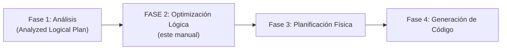
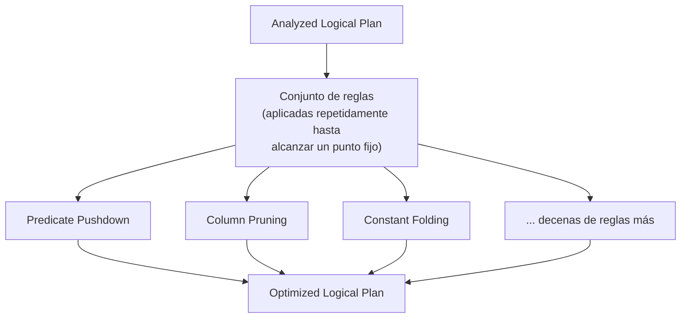
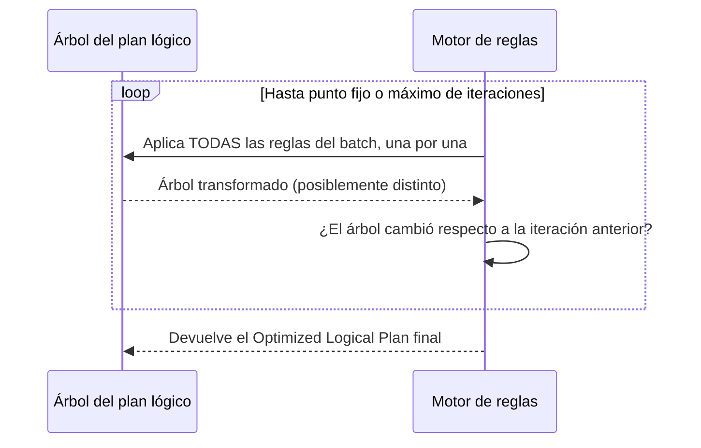
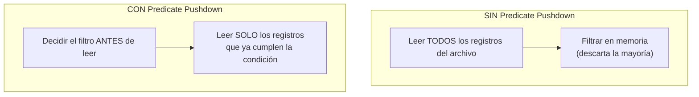
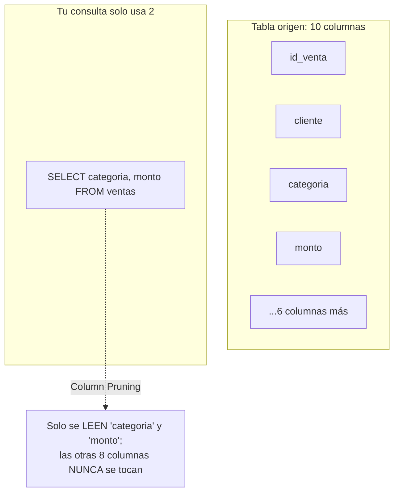
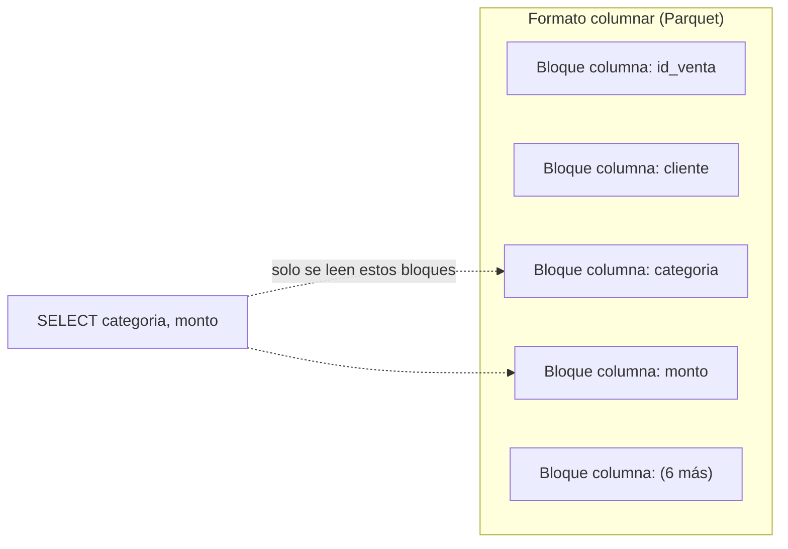
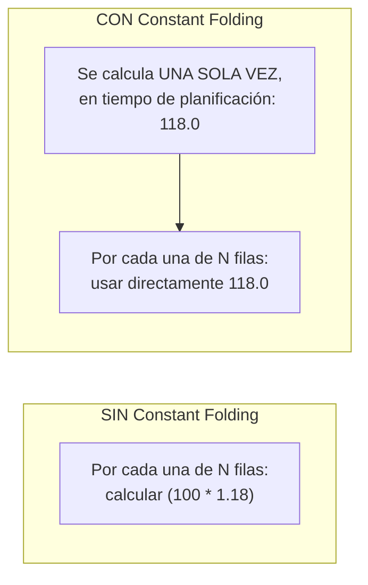
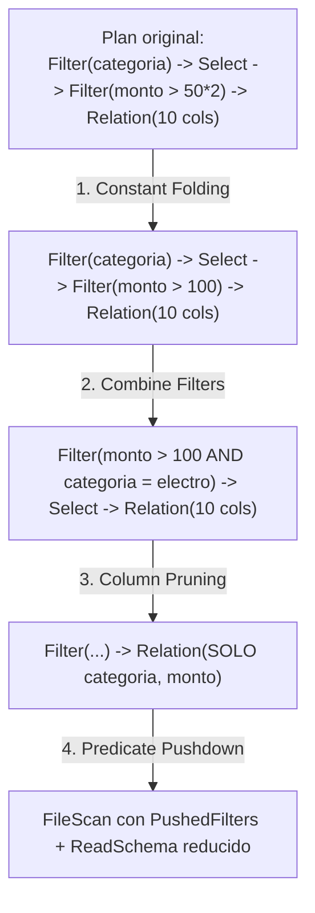
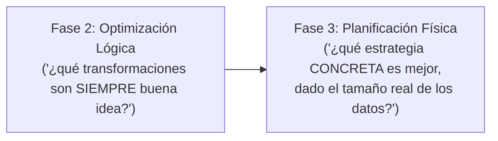

# El Optimizador Catalyst — Fase 2: Optimización Lógica (Logical Optimization)

## Índice

1. [Ubicando la Fase 2 en el ciclo de vida completo](#1-ubicando-la-fase-2-en-el-ciclo-de-vida-completo)
2. [Punto de partida: el Analyzed Logical Plan](#2-punto-de-partida-el-analyzed-logical-plan)
3. [Optimización basada en reglas: el enfoque heurístico](#3-optimización-basada-en-reglas-el-enfoque-heurístico)
4. [Predicate Pushdown: bajar filtros a la capa de almacenamiento](#4-predicate-pushdown-bajar-filtros-a-la-capa-de-almacenamiento)
5. [Column Pruning: descartar columnas no utilizadas tempranamente](#5-column-pruning-descartar-columnas-no-utilizadas-tempranamente)
6. [Constant Folding: evaluación anticipada de expresiones estáticas](#6-constant-folding-evaluación-anticipada-de-expresiones-estáticas)
7. [Otras reglas heurísticas relevantes (panorama ampliado)](#7-otras-reglas-heurísticas-relevantes-panorama-ampliado)
8. [Cómo interactúan varias reglas entre sí en una sola consulta](#8-cómo-interactúan-varias-reglas-entre-sí-en-una-sola-consulta)
9. [Observando la Fase 2 en la práctica](#9-observando-la-fase-2-en-la-práctica)
10. [Los límites de la heurística: por qué esto no es suficiente por sí solo](#10-los-límites-de-la-heurística-por-qué-esto-no-es-suficiente-por-sí-solo)
11. [Ejemplo end-to-end integrador](#11-ejemplo-end-to-end-integrador)
12. [Errores comunes](#12-errores-comunes)
13. [Resumen mental (cheatsheet)](#13-resumen-mental-cheatsheet)

---

## 1. Ubicando la Fase 2 en el ciclo de vida completo



Una vez que el **Analyzed Logical Plan** existe (todas las tablas y columnas resueltas, todos los tipos conocidos — visto en el manual de la Fase 1), Catalyst tiene la certeza necesaria para empezar a **reescribir el plan de forma equivalente pero más eficiente**. Esto es exactamente lo que ocurre en la Fase 2: **Optimización Lógica**.

---

## 2. Punto de partida: el Analyzed Logical Plan

Recordemos la forma de un Analyzed Logical Plan típico, tomando la consulta:

```python
resultado = (
    spark.table("ventas")
    .filter(col("monto") > 100)
    .select("cliente", "categoria", "monto")
    .filter(col("categoria") == "electro")
)
```

```
Analyzed Logical Plan (simplificado):

Filter (categoria#12 = electro)
+- Project [cliente#11, categoria#12, monto#15]
   +- Filter (monto#15 > 100.0)
      +- Relation[id_venta#10,cliente#11,categoria#12,monto#15,columna_no_usada#16] parquet
```

Este plan es **correcto**, pero **ingenuo**: refleja exactamente el orden en que escribiste el código (filtro → proyección → otro filtro), sin ningún criterio de eficiencia. La Fase 2 toma este árbol y lo **reescribe** aplicando un conjunto de reglas, produciendo un **Optimized Logical Plan** semánticamente equivalente pero más eficiente de ejecutar.

---

## 3. Optimización basada en reglas: el enfoque heurístico

### 3.1 Qué significa "heurístico" aquí

La Fase 2 de Catalyst opera mediante un motor de **reglas de transformación de árboles**, cada una encapsulando una "buena práctica" de optimización conocida de antemano — **sin necesitar información real sobre el tamaño de los datos ni estadísticas de ejecución**. Por eso se le llama **heurística**: son reglas que "casi siempre" mejoran el plan, aplicadas de forma determinista, sin importar cuántos registros tenga realmente la tabla.



Esto contrasta directamente con la **Fase 3 (Planificación Física)**, donde sí interviene un **Optimizador Basado en Costos (CBO)** que consulta estadísticas reales (tamaños de tabla, cardinalidades) — la Fase 2, en cambio, es puramente **basada en reglas (Rule-Based Optimization, RBO)**.

### 3.2 El mecanismo de aplicación iterativa

Catalyst organiza sus reglas de optimización lógica en **"batches"** (grupos), y aplica cada batch de reglas **repetidamente sobre el árbol** hasta que ya no se produzca ningún cambio adicional (un punto fijo), o hasta un límite máximo de iteraciones.



Esto es importante porque **una regla puede habilitar que otra regla se aplique** después (ver sección 8) — por eso el proceso es iterativo, no una sola pasada lineal.

---

## 4. Predicate Pushdown: bajar filtros a la capa de almacenamiento

### 4.1 La idea central

**Predicate Pushdown** (o "empuje de predicados") es la técnica de **mover las condiciones de filtro (`WHERE`, `.filter()`) lo más cerca posible de la fuente de datos** — idealmente, hasta el propio formato de almacenamiento — en lugar de leer todos los datos primero y filtrar después en memoria.



### 4.2 Ejemplo concreto

```python
df = spark.read.parquet("ventas.parquet")
resultado = df.filter(df.monto > 1000)
resultado.explain()
```

```
== Physical Plan ==
*(1) Filter (isnotnull(monto#15) AND (monto#15 > 1000.0))
+- *(1) ColumnarToRow
   +- FileScan parquet [monto#15,...] Batched: true, DataFilters: [isnotnull(monto#15), (monto#15 > 1000.0)],
      Format: Parquet, PushedFilters: [IsNotNull(monto), GreaterThan(monto,1000.0)], ...
```

**El detalle clave está en `PushedFilters`**: Spark logró comunicarle directamente al lector de Parquet que solo traiga los **row groups** (bloques internos de Parquet) cuyas estadísticas (min/max por columna, guardadas en los metadatos del archivo) indiquen que **podrían** contener filas con `monto > 1000` — descartando bloques enteros sin siquiera abrirlos completamente.

### 4.3 Dependencia del formato de almacenamiento

No todos los formatos soportan el mismo nivel de pushdown:

| Formato | Soporte de Predicate Pushdown |
|---|---|
| **Parquet / ORC** | Alto — usan estadísticas por row group/stripe (min/max, a veces bloom filters) |
| **JDBC (bases de datos)** | Alto — el filtro se traduce literalmente a una cláusula `WHERE` en el SQL enviado a la base de datos |
| **CSV / JSON** | Bajo o nulo — formatos de texto plano sin metadata estructurada que permita saltar bloques |

```python
# Con JDBC, el pushdown es especialmente visible: el filtro viaja
# literalmente como parte del SQL ejecutado en la base de datos externa
df_jdbc = spark.read.jdbc(url="jdbc:postgresql://host/db", table="ventas", properties=props)
df_jdbc.filter("monto > 1000").explain()
# El plan físico mostrará algo como:
# PushedFilters: [*GreaterThan(monto,1000.0)]  <- el filtro se ejecuta EN la base de datos, no en Spark
```

### 4.4 Por qué esto ahorra tanto tiempo y recursos

- **Menos I/O**: se leen menos bytes desde disco/red.
- **Menos deserialización**: los registros descartados nunca llegan a convertirse en objetos/filas dentro de Spark.
- **Menos presión de memoria**: menos datos "de más" ocupando espacio en los Executors antes de ser descartados.

---

## 5. Column Pruning: descartar columnas no utilizadas tempranamente

### 5.1 La idea central

**Column Pruning** (o "poda de columnas") consiste en identificar, mirando el plan completo, **qué columnas realmente se necesitan** para producir el resultado final, y **leer únicamente esas columnas** desde el origen — ignorando por completo cualquier columna que nunca se use, sin importar en qué parte de tu código original aparecía.



### 5.2 Ejemplo concreto

```python
# La tabla 'ventas' tiene, digamos, 10 columnas, pero solo usamos 2
df = spark.table("ventas")  # esquema completo: id_venta, cliente, categoria, monto, dirección, teléfono, ...
resultado = df.select("categoria", "monto").filter(df.monto > 100)
resultado.explain()
```

```
== Physical Plan ==
*(1) Filter (isnotnull(monto#15) AND (monto#15 > 100.0))
+- *(1) ColumnarToRow
   +- FileScan parquet [categoria#12,monto#15] Batched: true, ...
      ReadSchema: struct<categoria:string,monto:double>
```

**El detalle clave está en `ReadSchema`**: aunque la tabla original tiene 10 columnas, Spark solo lee `categoria` y `monto` — las 8 columnas restantes ni siquiera se decodifican desde el archivo Parquet.

### 5.3 Por qué es especialmente potente en formatos columnares

Column Pruning es dramáticamente más eficiente en formatos **columnares** como **Parquet** u **ORC**, porque estos formatos ya almacenan los datos **físicamente separados por columna** en el archivo — Spark puede literalmente **saltarse los bloques de bytes** correspondientes a las columnas no solicitadas, sin siquiera leerlos del disco.



En formatos **orientados a filas** (como CSV o JSON), esta ventaja se pierde casi por completo: como cada fila completa está almacenada de forma contigua, Spark de todas formas debe leer la fila entera para poder extraer las columnas de interés, aunque luego descarte el resto en memoria.

### 5.4 Column Pruning se propaga a través de múltiples pasos

Column Pruning no se limita a la primera operación de lectura — Catalyst puede "empujar" la necesidad de columnas específicas **a través de toda la cadena de transformaciones**, incluso atravesando joins y agregaciones intermedias.

```python
df1 = spark.table("ventas")     # 10 columnas
df2 = spark.table("clientes")   # 8 columnas

resultado = (
    df1.join(df2, "cliente_id")
    .select("ventas.categoria", "clientes.pais", "ventas.monto")  # solo 3 columnas finales
)
resultado.explain()
# Catalyst puede determinar que, de las 18 columnas combinadas entre ambas tablas,
# solo necesita leer 'categoria', 'monto' de ventas, y 'cliente_id', 'pais' de clientes
# (cliente_id se necesita para el join, aunque no aparezca en el SELECT final)
```

---

## 6. Constant Folding: evaluación anticipada de expresiones estáticas

### 6.1 La idea central

**Constant Folding** (o "plegado de constantes") consiste en **evaluar de antemano, en tiempo de planificación, cualquier expresión cuyo resultado no dependa de los datos** — es decir, expresiones compuestas enteramente por literales/constantes — reemplazando esa expresión por su resultado ya calculado, para no repetir ese cálculo **una vez por cada fila** durante la ejecución real.



### 6.2 Ejemplo concreto

```python
from pyspark.sql.functions import col, lit

df = spark.table("ventas")

# La expresión '100 * 1.18' es enteramente constante: no depende de ninguna columna
resultado = df.filter(col("monto") > (100 * 1.18))
resultado.explain(True)
```

```
== Optimized Logical Plan ==
Filter (monto#15 > 118.0)     <-- '100 * 1.18' ya fue reemplazado por 118.0
+- Relation[...] parquet
```

Sin Constant Folding, Spark tendría que ejecutar literalmente la multiplicación `100 * 1.18` **por cada una de las N filas** del dataset durante la ejecución — un desperdicio evidente cuando el resultado es siempre el mismo, conocido desde antes de leer un solo dato.

### 6.3 Otro ejemplo: expresiones dentro de columnas calculadas

```python
df_con_columna = df.withColumn("factor_ajuste", lit(2) * lit(3) + lit(1))
df_con_columna.select("factor_ajuste").explain(True)
```

```
== Optimized Logical Plan ==
Project [7 AS factor_ajuste#30]    <-- '2 * 3 + 1' se plegó directamente a 7
+- Relation[...] parquet
```

### 6.4 Constant Folding también simplifica condiciones lógicas

```python
# Ejemplo con una condición que Catalyst puede simplificar/eliminar directamente
resultado = df.filter(lit(True) & (col("monto") > 100))
resultado.explain(True)
```

```
== Optimized Logical Plan ==
Filter (monto#15 > 100.0)   <-- 'lit(True) AND' fue eliminado por ser una constante neutra
+- Relation[...] parquet
```

---

## 7. Otras reglas heurísticas relevantes (panorama ampliado)

Aunque el temario se centra en las tres reglas anteriores, es útil saber que la Fase 2 incluye **decenas de reglas adicionales** que trabajan bajo el mismo principio heurístico. Algunas de las más comunes:

| Regla | Qué hace |
|---|---|
| **Predicate Pushdown a través de Joins** | Empuja filtros hasta *antes* de un join, cuando es semánticamente seguro, reduciendo el volumen de datos que participan en el join |
| **Boolean Simplification** | Simplifica expresiones booleanas redundantes (ej. `NOT (NOT x)` → `x`) |
| **Combine Filters** | Fusiona múltiples `Filter` consecutivos en uno solo (ej. dos `.filter()` seguidos se combinan con `AND`) |
| **Eliminate Subquery Aliases** | Elimina alias de subconsultas que ya no aportan información tras la resolución |
| **Simplify Casts** | Elimina conversiones de tipo (`CAST`) innecesarias o redundantes |
| **Null Propagation** | Simplifica expresiones que involucran valores `NULL` conocidos de antemano (ej. `NULL AND x` → `NULL`/`false` según el contexto) |

```python
# Ejemplo de "Combine Filters": dos .filter() consecutivos se fusionan en uno solo
resultado = df.filter(df.monto > 100).filter(df.categoria == "electro")
resultado.explain(True)
```

```
== Optimized Logical Plan ==
Filter ((monto#15 > 100.0) AND (categoria#12 = electro))   <-- un solo Filter, no dos
+- Relation[...] parquet
```

---

## 8. Cómo interactúan varias reglas entre sí en una sola consulta

Este es un punto sutil pero importante: las reglas de optimización lógica **no actúan de forma aislada** — con frecuencia, aplicar una regla **habilita** que otra regla pueda aplicarse a continuación, razón por la cual el proceso es iterativo (sección 3.2).

```python
df = spark.table("ventas")  # 10 columnas: incluye 'id_venta', 'cliente', 'categoria', 'monto', + 6 más sin usar

resultado = (
    df.filter(col("monto") > (50 * 2))          # Constant Folding: 50*2 -> 100
    .select("categoria", "monto")                # Column Pruning: solo estas 2 columnas importan
    .filter(col("categoria") == "electro")        # Combine Filters + Predicate Pushdown
)
resultado.explain(True)
```



En este ejemplo, **cuatro reglas distintas** colaboran para transformar el plan ingenuo original en uno mucho más eficiente — y el orden en que Catalyst las aplica (iterando hasta el punto fijo) garantiza que, sin importar en qué orden **tú** hayas escrito las operaciones en tu código, el resultado optimizado final tiende a converger hacia el plan más eficiente posible dentro de lo que la heurística puede determinar.

---

## 9. Observando la Fase 2 en la práctica

```python
df = spark.table("ventas")
resultado = (
    df.filter(col("monto") > (50 * 2))
    .select("categoria", "monto")
    .filter(col("categoria") == "electro")
)

resultado.explain(extended=True)
```

En la salida, compara específicamente:

- **`== Analyzed Logical Plan ==`**: refleja el orden y forma exactos de tu código (dos `Filter` separados, `50*2` sin evaluar).
- **`== Optimized Logical Plan ==`**: aquí debes buscar:
  - Un único `Filter` combinado (`Combine Filters`).
  - `100.0` en lugar de `50 * 2` (`Constant Folding`).
  - La `Relation` mostrando solo las columnas realmente usadas (`Column Pruning`), aunque esto se confirma con más detalle en el `Physical Plan` (`ReadSchema`).

---

## 10. Los límites de la heurística: por qué esto no es suficiente por sí solo

Es importante entender qué **no** resuelve la Fase 2, para apreciar por qué existe la Fase 3 (Planificación Física con CBO):

- Las reglas heurísticas de la Fase 2 **no saben nada sobre el tamaño real de las tablas**. Por ejemplo, Column Pruning y Predicate Pushdown se aplican igual sin importar si una tabla tiene 100 filas o 100 mil millones.
- Decisiones que **sí** requieren conocer tamaños reales — como elegir entre un `Broadcast Join` o un `Sort-Merge Join` — **no se resuelven en esta fase**, sino en la Fase 3, donde interviene el Optimizador Basado en Costos (CBO).



La Fase 2 responde preguntas del tipo *"¿esta transformación es casi siempre una mejora, sin importar los datos?"* — mientras que decisiones que dependen genuinamente de **cuántos datos hay** quedan para la siguiente fase.

---

## 11. Ejemplo end-to-end integrador

```python
from pyspark.sql import SparkSession
from pyspark.sql.functions import col, lit

spark = SparkSession.builder.appName("OptimizacionLogicaDemo").master("local[4]").getOrCreate()

datos = [(1, "Ana", "electro", 150.0, "Lima"), (2, "Luis", "moda", 89.5, "Cusco"),
         (3, "Marta", "electro", 320.0, "Lima"), (4, "Pedro", "hogar", 45.0, "Arequipa")]
df = spark.createDataFrame(datos, ["id_venta", "cliente", "categoria", "monto", "ciudad"])
df.createOrReplaceTempView("ventas")

# Consulta deliberadamente "ingenua": múltiples filtros separados,
# una expresión constante sin evaluar, y columnas de más
resultado = (
    spark.table("ventas")
    .filter(col("monto") > (30 * 2))          # candidato a Constant Folding: 30*2 -> 60
    .filter(col("categoria") != "hogar")       # candidato a Combine Filters (con el filtro anterior)
    .select("cliente", "categoria", "monto")   # candidato a Column Pruning (descarta id_venta, ciudad)
)

print("=== Analyzed Logical Plan (tal cual lo escribiste) ===")
resultado.explain(True)

print("\n=== Resultado final ===")
resultado.show()

spark.stop()
```

Al revisar la salida de `.explain(True)`, deberías poder identificar en el `Optimized Logical Plan`:
1. Un único nodo `Filter` combinando ambas condiciones (`Combine Filters`).
2. El valor `60.0` en lugar de `30 * 2` (`Constant Folding`).
3. Una proyección/relación que ya no incluye `id_venta` ni `ciudad` (`Column Pruning`).

---

## 12. Errores comunes

| Creencia errónea | Realidad |
|---|---|
| "Column Pruning también funciona igual de bien en CSV que en Parquet" | Column Pruning reduce el uso de memoria en cualquier formato, pero solo ahorra **I/O real de disco** en formatos columnares como Parquet/ORC; en CSV la fila completa igual debe leerse del disco |
| "Predicate Pushdown garantiza que Spark filtre 'en la fuente' siempre" | Depende del formato/soporte: no todos los formatos ni todos los tipos de condición son "empujables" (algunas UDFs o expresiones complejas no se pueden traducir a un filtro nativo del origen) |
| "Constant Folding solo aplica a operaciones aritméticas simples" | También simplifica expresiones booleanas, casts redundantes, y combinaciones con `NULL` conocido |
| "El orden en que escribo mis `.filter()`/`.select()` determina el orden real de ejecución" | Catalyst puede reordenar y fusionar libremente estas operaciones en la Fase 2, siempre que el resultado sea semánticamente equivalente |
| "Esta fase ya elige la mejor estrategia de Join" | No: decisiones de estrategia de Join basadas en tamaños reales pertenecen a la Fase 3 (Planificación Física + CBO) |

---

## 13. Resumen mental (cheatsheet)

- La **Fase 2 (Optimización Lógica)** toma el **Analyzed Logical Plan** y lo reescribe en un **Optimized Logical Plan** semánticamente equivalente pero más eficiente, aplicando **reglas heurísticas** de forma iterativa hasta un punto fijo.
- Es **Rule-Based (RBO)**, no Cost-Based: las reglas no consultan tamaños reales de datos, son "buenas prácticas" aplicadas siempre igual.
- **Predicate Pushdown**: empuja filtros hasta la fuente de datos — visible como `PushedFilters` en el plan físico. Muy efectivo en Parquet/ORC/JDBC, poco efectivo en CSV/JSON.
- **Column Pruning**: descarta columnas no usadas antes de leerlas — visible como `ReadSchema` reducido en el plan físico. Especialmente potente en formatos **columnares**.
- **Constant Folding**: evalúa expresiones puramente constantes **una sola vez**, en tiempo de planificación, en lugar de recalcularlas por cada fila.
- Estas reglas **se combinan e interactúan entre sí** (una puede habilitar a otra), por eso el motor de reglas itera repetidamente sobre el árbol hasta que ya no hay más cambios que aplicar.
- El **orden en que escribes tu código no determina el plan final** — Catalyst puede reordenar y fusionar operaciones libremente en esta fase, siempre preservando la semántica original.
- Esta fase **no** decide estrategias que dependen del tamaño real de los datos (como qué tipo de Join usar) — eso corresponde a la **Fase 3: Planificación Física**, con el Optimizador Basado en Costos (CBO).
