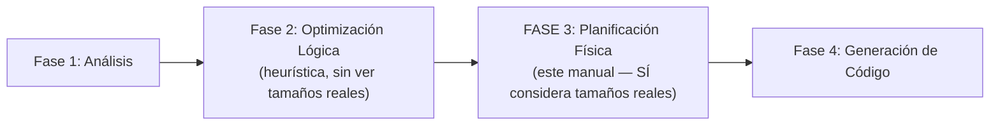
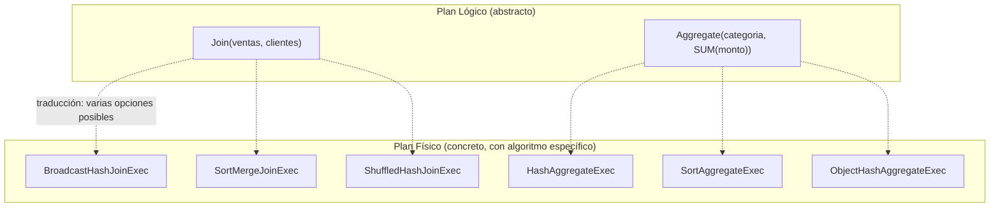
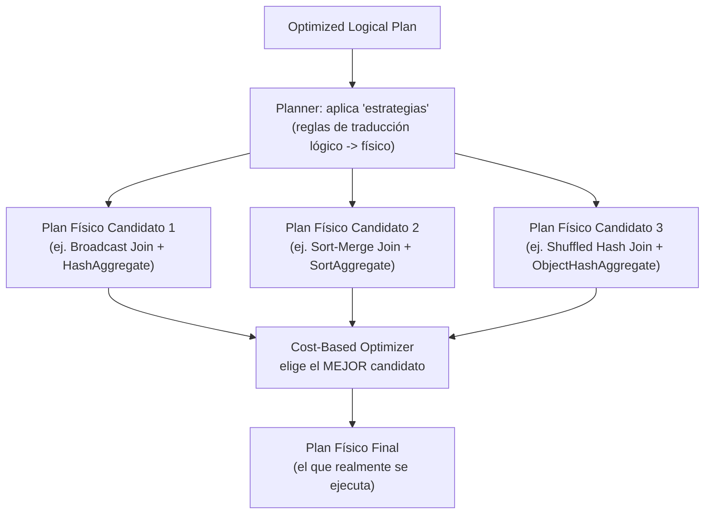
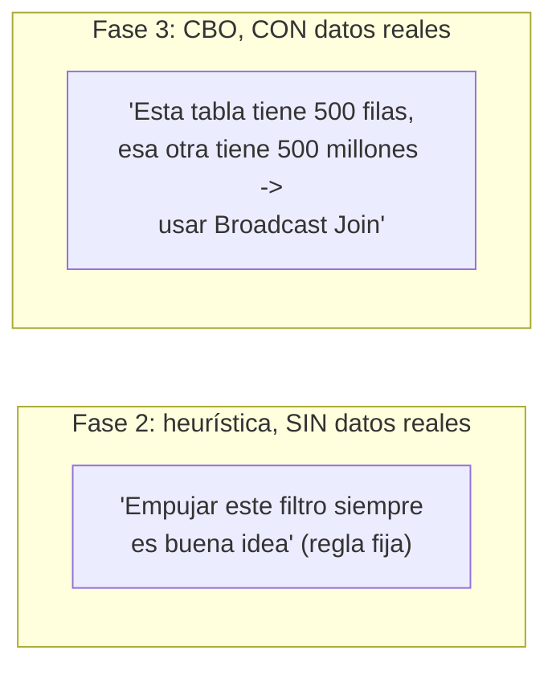
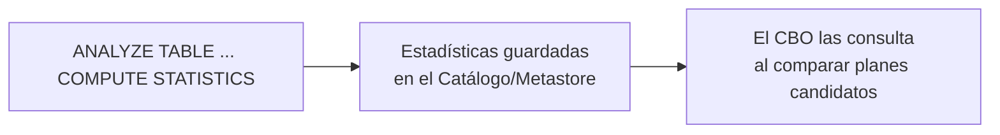
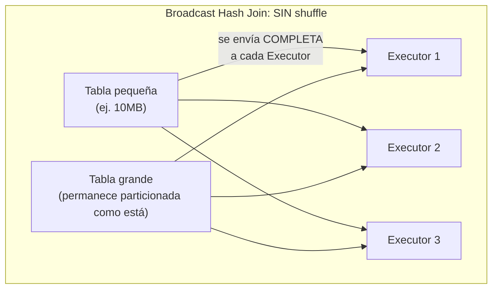
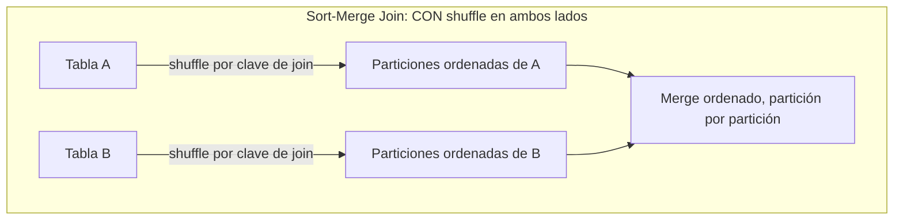
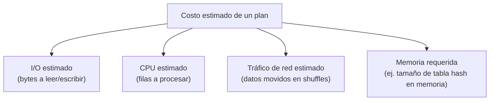
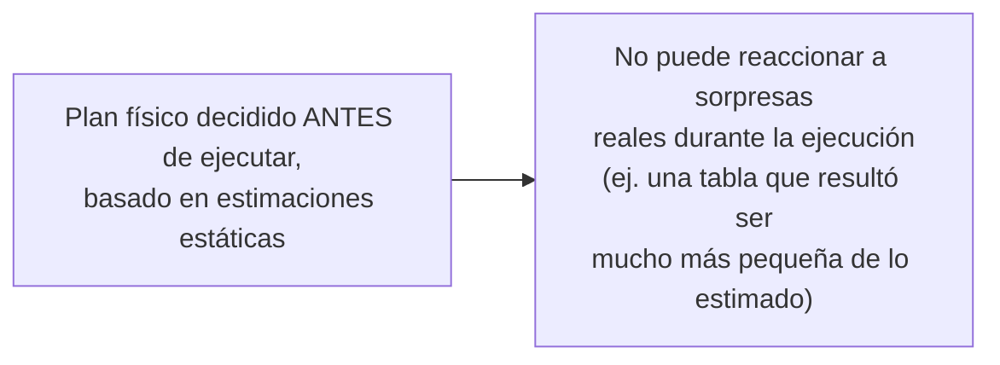

# El Optimizador Catalyst — Fase 3: Planificación Física (Physical Planning)

## Índice

1. [Ubicando la Fase 3 en el ciclo de vida completo](#1-ubicando-la-fase-3-en-el-ciclo-de-vida-completo)
2. [Del plan lógico al plan físico: qué cambia exactamente](#2-del-plan-lógico-al-plan-físico-qué-cambia-exactamente)
3. [Traducción a múltiples planes físicos posibles](#3-traducción-a-múltiples-planes-físicos-posibles)
4. [El Optimizador Basado en Costos (Cost-Based Optimizer — CBO)](#4-el-optimizador-basado-en-costos-cost-based-optimizer--cbo)
5. [Estadísticas: la materia prima del CBO](#5-estadísticas-la-materia-prima-del-cbo)
6. [Caso de estudio central: elección de estrategia de Join](#6-caso-de-estudio-central-elección-de-estrategia-de-join)
7. [Otras decisiones que toma la Planificación Física](#7-otras-decisiones-que-toma-la-planificación-física)
8. [El modelo de costos: cómo se comparan los planes candidatos](#8-el-modelo-de-costos-cómo-se-comparan-los-planes-candidatos)
9. [Observando la Fase 3 en la práctica](#9-observando-la-fase-3-en-la-práctica)
10. [Cuándo el CBO se queda corto](#10-cuándo-el-cbo-se-queda-corto)
11. [Ejemplo end-to-end integrador](#11-ejemplo-end-to-end-integrador)
12. [Errores comunes](#12-errores-comunes)
13. [Resumen mental (cheatsheet)](#13-resumen-mental-cheatsheet)

---

## 1. Ubicando la Fase 3 en el ciclo de vida completo



La Fase 2 (Optimización Lógica) responde a la pregunta *"¿qué transformaciones son casi siempre una mejora, sin importar los datos?"*. La Fase 3 responde a una pregunta distinta y más concreta: ***"dado el tamaño REAL de estas tablas específicas, ¿cuál es la mejor forma física de ejecutar este plan?"***. Esta es la diferencia fundamental entre ambas fases, y el motivo por el que la Fase 3 necesita un mecanismo adicional: el **Optimizador Basado en Costos (CBO)**.

---

## 2. Del plan lógico al plan físico: qué cambia exactamente

El **Optimized Logical Plan** (salida de la Fase 2) describe **qué** operaciones relacionales hay que hacer (un filtro, una agregación, un join) de forma abstracta — sin especificar **cómo** ejecutarlas físicamente en el clúster. La Fase 3 traduce cada operador lógico a uno o más **operadores físicos concretos**, que sí especifican el algoritmo/estrategia exacta a usar.



**Punto clave**: para **un mismo** operador lógico (por ejemplo, un `Join`), pueden existir **varias estrategias físicas válidas** que producen exactamente el mismo resultado, pero con costos de ejecución muy distintos según el tamaño real de los datos involucrados.

---

## 3. Traducción a múltiples planes físicos posibles

Catalyst no se limita a generar **un** plan físico — genera un conjunto de **candidatos**, cada uno representando una combinación distinta de estrategias físicas para los distintos operadores del plan lógico.



Este mecanismo interno de Spark se conoce como el **`SparkPlanner`**, que aplica un conjunto de **"estrategias" (`Strategy`)** — cada una sabe cómo traducir un tipo específico de operador lógico a uno o más operadores físicos candidatos.

```python
# Ejemplo simplificado del concepto (no es código real de Spark, sino ilustrativo):
# Para un nodo lógico Join, las estrategias disponibles podrían generar:
candidatos_join = [
    "BroadcastHashJoinExec",   # si una tabla es pequeña
    "ShuffledHashJoinExec",    # alternativa con shuffle, sin necesitar orden
    "SortMergeJoinExec",       # requiere ambos lados ordenados por la clave de join
]
```

---

## 4. El Optimizador Basado en Costos (Cost-Based Optimizer — CBO)

### 4.1 Qué resuelve el CBO que la Fase 2 no puede

El CBO es el componente que **evalúa el costo estimado** de cada plan físico candidato, y **selecciona el más eficiente**, usando información que la Fase 2 (puramente heurística) **no tiene disponible**: estadísticas reales sobre el tamaño de las tablas, la cardinalidad de las columnas, y la distribución de los datos.



### 4.2 Activación del CBO

El CBO en Spark SQL se activa (y depende de estadísticas recolectadas previamente) mediante:

```python
spark.conf.set("spark.sql.cbo.enabled", "true")
```

Para que el CBO tenga información real que usar, es necesario haber ejecutado previamente el cálculo de estadísticas sobre las tablas involucradas:

```sql
ANALYZE TABLE ventas COMPUTE STATISTICS;
ANALYZE TABLE ventas COMPUTE STATISTICS FOR COLUMNS monto, categoria;
```

```python
spark.sql("ANALYZE TABLE ventas COMPUTE STATISTICS FOR ALL COLUMNS")
```

> **Nota importante**: incluso con `spark.sql.cbo.enabled=false` (su valor histórico por defecto en muchas configuraciones), Spark **sigue tomando algunas decisiones basadas en tamaño** — por ejemplo, la elección de Broadcast Join basada en el umbral `spark.sql.autoBroadcastJoinThreshold` (ver sección 6) funciona de forma independiente al CBO completo, usando estimaciones de tamaño más simples derivadas de los metadatos del propio plan.

---

## 5. Estadísticas: la materia prima del CBO

Sin estadísticas, el CBO no tiene nada que comparar. Las estadísticas que Spark puede recolectar y usar incluyen:

| Estadística | Qué mide | Uso principal |
|---|---|---|
| **Tamaño total de la tabla** (`sizeInBytes`) | Bytes totales que ocupa la tabla/partición | Decidir si es candidata a Broadcast Join |
| **Número de filas** (`rowCount`) | Cantidad de registros | Estimar el costo de operaciones downstream |
| **Cardinalidad por columna** (`distinctCount`) | Cuántos valores únicos tiene una columna | Estimar la selectividad de un filtro o un join |
| **Valores min/max por columna** | Rango de valores | Estimar cuántas filas sobrevivirán a un filtro de rango |
| **Histograma de valores** (opcional, más detallado) | Distribución de frecuencia de valores | Estimaciones más precisas en columnas con distribución desigual (skew) |

```python
# Ver las estadísticas que Spark tiene registradas sobre una tabla:
spark.sql("DESCRIBE EXTENDED ventas").show(truncate=False)
# Busca la fila 'Statistics' en la salida: ej. "1234567 bytes, 50000 rows"
```



---

## 6. Caso de estudio central: elección de estrategia de Join

Este es, con diferencia, el ejemplo más ilustrativo e importante de la Fase 3, y el que menciona explícitamente el temario.

### 6.1 Las estrategias de Join disponibles

| Estrategia | Cuándo se usa | Mecanismo |
|---|---|---|
| **Broadcast Hash Join** | Una de las tablas es lo suficientemente **pequeña** | La tabla pequeña se envía **completa** a la memoria de **todos** los Executors; cada Executor hace el join localmente, sin shuffle |
| **Sort-Merge Join** | Ambas tablas son grandes | Ambos lados se particionan por la clave de join (shuffle), se ordenan, y se combinan mediante un recorrido tipo "merge" |
| **Shuffled Hash Join** | Ambas tablas medianas/grandes, pero una cabe en memoria tras el shuffle | Ambos lados se particionan por la clave (shuffle), y se construye una tabla hash en memoria del lado más pequeño para cada partición |





### 6.2 El umbral que dispara la decisión

```python
spark.conf.get("spark.sql.autoBroadcastJoinThreshold")
# '10485760' -> 10 MB por defecto
```

Si el CBO (o incluso la estimación básica de tamaño sin CBO completo) determina que **una de las tablas** del join tiene un tamaño estimado **por debajo de este umbral**, Spark elegirá automáticamente un **Broadcast Hash Join**, evitando por completo el costoso shuffle de la tabla grande.

```python
df_grande = spark.table("ventas")       # ej. 500 millones de filas
df_pequena = spark.table("categorias")  # ej. 20 filas, unos pocos KB

resultado = df_grande.join(df_pequena, "categoria_id")
resultado.explain()
```

```
== Physical Plan ==
*(2) Project [...]
+- *(2) BroadcastHashJoin [categoria_id#10], [categoria_id#20], Inner, BuildRight
   :- *(2) FileScan parquet ventas [...]
   +- BroadcastExchange HashedRelationBroadcastMode(...)
      +- *(1) FileScan parquet categorias [...]
```

**Detalles a identificar**: `BroadcastHashJoin` confirma la estrategia elegida, y `BuildRight` indica que la tabla del lado derecho (`categorias`, la pequeña) es la que se construyó como tabla hash y se transmitió (`BroadcastExchange`) a todos los Executors.

### 6.3 Forzando explícitamente una estrategia (hints)

Aunque normalmente el planificador decide automáticamente, Spark permite **sugerir explícitamente** una estrategia mediante *hints*, útil cuando las estadísticas no están disponibles o son imprecisas:

```python
from pyspark.sql.functions import broadcast

# Fuerza un Broadcast Join incluso si Spark no lo habría elegido automáticamente
resultado = df_grande.join(broadcast(df_pequena), "categoria_id")
```

```sql
-- Equivalente en SQL puro
SELECT /*+ BROADCAST(categorias) */ *
FROM ventas JOIN categorias ON ventas.categoria_id = categorias.categoria_id
```

### 6.4 Qué pasa si ambas tablas son grandes

Cuando ninguna tabla es candidata a Broadcast (ambas superan el umbral), Spark elige entre **Sort-Merge Join** y **Shuffled Hash Join** — en versiones modernas de Spark, **Sort-Merge Join** es la opción por defecto para joins grandes por su robustez frente a datos con distribución desigual, aunque el CBO puede favorecer Shuffled Hash Join en ciertos escenarios donde uno de los lados, aun siendo grande, cabe razonablemente en memoria tras particionarse.

```python
df1 = spark.table("ventas")      # grande
df2 = spark.table("transacciones")  # también grande

resultado = df1.join(df2, "id_venta")
resultado.explain()
```

```
== Physical Plan ==
*(5) SortMergeJoin [id_venta#10], [id_venta#30], Inner
:- *(2) Sort [id_venta#10 ASC NULLS FIRST], false, 0
:  +- Exchange hashpartitioning(id_venta#10, 200)
:     +- *(1) FileScan parquet ventas [...]
+- *(4) Sort [id_venta#30 ASC NULLS FIRST], false, 0
   +- Exchange hashpartitioning(id_venta#30, 200)
      +- *(3) FileScan parquet transacciones [...]
```

---

## 7. Otras decisiones que toma la Planificación Física

Aunque el Join es el ejemplo más citado, la Fase 3 también decide:

| Decisión | Opciones típicas |
|---|---|
| **Estrategia de agregación** | `HashAggregateExec` (rápido, requiere que quepa en memoria) vs. `SortAggregateExec` (más lento pero robusto ante datos que no caben en memoria) |
| **Número de particiones tras un shuffle** | Gobernado por `spark.sql.shuffle.partitions`, aunque AQE (visto más adelante en el temario) puede ajustarlo dinámicamente |
| **Orden de ejecución de un `UNION`/multi-way join** | El CBO puede reordenar joins múltiples para minimizar el tamaño de los resultados intermedios |
| **Uso de índices/particiones físicas** | Aprovechar partition pruning (visto en la Sección 1) cuando el filtro coincide con columnas de particionamiento en disco |

---

## 8. El modelo de costos: cómo se comparan los planes candidatos

De forma simplificada, el CBO estima un "costo" para cada plan candidato considerando factores como:



Estos factores se combinan (con fórmulas y pesos internos específicos de la implementación de Spark) para producir un **costo numérico comparable** entre los distintos planes candidatos generados en la sección 3 — el plan con el costo estimado más bajo es el que finalmente se selecciona para ejecución.

> **Nota importante**: estas estimaciones son, por definición, **aproximaciones**. El CBO no ejecuta los planes para medir el costo real — los infiere a partir de las estadísticas disponibles y de fórmulas de propagación (por ejemplo, cómo cambia la cardinalidad estimada al aplicar un filtro con cierta selectividad conocida).

---

## 9. Observando la Fase 3 en la práctica

```python
spark.sql("ANALYZE TABLE ventas COMPUTE STATISTICS FOR ALL COLUMNS")
spark.sql("ANALYZE TABLE categorias COMPUTE STATISTICS FOR ALL COLUMNS")
spark.conf.set("spark.sql.cbo.enabled", "true")

resultado = spark.table("ventas").join(spark.table("categorias"), "categoria_id")
resultado.explain(mode="cost")   # modo especial que muestra estadísticas usadas en la decisión
```

El modo `"cost"` de `.explain()` (disponible en versiones recientes de Spark) muestra explícitamente las estadísticas (`Statistics: sizeInBytes=..., rowCount=...`) que el CBO utilizó junto a cada nodo del plan — la forma más directa de confirmar que el CBO efectivamente tuvo información real disponible al tomar su decisión.

```python
resultado.explain(True)
# Revisa la sección '== Physical Plan ==' buscando específicamente:
# - BroadcastHashJoin / SortMergeJoin / ShuffledHashJoin (la estrategia elegida)
# - BroadcastExchange (si aplica) vs. Exchange hashpartitioning (shuffle regular)
```

---

## 10. Cuándo el CBO se queda corto

Es importante conocer las limitaciones prácticas de esta fase:

- **Estadísticas desactualizadas**: si los datos cambiaron significativamente desde el último `ANALYZE TABLE`, el CBO tomará decisiones basadas en información obsoleta, potencialmente eligiendo una estrategia subóptima.
- **Ausencia total de estadísticas**: si nunca se ejecutó `ANALYZE TABLE`, Spark recurre a estimaciones más simples (basadas en el tamaño de archivo en disco, no en cardinalidad real de columnas), lo que puede llevar a decisiones menos precisas — por ejemplo, subestimar o sobreestimar si una tabla filtrada calificará para Broadcast Join.
- **Cambios de tamaño en tiempo de ejecución**: una tabla que originalmente era "grande" puede reducirse drásticamente tras un filtro muy selectivo aplicado **en tiempo de ejecución** — algo que el plan físico estático, decidido **antes** de ejecutar nada, no puede anticipar perfectamente.



Esta limitación específica — decisiones tomadas de forma **estática, antes de ejecutar**, sin poder ajustarse a lo que realmente ocurre durante el Job — es exactamente el problema que resuelve la **Ejecución Adaptativa de Consultas (AQE)**, cubierta más adelante en el temario, que permite **re-optimizar el plan físico a mitad de ejecución** usando estadísticas reales recolectadas tras cada shuffle.

---

## 11. Ejemplo end-to-end integrador

```python
from pyspark.sql import SparkSession
from pyspark.sql.functions import broadcast

spark = SparkSession.builder.appName("PlanificacionFisicaDemo").master("local[4]").getOrCreate()

# Tabla "grande" simulada
ventas = spark.range(0, 1_000_000).selectExpr("id as id_venta", "(id % 5) as categoria_id", "rand()*500 as monto")
ventas.write.mode("overwrite").saveAsTable("ventas_demo")

# Tabla "pequeña"
categorias = spark.createDataFrame(
    [(0, "electro"), (1, "moda"), (2, "hogar"), (3, "deporte"), (4, "libros")],
    ["categoria_id", "nombre_categoria"],
)
categorias.write.mode("overwrite").saveAsTable("categorias_demo")

spark.sql("ANALYZE TABLE ventas_demo COMPUTE STATISTICS FOR ALL COLUMNS")
spark.sql("ANALYZE TABLE categorias_demo COMPUTE STATISTICS FOR ALL COLUMNS")

print("=== Join SIN forzar estrategia (Spark decide automáticamente) ===")
resultado_auto = spark.table("ventas_demo").join(spark.table("categorias_demo"), "categoria_id")
resultado_auto.explain()
# Esperado: BroadcastHashJoin, porque 'categorias_demo' es diminuta

print("\n=== Forzando explícitamente Sort-Merge Join con un hint (para comparar) ===")
resultado_forzado = spark.table("ventas_demo").join(
    spark.table("categorias_demo").hint("MERGE"), "categoria_id"
)
resultado_forzado.explain()
# Esperado: SortMergeJoin, aunque sea una estrategia subóptima para este caso

spark.stop()
```

---

## 12. Errores comunes

| Creencia errónea | Realidad |
|---|---|
| "El CBO siempre está activo por defecto y usando estadísticas reales" | El CBO completo requiere `spark.sql.cbo.enabled=true` Y estadísticas generadas explícitamente con `ANALYZE TABLE`; sin esto, Spark usa estimaciones más básicas |
| "Broadcast Join siempre es la mejor opción si una tabla es 'pequeña'" | Depende del umbral configurado (`spark.sql.autoBroadcastJoinThreshold`) y de la memoria disponible en los Executors — una tabla "pequeña" pero mal dimensionada frente al umbral puede seguir usando Sort-Merge Join |
| "Una vez elegido, el plan físico nunca cambia durante la ejecución" | Cierto para la Fase 3 "clásica" (planificación estática), pero **AQE** (tema posterior) sí puede cambiar estrategias de Join a mitad de ejecución con estadísticas reales |
| "Los hints (`broadcast()`, `/*+ MERGE */`) garantizan que Spark use esa estrategia sin excepción" | Son sugerencias fuertes, pero en ciertos casos Spark puede ignorarlas si son físicamente inviables (ej. forzar broadcast de una tabla que no cabe en memoria) |
| "Ejecutar `ANALYZE TABLE` una vez es suficiente para siempre" | Las estadísticas quedan desactualizadas si los datos subyacentes cambian; deben recalcularse periódicamente en tablas que reciben actualizaciones frecuentes |

---

## 13. Resumen mental (cheatsheet)

- La **Fase 3 (Planificación Física)** traduce el **Optimized Logical Plan** (abstracto) en uno o más **planes físicos candidatos** concretos, cada uno con estrategias/algoritmos específicos.
- El **CBO (Cost-Based Optimizer)** evalúa estos candidatos usando **estadísticas reales** (tamaño de tabla, cardinalidad, min/max) obtenidas vía `ANALYZE TABLE`, y elige el de menor costo estimado — a diferencia de la Fase 2, que es puramente heurística y ciega al tamaño real de los datos.
- El caso de estudio central es la **elección de estrategia de Join**: **Broadcast Hash Join** (sin shuffle, tabla pequeña enviada a todos los Executors) vs. **Sort-Merge Join** / **Shuffled Hash Join** (con shuffle, para tablas grandes), gobernado en gran parte por `spark.sql.autoBroadcastJoinThreshold`.
- Se pueden forzar estrategias explícitamente con `broadcast()` en la API o hints SQL (`/*+ BROADCAST(...) */`, `/*+ MERGE(...) */`).
- El plan físico elegido se puede inspeccionar con `.explain()`, buscando nodos como `BroadcastHashJoin`, `SortMergeJoin`, `BroadcastExchange`, o `Exchange hashpartitioning`.
- Esta fase toma decisiones **de forma estática, antes de ejecutar el Job** — su principal limitación es que no puede reaccionar a sorpresas reales durante la ejecución (estadísticas desactualizadas, filtros muy selectivos en runtime), problema que resuelve la **Ejecución Adaptativa de Consultas (AQE)**, cubierta más adelante en el temario.
