# El Optimizador Catalyst — Fase 4: Generación de Código (Whole-Stage Code Generation)

## Índice

1. [Ubicando la Fase 4 en el ciclo de vida completo](#1-ubicando-la-fase-4-en-el-ciclo-de-vida-completo)
2. [El problema que resuelve: el modelo Volcano y su overhead](#2-el-problema-que-resuelve-el-modelo-volcano-y-su-overhead)
3. [Fusión de operadores (Operator Fusion)](#3-fusión-de-operadores-operator-fusion)
4. [Compilación a bytecode Java en tiempo de ejecución](#4-compilación-a-bytecode-java-en-tiempo-de-ejecución)
5. [Cómo funciona internamente: el protocolo `produce`/`consume`](#5-cómo-funciona-internamente-el-protocolo-produceconsume)
6. [Qué operadores SÍ y NO participan en Whole-Stage CodeGen](#6-qué-operadores-sí-y-no-participan-en-whole-stage-codegen)
7. [Leyendo el plan físico: el símbolo `*(n)`](#7-leyendo-el-plan-físico-el-símbolo-n)
8. [Viendo el código Java generado realmente](#8-viendo-el-código-java-generado-realmente)
9. [Relación con el Motor Tungsten](#9-relación-con-el-motor-tungsten)
10. [Cuándo Spark decide NO generar código (los límites)](#10-cuándo-spark-decide-no-generar-código-los-límites)
11. [Ejemplo end-to-end integrador](#11-ejemplo-end-to-end-integrador)
12. [Errores comunes](#12-errores-comunes)
13. [Resumen mental (cheatsheet)](#13-resumen-mental-cheatsheet)

---

## 1. Ubicando la Fase 4 en el ciclo de vida completo

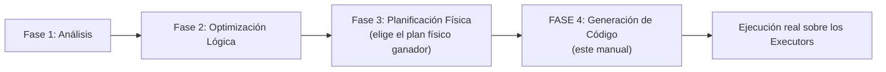

Una vez que la Fase 3 ha elegido **un** plan físico concreto (con sus operadores específicos: `Filter`, `Project`, `HashAggregate`, `BroadcastHashJoin`, etc.), todavía queda un último paso antes de que ese plan se convierta en instrucciones que la JVM realmente ejecuta: **transformar ese plan en código Java compilado, optimizado específicamente para esa consulta**. Ese es el trabajo de la Fase 4.

---

## 2. El problema que resuelve: el modelo Volcano y su overhead

### 2.1 El modelo clásico de ejecución "Volcano" (iterador)

Antes de entender por qué existe la Generación de Código, hay que entender el modelo que reemplaza: el **modelo Volcano** (también llamado "modelo de iteradores"), usado tradicionalmente en motores de bases de datos. En este modelo, cada operador físico implementa una interfaz genérica tipo `next()`, y los operadores se **encadenan mediante llamadas de función**, cada uno "tirando" (pull) de una fila a la vez desde el operador anterior.

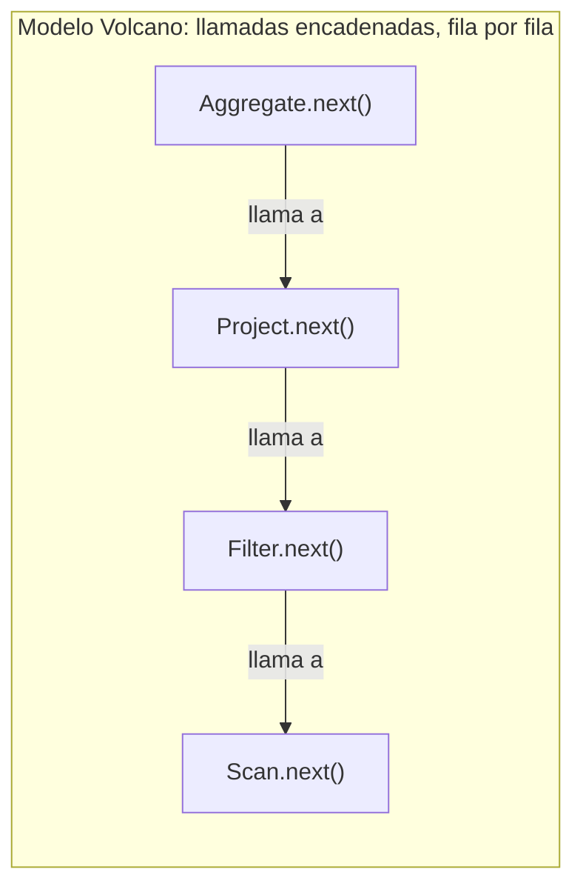

```java
// Pseudocódigo ilustrativo del modelo Volcano (NO es cómo Spark ejecuta con CodeGen)
class FilterOperator {
    Iterator child;
    Row next() {
        while (true) {
            Row fila = child.next();       // llamada de función virtual al operador hijo
            if (cumpleCondicion(fila)) {
                return fila;
            }
        }
    }
}
```

### 2.2 Por qué este modelo es costoso a gran escala

Aunque elegante y modular (cada operador es independiente, fácil de razonar por separado), el modelo Volcano tiene un costo de rendimiento real cuando se procesan **millones o miles de millones de filas**:

1. **Llamadas de función virtuales repetidas**: cada fila individual dispara una cadena de llamadas `next()` a través de **todos** los operadores del plan — con millones de filas, esto son millones de llamadas de función, cada una con su propio overhead de invocación.
2. **Creación de objetos intermedios**: en implementaciones ingenuas, cada operador puede necesitar crear un objeto `Row` intermedio para pasar al siguiente operador, generando presión adicional sobre el Garbage Collector (el mismo problema que vimos con Tungsten).
3. **Pérdida de oportunidades de optimización del compilador JIT**: el compilador Just-In-Time de la JVM optimiza mejor código con patrones de acceso predecibles y bucles simples; una cadena larga de llamadas virtuales polimórficas es más difícil de optimizar automáticamente.

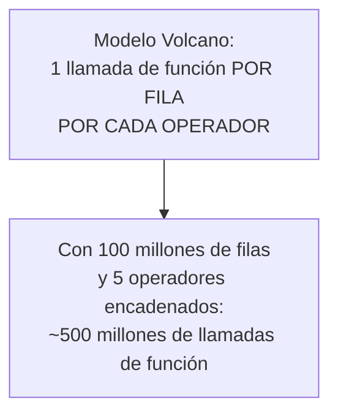

### 2.3 La solución de Spark: Whole-Stage Code Generation

En lugar de ejecutar cada operador como una "caja" separada que se comunica por llamadas de función, **Whole-Stage Code Generation fusiona múltiples operadores en un único método Java, generado dinámicamente**, que procesa cada fila con código lineal y directo — sin llamadas virtuales intermedias.

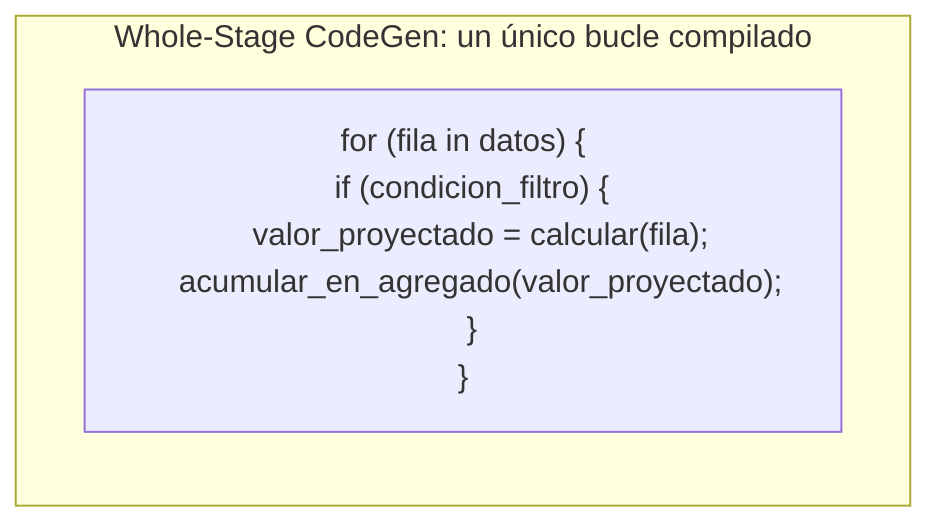

---

## 3. Fusión de operadores (Operator Fusion)

### 3.1 Qué significa "fusionar"

**Operator Fusion** es el proceso de identificar una **cadena de operadores físicos consecutivos** que pueden combinarse en una única unidad de procesamiento, eliminando la necesidad de que cada uno sea una función/objeto separado que se invoque individualmente por fila.

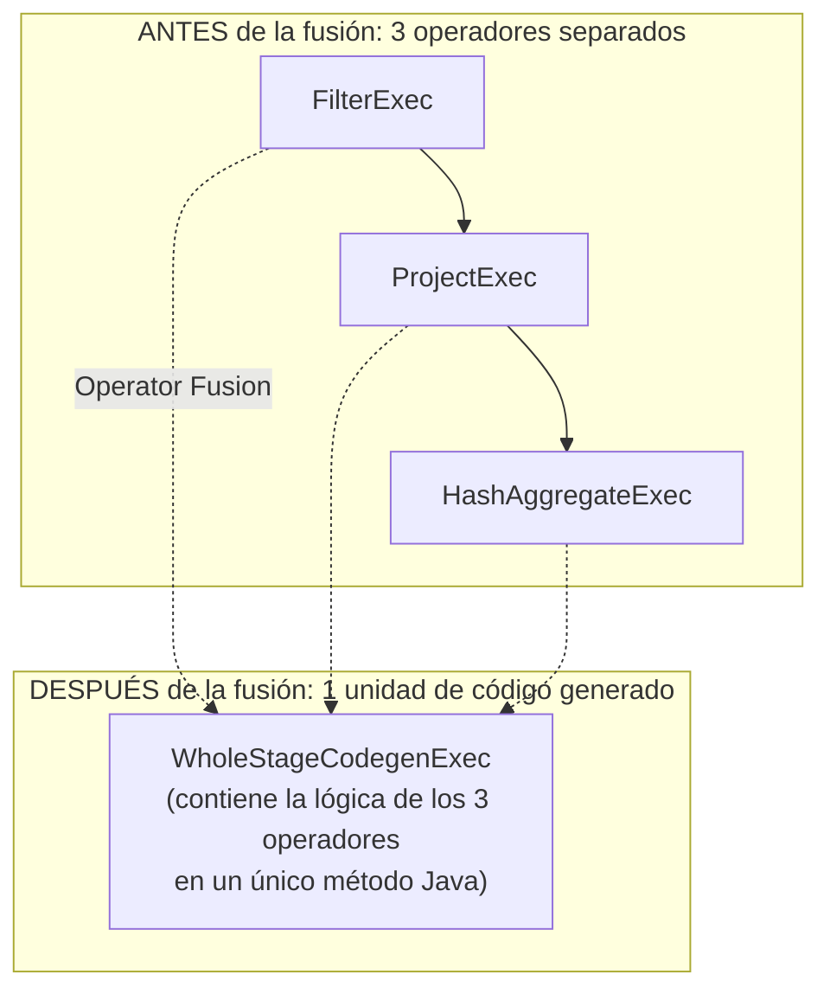

### 3.2 Ejemplo concreto de fusión

```python
resultado = (
    spark.range(0, 100_000_000)
    .filter("id % 2 = 0")
    .selectExpr("id * 2 as doble")
)
resultado.explain()
```

```
== Physical Plan ==
*(1) Project [(id#0L * 2) AS doble#5L]
+- *(1) Filter ((id#0L % 2) = 0)
   +- *(1) Range (0, 100000000, step=1, splits=4)
```

Los tres operadores (`Range`, `Filter`, `Project`) comparten el **mismo número entre paréntesis** — `*(1)` — confirmando que fueron **fusionados en una sola unidad de código generado**, en lugar de ejecutarse como tres objetos independientes comunicándose por llamadas de función.

### 3.3 Fusión a través de fronteras de Stage: no es posible

Es importante entender un límite claro de la fusión: **Whole-Stage Code Generation nunca fusiona operadores que están separados por un shuffle** (`Exchange`). Cada lado de un `Exchange` pertenece a una unidad de generación de código distinta, identificada con un número diferente entre paréntesis.

```python
resultado = spark.range(0, 100_000_000).filter("id % 2 = 0").groupBy((spark.range(0,1).id)).count()
# (ejemplo ilustrativo simplificado)
```

```
== Physical Plan ==
*(2) HashAggregate(keys=[...], functions=[count(1)])
+- Exchange hashpartitioning(...)              <-- el Exchange rompe la fusión aquí
   +- *(1) HashAggregate(keys=[...], functions=[partial_count(1)])
      +- *(1) Filter ((id#0L % 2) = 0)
         +- *(1) Range (0, 100000000, step=1, splits=4)
```

Aquí ves **dos** unidades de código generado distintas: `*(1)` (todo lo anterior al shuffle) y `*(2)` (todo lo posterior). Esto tiene sentido: un shuffle **necesariamente** implica escribir a disco, transferir por red, y leer en otro proceso — no hay forma de "fusionar" ese paso intermedio en un único bucle de memoria continuo.

---

## 4. Compilación a bytecode Java en tiempo de ejecución

### 4.1 El mecanismo: generar código fuente Java como texto, y compilarlo al vuelo

Lo que hace Spark, de forma literal, es **generar código fuente Java como una cadena de texto**, específicamente adaptado a la consulta exacta que estás ejecutando, y luego **compilar ese código a bytecode usando el compilador Janino** (un compilador Java ligero embebido en Spark, diseñado para compilación rápida en tiempo de ejecución) — todo esto ocurre **antes** de que la primera fila de datos sea procesada.

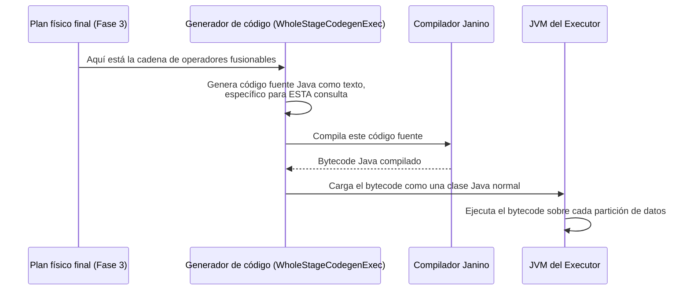

### 4.2 Por qué "en tiempo de ejecución" y no "en tiempo de compilación de Spark"

Spark **no puede** generar este código de antemano cuando se compila el propio framework de Spark, porque **no sabe cuál será tu consulta específica** hasta que la escribes. Por eso, el código Java se genera **dinámicamente, para cada consulta particular**, justo antes de ejecutarla — de ahí el nombre "code generation en tiempo de ejecución" (*runtime code generation*).

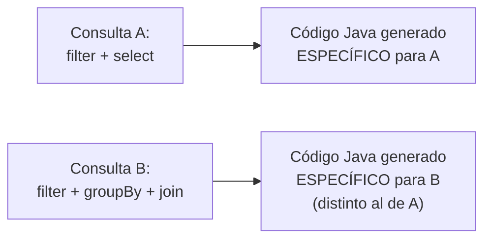

### 4.3 Por qué esto es más rápido que interpretar el plan genéricamente

Una alternativa más simple (y más lenta) sería tener un **intérprete genérico** que recorra el árbol del plan físico fila por fila, decidiendo dinámicamente qué hacer en cada nodo (equivalente al modelo Volcano descrito en la sección 2). En cambio, el código generado:

- Contiene **exactamente** las operaciones necesarias para esa consulta específica, sin ninguna lógica genérica de "¿qué tipo de operador es este?" evaluada repetidamente por fila.
- Puede ser optimizado agresivamente por el compilador **JIT (Just-In-Time)** de la JVM, porque es código Java "normal", con patrones de bucle simples y predecibles — exactamente el tipo de código que el JIT sabe optimizar muy bien (inlining, eliminación de bounds-checking, etc.).
- Opera directamente sobre las representaciones binarias `UnsafeRow` de Tungsten (ver sección 9), evitando conversiones intermedias a objetos Java "normales".

---

## 5. Cómo funciona internamente: el protocolo `produce`/`consume`

Para quien quiera entender el mecanismo con más profundidad técnica: Spark implementa la fusión mediante un protocolo interno llamado **`produce`/`consume`**, donde cada operador físico que soporta Code Generation implementa dos métodos:

- **`produceCode()`**: genera el fragmento de código Java que **produce** filas (típicamente, el operador que lee los datos de origen, como un `Scan`).
- **`doConsume()`**: genera el fragmento de código Java que **consume** una fila recibida del operador anterior, y hace su trabajo específico (filtrar, proyectar, acumular) antes de pasarla —dentro del mismo bloque de código— al siguiente operador.

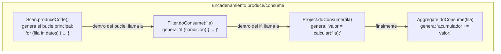

El resultado final es **un único bloque de código Java anidado**, generado por la concatenación de estos fragmentos — exactamente como el pseudocódigo mostrado en la sección 2.3, pero generado automáticamente y específico para tu consulta exacta.

---

## 6. Qué operadores SÍ y NO participan en Whole-Stage CodeGen

No todos los operadores físicos de Spark soportan este mecanismo. Los que sí lo soportan implementan una interfaz específica (`CodegenSupport`, en términos internos de Spark).

| Soportan CodeGen (participan en la fusión) | Generalmente NO soportan CodeGen (actúan como "frontera") |
|---|---|
| `FilterExec` | `SortMergeJoinExec` (en algunas configuraciones/versiones) |
| `ProjectExec` | Operadores que dependen de estado complejo entre filas de forma no lineal |
| `RangeExec` | `Exchange` (por definición: implica shuffle, nunca se fusiona) |
| `HashAggregateExec` | UDFs de Python (PySpark) — ver nota abajo |
| `BroadcastHashJoinExec` | Algunos operadores de ventana (`Window`) complejos, según el caso |

> **Nota especialmente relevante para PySpark**: las **UDFs de Python** (funciones definidas por el usuario en `pyspark.sql.functions.udf`) **rompen la cadena de Code Generation**, porque requieren serializar datos y enviarlos a un proceso Python separado (recordemos el overhead de UDFs visto en el módulo de Extensibilidad del temario) — la JVM no puede "generar código Java" que ejecute directamente tu función Python. Esto es una razón adicional (más allá de la opacidad para Catalyst) por la que se recomienda preferir `pyspark.sql.functions` nativas sobre UDFs de Python cuando sea posible.

```python
from pyspark.sql.functions import udf, col
from pyspark.sql.types import DoubleType

@udf(returnType=DoubleType())
def mi_udf(x):
    return x * 2.0

df = spark.range(0, 1000).withColumn("doble", mi_udf(col("id")))
df.explain()
```

```
== Physical Plan ==
*(2) Project [id#0L, pythonUDF0#10 AS doble#8]
+- BatchEvalPython [mi_udf(id#0L)], [pythonUDF0#10]
   +- *(1) Range (0, 1000, step=1, splits=4)
```

Observa cómo `BatchEvalPython` **no** lleva el prefijo `*(n)` — es una frontera explícita donde el Code Generation se interrumpe, exactamente donde ocurre la comunicación con el proceso Python externo.

---

## 7. Leyendo el plan físico: el símbolo `*(n)`

Este es el detalle práctico más importante para reconocer esta fase en tu trabajo diario con Spark:

```python
resultado.explain()
```

```
*(2) HashAggregate(...)
+- Exchange hashpartitioning(...)
   +- *(1) HashAggregate(...)
      +- *(1) Filter (...)
         +- *(1) FileScan parquet [...]
```

**Reglas de lectura:**

- El asterisco `*` indica que ese operador **participa en Whole-Stage Code Generation**.
- El número entre paréntesis `(n)` identifica a **qué unidad de código generado** pertenece — operadores con el **mismo número** fueron fusionados juntos en un único método Java.
- Un cambio de número (`*(1)` a `*(2)`) o la ausencia del asterisco (como en `Exchange` o `BatchEvalPython`) señala una **frontera** donde la fusión se interrumpe.

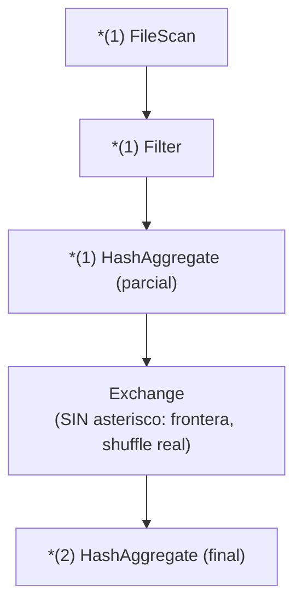

---

## 8. Viendo el código Java generado realmente

Spark permite inspeccionar el código Java exacto generado para una consulta, útil para depuración avanzada de rendimiento:

```python
resultado = spark.range(0, 1000).filter("id % 2 = 0").selectExpr("id * 2 as doble")
resultado.explain(mode="codegen")
```

Esto imprime el código fuente Java generado literalmente, algo como (fragmento simplificado e ilustrativo — el código real generado por Spark es más extenso y usa nombres de variables internos):

```java
public void processNext() throws java.io.IOException {
    while (range.hasNext()) {
        long id = range.next();
        if ((id % 2) == 0) {           // <- lógica del Filter, inlined directamente
            long doble = id * 2;        // <- lógica del Project, inlined directamente
            append(doble);               // <- entrega la fila resultante
        }
    }
}
```

**Esto es exactamente lo que se ganó**: en vez de que `Filter` y `Project` sean dos objetos separados que se llaman mutuamente por cada fila, todo el trabajo vive en un único método `processNext()`, con lógica **inline**, sin llamadas de función intermedias.

---

## 9. Relación con el Motor Tungsten

Es importante conectar explícitamente esta fase con el manual de Tungsten (Sección 2 del temario): **Whole-Stage Code Generation y el formato binario `UnsafeRow` trabajan en conjunto**, no de forma aislada.

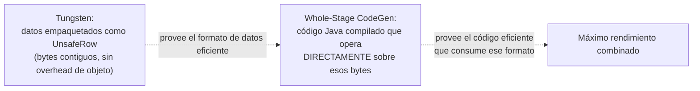

El código generado por esta fase accede a los campos de una `UnsafeRow` mediante **offsets binarios directos** (visto en el manual de Tungsten), en lugar de deferenciar objetos Java dispersos — es precisamente esta combinación (formato de datos + código especializado) la que produce las ganancias de rendimiento más grandes frente al enfoque original de Spark (antes de Tungsten y Whole-Stage CodeGen, introducidos progresivamente entre Spark 1.4 y 2.0).

---

## 10. Cuándo Spark decide NO generar código (los límites)

Existen escenarios donde Spark **desactiva** la generación de código, incluso para operadores que normalmente la soportarían:

- **Consultas con demasiados campos o expresiones anidadas muy complejas**: generar y compilar código Java tiene su propio costo (tiempo de compilación con Janino); si una consulta es extremadamente compleja, el código generado podría exceder límites internos de tamaño de método de la JVM (el límite de 64KB de bytecode por método, una restricción histórica de la JVM), forzando a Spark a dividir el código o recurrir a una ejecución no generada para esa porción.
- **Configuración explícita deshabilitada**:

```python
spark.conf.set("spark.sql.codegen.wholeStage", "false")   # deshabilita Whole-Stage CodeGen globalmente (solo para diagnóstico/debug)
```

- **Presencia de UDFs de Python** (ya visto en la sección 6): interrumpen la cadena de fusión en ese punto específico del plan.

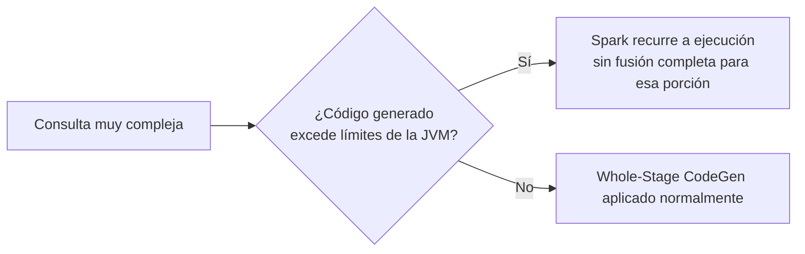

---

## 11. Ejemplo end-to-end integrador

```python
from pyspark.sql import SparkSession
from pyspark.sql.functions import col, udf
from pyspark.sql.types import DoubleType
import time

spark = SparkSession.builder.appName("WholeStageCodeGenDemo").master("local[4]").getOrCreate()

N = 20_000_000

print("=== 1. Plan CON Whole-Stage CodeGen (comportamiento normal) ===")
df = spark.range(0, N).selectExpr("id", "id * 2 as doble")
resultado_nativo = df.filter("id % 2 = 0").selectExpr("doble * 1.1 as ajustado")
resultado_nativo.explain()
# Busca: '*(1)' compartido entre Range, Filter y Project

inicio = time.time()
resultado_nativo.count()
print(f"Tiempo con CodeGen: {time.time() - inicio:.2f}s")

print("\n=== 2. El mismo cómputo, pero con una UDF de Python (rompe la fusión) ===")
@udf(returnType=DoubleType())
def ajustar(doble):
    return doble * 1.1

resultado_udf = df.filter("id % 2 = 0").select(ajustar(col("doble")).alias("ajustado"))
resultado_udf.explain()
# Busca: 'BatchEvalPython' SIN asterisco, rompiendo la unidad de CodeGen

inicio = time.time()
resultado_udf.count()
print(f"Tiempo con UDF de Python (sin CodeGen en ese tramo): {time.time() - inicio:.2f}s")

print("\n=== 3. Deshabilitando Whole-Stage CodeGen por completo (solo para comparar) ===")
spark.conf.set("spark.sql.codegen.wholeStage", "false")
resultado_sin_codegen = df.filter("id % 2 = 0").selectExpr("doble * 1.1 as ajustado")
resultado_sin_codegen.explain()
# Ya NO deberías ver los asteriscos '*(n)' en absoluto

spark.stop()
```

---

## 12. Errores comunes

| Creencia errónea | Realidad |
|---|---|
| "El asterisco `*(n)` en `.explain()` es decorativo" | Indica exactamente qué operadores fueron fusionados en una única unidad de código Java compilado — información de diagnóstico real |
| "Whole-Stage CodeGen puede fusionar cualquier secuencia de operadores, incluso a través de un shuffle" | Falso: un `Exchange` **siempre** rompe la fusión — el shuffle implica escritura/lectura física real, imposible de fusionar en un bucle en memoria |
| "Usar UDFs de Python en PySpark no tiene ningún costo adicional más allá de la serialización" | También rompen la cadena de Whole-Stage CodeGen en el punto donde se usan, perdiendo la optimización de código nativo compilado en ese tramo del plan |
| "La generación de código ocurre una sola vez para todo Spark, al arrancar" | Se genera **dinámicamente, por cada consulta específica**, justo antes de su ejecución — no es un artefacto precompilado genérico |
| "Esta fase reemplaza a la Fase 3 (Planificación Física)" | No: la Fase 4 **parte del plan físico ya elegido** por la Fase 3 y lo compila; no vuelve a decidir estrategias de Join ni nada por el estilo |

---

## 13. Resumen mental (cheatsheet)

- La **Fase 4 (Generación de Código)** toma el plan físico ya elegido (Fase 3) y lo convierte en **código Java compilado, generado dinámicamente y específico para esa consulta exacta**.
- Reemplaza el costoso **modelo Volcano** (llamadas de función encadenadas, fila por fila, entre operadores separados) por **Operator Fusion**: múltiples operadores consecutivos se combinan en un único método Java con lógica inline.
- El mecanismo interno se llama protocolo **`produce`/`consume`**: cada operador aporta un fragmento de código que se ensambla en un único bucle.
- El código generado se compila al vuelo con el compilador **Janino**, y se identifica en `.explain()` con el símbolo **`*(n)`** — operadores con el mismo número fueron fusionados juntos.
- Un **`Exchange`** (shuffle) **siempre** rompe la fusión — no hay forma de fusionar a través de una escritura/lectura física real.
- Las **UDFs de Python** (PySpark) también rompen la fusión, visible como `BatchEvalPython` sin asterisco en el plan.
- Trabaja en **conjunto con el Motor Tungsten**: el código generado opera directamente sobre el formato binario `UnsafeRow`, evitando conversiones a objetos Java dispersos.
- Puedes ver el código Java real generado con `.explain(mode="codegen")`, y deshabilitar el mecanismo (solo para diagnóstico) con `spark.sql.codegen.wholeStage=false`.
- Esta es la **última** fase del ciclo de vida de Catalyst — su salida es lo que finalmente se ejecuta, fila por fila, dentro de cada Task en los Executors.
