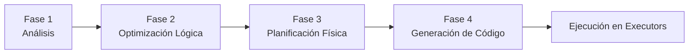

# Cheatsheet — Sección 4: El Optimizador Catalyst — Ciclo de Vida de una Consulta



```python
df.explain(extended=True)   # muestra las 4 representaciones del plan
df.explain(mode="cost")      # muestra estadísticas usadas por el CBO
df.explain(mode="codegen")   # muestra el código Java generado (Fase 4)
```

---

## Fase 1 — Análisis (Analysis)

**Objetivo:** validar que la consulta tiene sentido (tablas/columnas/tipos existen), antes de optimizar nada.

| Paso | Qué hace |
|---|---|
| 1. Conversión a **Unresolved Logical Plan** | Tu código (SQL o DataFrame) → árbol con `'UnresolvedRelation`, `'UnresolvedAttribute` (apóstrofe = sin validar) |
| 2. Resolución contra el **Catálogo/Metastore** | El **Analyzer** aplica reglas iterativas (`ResolveRelations`, `ResolveReferences`, `ResolveFunctions`, `TypeCoercion`) hasta resolver todo |

- Resultado: **Analyzed Logical Plan** (sin apóstrofes, columnas con id único `#12`, tipos concretos).
- Si algo no se resuelve → **`AnalysisException`**, **antes** de ejecutar cualquier Job.
- **SQL y DataFrame API comparten el mismo Analyzer** — mismo destino, dos caminos de entrada.

```python
spark.catalog.listTables()
spark.catalog.listColumns("ventas")
```

---

## Fase 2 — Optimización Lógica (Logical Optimization)

**Objetivo:** reescribir el plan de forma equivalente pero más eficiente, usando **reglas heurísticas** (Rule-Based, sin ver tamaños reales de datos).

| Regla | Qué hace | Evidencia en `.explain()` |
|---|---|---|
| **Predicate Pushdown** | Empuja filtros hasta la fuente de datos | `PushedFilters: [...]` en el FileScan |
| **Column Pruning** | Descarta columnas no usadas antes de leerlas | `ReadSchema: struct<...>` reducido |
| **Constant Folding** | Evalúa expresiones constantes una sola vez | `100 * 1.18` → `118.0` en el plan |

- Muy efectivo en formatos **columnares** (Parquet/ORC); poco/nulo en CSV/JSON.
- Otras reglas: `Combine Filters`, `Boolean Simplification`, `Simplify Casts`, `Null Propagation`.
- Se aplica **iterativamente** hasta un punto fijo (una regla puede habilitar otra).
- **No** decide estrategias de Join ni nada que dependa del tamaño real → eso es la Fase 3.

```python
# 2 filtros separados + expresión constante + columnas de más
df.filter(col("monto") > 50*2).filter(col("cat")=="x").select("cat","monto")
# Optimized Logical Plan: 1 Filter combinado, 100.0 ya evaluado, solo 2 columnas
```

---

## Fase 3 — Planificación Física (Physical Planning)

**Objetivo:** traducir el plan lógico a uno o más planes físicos **concretos**, y elegir el mejor usando el **CBO** (Cost-Based Optimizer) con estadísticas reales.

```python
spark.conf.set("spark.sql.cbo.enabled", "true")
spark.sql("ANALYZE TABLE ventas COMPUTE STATISTICS FOR ALL COLUMNS")
```

### Caso central: estrategia de Join

| Estrategia | Cuándo | Shuffle |
|---|---|---|
| **Broadcast Hash Join** | Una tabla es pequeña (< `spark.sql.autoBroadcastJoinThreshold`, 10MB por defecto) | No |
| **Sort-Merge Join** | Ambas tablas grandes | Sí (ambos lados) |
| **Shuffled Hash Join** | Ambas medianas/grandes, una cabe en memoria tras shuffle | Sí |

```python
from pyspark.sql.functions import broadcast
df_grande.join(broadcast(df_pequena), "id")   # forzar Broadcast
```
```sql
SELECT /*+ BROADCAST(tabla) */ ...
SELECT /*+ MERGE(tabla) */ ...
```

Evidencia en `.explain()`: `BroadcastHashJoin` + `BroadcastExchange` vs. `SortMergeJoin` + `Exchange hashpartitioning`.

**Límite clave:** decisiones **estáticas**, tomadas antes de ejecutar — no reacciona a sorpresas en runtime (estadísticas desactualizadas, filtros muy selectivos). Eso lo resuelve **AQE** (tema posterior).

---

## Fase 4 — Generación de Código (Whole-Stage Code Generation)

**Objetivo:** compilar el plan físico elegido en **bytecode Java optimizado**, específico para esa consulta.

- Reemplaza el **modelo Volcano** (llamadas de función fila por fila entre operadores) por **Operator Fusion**: varios operadores → **un único bucle compilado**.
- Mecanismo interno: protocolo **`produce`/`consume`**.
- Compilado en runtime con **Janino**.

### Leer el símbolo `*(n)` en `.explain()`

```
*(1) Project ...
*(1) Filter ...
+- Exchange ...          <- SIN asterisco: rompe la fusión (shuffle real)
   *(2) HashAggregate ...
```

- Mismo número `(n)` = fusionados en el mismo método Java.
- `Exchange` **siempre** rompe la fusión.
- **UDFs de Python** rompen la fusión → aparecen como `BatchEvalPython` sin asterisco.

```python
spark.conf.set("spark.sql.codegen.wholeStage", "false")  # deshabilitar (solo debug)
```

**Conexión con Tungsten**: el código generado opera directamente sobre `UnsafeRow` (bytes contiguos), no sobre objetos Java dispersos — formato + código trabajando juntos.

---

## Tabla resumen de las 4 fases

| Fase | Pregunta que responde | Basada en | Salida |
|---|---|---|---|
| 1. Análisis | ¿Existen las tablas/columnas? ¿Los tipos son válidos? | Catálogo/Metastore | Analyzed Logical Plan |
| 2. Optimización Lógica | ¿Qué transformaciones son siempre buena idea? | Reglas heurísticas (RBO) | Optimized Logical Plan |
| 3. Planificación Física | ¿Qué estrategia concreta es mejor para ESTOS datos? | Estadísticas reales (CBO) | Plan Físico elegido |
| 4. Generación de Código | ¿Cómo ejecuto esto lo más rápido posible en la JVM? | Compilación runtime (Janino) | Bytecode Java específico |

---

## Errores comunes (resumen cruzado)

| Síntoma | Causa | Fase relacionada |
|---|---|---|
| `AnalysisException` | Tabla/columna/función inexistente o typo | Fase 1 |
| Filtros no se combinan / columnas de más leídas | Esperabas optimización heurística que sí ocurre — revisa `Optimized Logical Plan` | Fase 2 |
| Join lento con tabla pequeña | CBO sin estadísticas (`ANALYZE TABLE` no ejecutado) o tabla supera el umbral de broadcast | Fase 3 |
| UDF de Python mata el rendimiento | Rompe Whole-Stage CodeGen (`BatchEvalPython`) | Fase 4 |
| Plan físico no se adapta a datos reales en runtime | Decisiones estáticas del CBO, ver AQE más adelante | Fase 3 |
